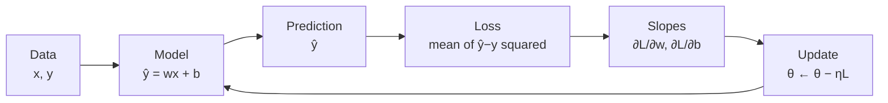

# Lecture 01 — What Does It Mean for a Machine to Learn?

> **The Big Question:** How can a machine discover a rule that nobody ever told it?

▶️ **Run the code:** [Open in Colab](https://colab.research.google.com/github/manish7725/deeplearning/blob/main/Lecture%2001%20-%20What%20Does%20It%20Mean%20for%20a%20Machine%20to%20Learn/notebook.ipynb) · [`notebook.ipynb`](<notebook.ipynb>)

## Where We Are

Four houses.

Four prices.

**No rule.**

Yet the machine has to price a fifth house.

> **How can it discover a rule that nobody ever gave it?**

That's our starting point.

But there's a catch.

A house isn't described by its number of rooms alone. It also has **area, location, age, bedrooms, and many other features.**

> **So how do we describe one house using many numbers at once?**

**Next → Vectors.**

## 1. The Problem: Four Houses and a Question

You work at a small property office. Your manager drops four sales on your desk and asks for a program that prices houses.

| Rooms | Price (₹ lakh) |
|---:|---:|
| 1 | 3 |
| 2 | 5 |
| 3 | 7 |
| 4 | 9 |

Then she asks the question that matters:

> **A five-room house just came on the market. What should we ask for it?**

Sit with that for a moment. Nobody has told you a pricing rule. There is no formula in the file. There are four facts and a question about a house that is *not among them*.

This is the entire problem of machine learning, and it is already here in four rows.

---

## 2. What Would a Solution Need?

Before inventing anything, let us reason about what we actually require. A useful solution must:

1. **Answer for inputs it has never seen.** The five-room house is the whole point.
2. **Come from the data, not from us.** If we supply the rule, the machine has learned nothing.
3. **Be compact.** Four rows fit on a desk. Four million do not.
4. **Be improvable.** When it is wrong, there must be a way to make it *less* wrong.

Keep these four requirements in view. Every idea in this chapter exists because one of them was violated.

---

## 3. First Attempt: Write Down the Answers

The simplest possible program stores what we saw:

```text
IF rooms = 1 THEN price = 3
IF rooms = 2 THEN price = 5
IF rooms = 3 THEN price = 7
IF rooms = 4 THEN price = 9
```

Test it on the four known houses: perfect, every time. A flawless score.

Now ask it about five rooms.

Silence. There is no matching line. The program has no opinion, because it never had an *idea* — it had a list. Ask it about a three-and-a-half room house and it fails again.

> ⚠️ **A Tempting Wrong Idea**
>
> *"It scored 100% on the data, so it is a great model."*
>
> It scored 100% because it memorized the answers. Requirement 1 is violated completely. **Perfect performance on examples you have already seen is not evidence of learning** — it is the one result you can always achieve by writing things down.

A second tempting fix: take the average of all four prices, ₹6 lakh, and quote that for every house. Now we always have an answer — requirement 1 satisfied! But a one-room flat and a four-room house get the same price. The rule ignores the very thing we were asked about. Remember this ₹6 lakh model; it comes back in §7 to teach us something sharp.

Both attempts fail the same way: **neither one captured the relationship between rooms and price.**

> 📜 **History Lens — Arthur Samuel, IBM, 1950s**
>
> Arthur Samuel faced exactly this wall, with checkers. He wanted a program that played well, but he could not write down the rules for good play — expert players themselves cannot fully articulate them. So in the 1950s he built a program that adjusted its own evaluation of board positions from the outcomes of games it played, and published the results in 1959 as *"Some Studies in Machine Learning Using the Game of Checkers."* The program eventually beat him.
>
> The idea that changed everything: **when you cannot write the rule, write the process that finds the rule.**
>
> Nearly forty years later Tom Mitchell made it precise in his 1997 textbook *Machine Learning*:
>
> > "A computer program is said to learn from experience E with respect to some class of tasks T and performance measure P, if its performance at tasks in T, as measured by P, improves with experience E."
>
> Read it against our problem: **T** is pricing houses, **E** is the four sales, **P** is how close our prices are. Learning is improvement of **P** on **T** through **E** — nothing more mystical than that.
>
> *(A popular one-line definition about computers learning "without being explicitly programmed" is widely attributed to Samuel, but it is a later paraphrase rather than a sentence from his paper. We quote only what is verifiable.)*

---

## 4. The Discovery: A Rule With Adjustable Dials

We stopped looking at the four prices as four separate facts. Let us look at how they *change*.

```text
rooms:   1  →  2  →  3  →  4
price:   3  →  5  →  7  →  9
change:     +2    +2    +2
```

Every extra room adds exactly ₹2 lakh. That is not four facts — that is one fact, repeated.

And if each room is worth ₹2 lakh, what is the ₹1 lakh left over at one room? One room costs ₹3 lakh, of which ₹2 lakh is the room itself. Something costs ₹1 lakh before any room exists: **the land**.

So the relationship is:

```text
price  =  price-per-room × rooms  +  base cost of the plot
```

Now we generalize. We do *not* yet know that a room is worth ₹2 lakh — we want the machine to find that out. So we leave the two numbers blank and give them names:

$$
\hat{y} = w x + b
$$

| Level | The same idea |
|---|---|
| 💡 **Intuition** | A machine with two dials. One dial sets how steeply price climbs per room; the other sets the price of an empty plot. Turn the dials until the machine agrees with reality. |
| ✏️ **Numbers** | With $w=2$ and $b=1$: a 3-room house costs $2(3) + 1 = 7$. ✓ matches the data. |
| 🎓 **Abstraction** | $\hat{y} = wx + b$, where $w, b \in \mathbb{R}$ are *learned from data*, not supplied by us. |

Every symbol, in English:

| Symbol | Read it as | Meaning here | In code |
|---|---|---|---|
| $x$ | "the input" | number of rooms | `x` |
| $y$ | "the true answer" | the price the house actually sold for | `y` |
| $\hat{y}$ | "y-hat", *our guess* of $y$ | the price our rule predicts | `y_hat` |
| $w$ | "weight" | ₹ lakh added per room | `w` |
| $b$ | "bias" | ₹ lakh before any rooms — the plot | `b` |

The hat matters. $y$ is what the world did. $\hat{y}$ is what we claim. **Learning is the business of closing the gap between them.**

Notice what we bought: two numbers now stand in for the whole table, and unlike the lookup table, $\hat{y} = wx + b$ has an answer for five rooms, for 3.5 rooms, for any $x$ at all. Requirements 1 and 3, satisfied.

---

## 5. Prediction Is Not Learning

We have the *form* of the rule. We do not have the two numbers. The machine must find them, so it cannot start from the answer. Let it start ignorant:

$$
w = 1, \qquad b = 0 \qquad \Longrightarrow \qquad \hat{y} = x
$$

Ask it about a three-room house:

$$
\hat{y} = 1(3) + 0 = 3 \quad \text{but the house sold for} \quad y = 7.
$$

The machine answered. The machine was wrong by ₹4 lakh. And notice — it will be wrong in exactly the same way tomorrow, and the day after. It has no mechanism to improve.

> 🧠 **Think** — This is the distinction the whole chapter turns on:
>
> **Prediction** is what a model *does*: run the input through the current dials.
> **Learning** is what changes the *dials themselves*, using evidence.
>
> A calculator predicts. It never learns.

To change the dials we need to know *how wrong* we are — not as a feeling, but as a number. Requirement 4 has arrived, and we cannot satisfy it yet.

---

## 6. What Would a Measure of Wrongness Need?

Again, reason before inventing. A useful measure must:

1. Be **one number** for the whole dataset — not four complaints, one verdict.
2. Be **zero** when every prediction is perfect.
3. **Grow** as predictions get worse.
4. **Never let a miss in one direction cancel a miss in the other.**

That fourth requirement looks fussy. §7 is about to show you why it is the one that matters.

---

## 7. Second Attempt: Just Average the Errors

The obvious move. For each house, compute $\hat{y} - y$, then average.

Return to that ₹6 lakh model from §3 — the one that quotes the same price for every house:

| Rooms $x$ | Prediction $\hat{y}$ | Truth $y$ | Error $\hat{y}-y$ |
|---:|---:|---:|---:|
| 1 | 6 | 3 | **+3** |
| 2 | 6 | 5 | **+1** |
| 3 | 6 | 7 | **−1** |
| 4 | 6 | 9 | **−3** |

Average error:

$$
\frac{(+3) + (+1) + (-1) + (-3)}{4} = \frac{0}{4} = 0.
$$

**Zero.** By this measure, a model that completely ignores the number of rooms is *flawless*.

> ⚠️ **A Tempting Wrong Idea**
>
> Averaging signed errors lets overcharging on small flats pay for undercharging on large houses. The books balance; every individual customer is still quoted the wrong price. Requirement 4, violated exactly as promised.

The problem is the minus signs. We need the size of each mistake, with its direction thrown away.

---

## 8. The Discovery: Squared Error and the Loss Function

Two honest ways to discard a sign. Take the absolute value, or square it.

| Rooms | Error | $\lvert \text{error} \rvert$ | $\text{error}^2$ |
|---:|---:|---:|---:|
| 1 | +3 | 3 | 9 |
| 2 | +1 | 1 | 1 |
| 3 | −1 | 1 | 1 |
| 4 | −3 | 3 | 9 |
| | **avg** | **2** | **5** |

Both refuse to report zero. Both do the job. So why does this course — and most of deep learning — reach for the square?

1. **Big misses hurt more than small ones.** Doubling an error quadruples its cost: being ₹3 lakh wrong contributes $9$, while being ₹1 lakh wrong contributes $1$. Squaring says *one catastrophic quote is worse than three small ones*, which is usually what we believe about pricing houses.
2. **It is smooth.** $\lvert e \rvert$ has a sharp corner at zero where its slope is undefined. From §11 onward, slopes are the only tool we have for improving the dials — so a kink is a genuine obstacle. $e^2$ is smooth everywhere.

> ⚠️ Squaring is a **choice**, not a law. It is unusually sensitive to outliers: one wildly mispriced mansion can dominate the whole average. Mean absolute error is a perfectly respectable alternative, used precisely when outliers should not dominate. We square because of the two reasons above, not because the universe demands it.

Write it for one house — the **squared error**:

$$
L = (\hat{y} - y)^2
$$

and for the whole dataset, the **mean squared error**:

$$
\mathrm{MSE} = \frac{1}{n}\sum_{i=1}^{n} (\hat{y}_i - y_i)^2
$$

If $\sum$ is new, read it left to right as an instruction:

$$
\sum_{i=1}^{n} (\hat{y}_i - y_i)^2
\quad\longrightarrow\quad
\text{"start at house } i=1 \text{, square its error, add it on, move to the next, stop at } n \text{."}
$$

The subscript $i$ is just a house number; $n$ is how many houses there are. With $n = 4$ it unpacks to
$(\hat{y}_1-y_1)^2 + (\hat{y}_2-y_2)^2 + (\hat{y}_3-y_3)^2 + (\hat{y}_4-y_4)^2$, divided by 4. Nothing more.

This number has a name: the **loss**. And something quietly enormous just happened —

> 💡 We turned the vague wish *"the machine should get better"* into a quantity we can compute. Anything we can compute, we can try to make small.

Check the measure against our models:

| Model | What it does | MSE |
|---|---|---:|
| $w=0, b=6$ | ignores rooms | 5 |
| $w=2, b=0$ | right slope, forgot the land | 1 |
| $w=2, b=1$ | the truth | **0** |

The ranking matches our judgement. The measure works.

---

## 9. Learning Becomes a Search

Now the problem has a shape. Every pair $(w, b)$ defines a line; every line produces predictions; every set of predictions produces one loss. So:

$$
\text{learning} \;=\; \text{find the } (w,b) \text{ that makes } L \text{ smallest.}
$$

With two dials you could hunt by hand. Try $w = 1$, try $w = 2$, keep what is better.

But count what happens when the model grows. A small image model has millions of dials; a large language model has hundreds of billions. Testing ten values of each is $10^{\text{billions}}$ combinations. There is not enough time in the universe.

> 🔭 **Next Question** — Guessing does not scale. Is there a way to know **which direction to turn a dial** without trying every value?

---

## 10. The Discovery: The Loss Landscape

Let us look at what the loss actually *does* as a dial turns. Hold $b = 1$ and walk $w$ through some values, computing MSE on our four houses by hand:

| $w$ | Predictions | Loss $L$ |
|---:|---|---:|
| 0 | 1, 1, 1, 1 | 30.0 |
| 1 | 2, 3, 4, 5 | 7.5 |
| 1.5 | 2.5, 4, 5.5, 7 | 1.875 |
| **2** | **3, 5, 7, 9** | **0** |
| 2.5 | 3.5, 6, 8.5, 11 | 1.875 |
| 3 | 4, 7, 10, 13 | 7.5 |
| 4 | 5, 9, 13, 17 | 30.0 |

Look at the shape: falling, bottoming out at $w = 2$, rising again — and *symmetric* around the bottom. That symmetry is a clue. Let us find the exact formula.

With $b = 1$ and true prices $y_i = 2x_i + 1$, the error on house $i$ is

$$
\hat{y}_i - y_i = (w x_i + 1) - (2 x_i + 1) = (w - 2)x_i .
$$

The $+1$ cancels — a fixed offset that both lines share. Now square and average:

$$
L(w) = \frac{1}{n}\sum_{i=1}^{n} \big[(w-2)x_i\big]^2
     = (w-2)^2 \cdot \frac{1}{n}\sum_{i=1}^{n} x_i^2 .
$$

$(w-2)^2$ came out of the sum because it does not depend on which house we are looking at. The leftover piece is a property of our data alone:

$$
\frac{1}{n}\sum x_i^2 = \frac{1^2+2^2+3^2+4^2}{4} = \frac{30}{4} = 7.5 .
$$

$$
\boxed{\;L(w) = 7.5\,(w-2)^2\;}
$$

Check it against the table: $L(0) = 7.5(4) = 30$ ✓, $L(1) = 7.5(1) = 7.5$ ✓, $L(2) = 0$ ✓. The hand calculations and the algebra agree exactly.

This is a **parabola** — a valley with exactly one bottom, at the correct answer $w = 2$.

---

## 11. Which Way Is Downhill?

Stand at $w = 0$, blindfolded, somewhere on that valley wall. You cannot see the bottom. But you *can* feel the ground under your feet: is it tilting up or down, and how steeply?

Measure the tilt the obvious way — take a tiny step $h$ and see how much the loss changed, per unit of step:

$$
\text{tilt} \approx \frac{L(w+h) - L(w)}{h}
$$

Let us actually compute it for $L(w) = 7.5(w-2)^2$. Expand the top:

$$
L(w+h) - L(w) = 7.5\Big[(w + h - 2)^2 - (w-2)^2\Big]
$$

Write $(w - 2 + h)^2 = (w-2)^2 + 2(w-2)h + h^2$ and the $(w-2)^2$ terms cancel:

$$
= 7.5\Big[2(w-2)h + h^2\Big]
$$

Divide by $h$:

$$
\frac{L(w+h)-L(w)}{h} = 7.5\big[2(w-2) + h\big] = 15(w-2) + 7.5h
$$

Now the key move. Our step $h$ was arbitrary — so make it smaller and smaller. The term $7.5h$ shrinks away to nothing, and what survives is the tilt at the point itself:

$$
\text{slope at } w \;=\; 15(w-2)
$$

No calculus was assumed. We expanded a square, divided, and watched what refused to disappear. *(The notation for "shrink $h$ to nothing" is $h \to 0$, and the machinery around it is the derivative — Chapter 08 builds it properly, Chapter 09 turns it into an algorithm.)*

Read the answer:

| Position | Slope $15(w-2)$ | Meaning | Move |
|---:|---:|---|---|
| $w = 0$ | $-30$ | ground falls away to the right | **increase** $w$ |
| $w = 1$ | $-15$ | still downhill to the right, less steeply | increase $w$ |
| $w = 2$ | $0$ | flat — the bottom | stop |
| $w = 3$ | $+15$ | ground rises to the right | **decrease** $w$ |

> 💡 **Intuition** — The slope is a compass. Its **sign** says which way is downhill; its **size** says how steep the ground is. Move *against* the slope and the loss falls.

"Move against the slope" is a rule we can write down. It is the rule the entire field runs on:

$$
\theta \;\leftarrow\; \theta - \eta \,\nabla_\theta L
$$

Every symbol, in English:

| Symbol | Read it as | Meaning |
|---|---|---|
| $\theta$ | "theta" | all the dials at once — here, $\theta = (w, b)$ |
| $\leftarrow$ | "is replaced by" | this is an update, not an equation to solve |
| $\nabla_\theta L$ | "grad L" | the collection of slopes, one per dial |
| $\eta$ | "eta" | the **learning rate** — what fraction of a step we take |
| $-$ | the crucial minus | downhill is *against* the slope |

For our two dials the slopes are (Chapter 10 derives these; here, take the form and check it numerically in the lab):

$$
\frac{\partial L}{\partial w} = \frac{1}{n}\sum 2(\hat{y}_i - y_i)\,x_i,
\qquad
\frac{\partial L}{\partial b} = \frac{1}{n}\sum 2(\hat{y}_i - y_i)
$$

Read $\frac{\partial L}{\partial w}$ as: *"if I nudge $w$ by a tiny amount and leave $b$ alone, how much does the loss move?"*

---

## 12. The Geometry: A Valley With a Single Bottom

With one dial, the loss is a curve — the parabola of §10.

```text
  L
  │   ╲                     ╱
  │     ╲                 ╱
  │       ╲             ╱
  │         ╲___⭐___╱          ⭐ = w is 2, L is 0
  └────────────────────────── w
      0     1     2     3
```

With two dials, $L(w, b)$ is a **surface** — a bowl in three dimensions, with $(w, b) = (2, 1)$ at the lowest point. Training is a ball released on the inside of that bowl.

This picture is worth holding onto, because almost everything later is a complication of it: deep networks have landscapes in millions of dimensions, full of ridges, plateaus and saddle points. But the move is always the same — **feel the slope, step downhill, repeat.**

> ⚠️ Our bowl has exactly one bottom because $\hat{y} = wx + b$ is linear and the loss is squared; this combination is *convex*. Deep networks are not convex, and that is a genuine difference, not a detail. Chapter 25 takes it seriously.

---

## 13. The Learning Loop

Everything so far assembles into one cycle:



> ✏️ **Hand Calculation — one full step of learning**
>
> Start ignorant: $w = 0$, $b = 0$, and choose $\eta = 0.01$.
>
> **Predict.** $\hat{y} = 0 \cdot x + 0 = 0$ for every house: $[0, 0, 0, 0]$.
>
> **Measure.** Errors $\hat{y}-y = [-3, -5, -7, -9]$, so
> $L = \frac{9 + 25 + 49 + 81}{4} = \frac{164}{4} = \mathbf{41}$.
>
> **Slopes.**
> $\dfrac{\partial L}{\partial w} = \dfrac{2\big[(-3)(1) + (-5)(2) + (-7)(3) + (-9)(4)\big]}{4} = \dfrac{2(-70)}{4} = \mathbf{-35}$
>
> $\dfrac{\partial L}{\partial b} = \dfrac{2\big[(-3) + (-5) + (-7) + (-9)\big]}{4} = \dfrac{2(-24)}{4} = \mathbf{-12}$
>
> Both slopes are negative: both dials are too small. The compass says *turn them up*.
>
> **Update.**
> $w \leftarrow 0 - 0.01(-35) = \mathbf{0.35}$
> $b \leftarrow 0 - 0.01(-12) = \mathbf{0.12}$
>
> **Check.** New predictions $[0.47,\, 0.82,\, 1.17,\, 1.52]$ give $L = \mathbf{28.45}$.
>
> The loss fell from 41 to 28.45 in a single step, and nobody told the machine that a room is worth ₹2 lakh.

Repeat that step 2000 times and the dials arrive at $w = 2.0002$, $b = 0.9993$ — the machine has *discovered* ₹2 lakh per room and ₹1 lakh for the land. Asked about the five-room house it finally answers:

$$
\hat{y} = 2.0002(5) + 0.9993 \approx \textbf{₹11 lakh}
$$

There is no function called `learn()` anywhere in this. Learning is arithmetic, repeated:

```text
predict → measure → find the slope → step downhill → repeat
```

---

## 14. 🔬 The Experiment: How Big Should a Step Be?

$\eta$ is ours to choose — the machine cannot learn it from the data. So what happens if we choose badly?

> 🧠 **Predict before you read on.** Three runs, 200 steps each, identical in every way except $\eta$: one at $0.001$, one at $0.01$, one at $0.13$. Which reaches $w=2, b=1$? What does failure look like — a wrong answer, or something else?

Here is what the arithmetic does (reproduce every row in Step 9 of the notebook):

| $\eta$ | After 200 steps | Loss | Verdict |
|---:|---|---:|---|
| 0.001 | $w=2.020,\; b=0.706$ | 0.061 | crawling — $b$ is still far from 1 |
| 0.01 | $w=2.054,\; b=0.843$ | 0.004 | working |
| 0.05 | $w=2.005,\; b=0.986$ | 0.00003 | working well |
| 0.13 | $w \to \pm\infty$ | overflow | **exploded** |

The failure is the interesting one. Watch the first four steps at $\eta = 0.13$:

```text
step 0:  w = 0.00   loss = 41
step 1:  w = 4.55   loss = 56     ← overshot past 2, landed further out
step 2:  w = -0.79  loss = 77     ← overshot back, worse again
step 3:  w = 5.46   loss = 106    ← each swing is bigger
```

It is not drifting to a wrong answer. It is **oscillating across the valley**, overshooting a little further every time, until the numbers overflow. The step is so long that it jumps from one wall of the valley to a higher point on the opposite wall.

And this threshold is not mysterious — it is predictable from the curvature we computed in §10. The mathematics says instability begins near $\eta \approx 0.12$, and the experiment breaks between $0.11$ (converges) and $0.12$ (diverges). Theory and machine agree.

> 💡 Too small and you never arrive. Too large and you are thrown out of the valley. $\eta$ is a **hyperparameter** — chosen by us, not learned from data.

---

## 15. How It Breaks

Learning is not automatic. Five ways this exact setup fails:

| Failure | What it looks like | Why |
|---|---|---|
| **Wrong model class** | loss stops falling while still large | A straight line cannot fit a curved relationship. No $(w,b)$ exists that works. |
| **Wrong loss** | loss small, users unhappy | You optimized what you measured, and you measured the wrong thing. |
| **Bad learning rate** | crawling, or overflow | §14. |
| **Uninformative input** | no better than guessing | If rooms genuinely do not affect price, no method recovers a signal that is not there. |
| **Memorization** | perfect on training data, poor on new houses | The §3 lookup table in a more sophisticated costume. This is **overfitting**; Chapter 12 builds train/test splits to detect it. |

> ⚠️ **Common Mistake** — treating a falling loss as proof of success. A falling *training* loss only proves you are fitting the data you already have. The question is always the five-room house you have not seen.

---

## 16. Shapes: A Habit Worth Starting Now

Our four houses are not four separate numbers — they are one array:

$$
\mathbf{x} = [1, 2, 3, 4] \in \mathbb{R}^{4},
\qquad
\mathbf{y} = [3, 5, 7, 9] \in \mathbb{R}^{4}
$$

$\mathbb{R}^4$ reads as *"four real numbers in a row."* When we write $\hat{\mathbf{y}} = w\mathbf{x} + b$, one line multiplies all four houses at once:

```text
   x: (4,)        w: scalar
       ↓ multiply every entry, add b to every entry
   ŷ: (4,)
```

Shape in, shape out. It looks trivial with four numbers and one dial. By Chapter 17 you will be tracking `(batch, tokens, heads, dim)` through an attention block, and the reader who started checking shapes in Chapter 1 will be the one who survives it.

---

## 17. 🎯 Machine Learning Connection

What we built in this chapter is not a warm-up for deep learning. It **is** deep learning, at the smallest size that still works.

| This chapter | A modern neural network |
|---|---|
| $\hat{y} = wx + b$ | $\hat{y} = f_\theta(\mathbf{x})$ — many such transformations composed |
| 2 parameters | $10^{6}$ to $10^{12}$ parameters |
| MSE | cross-entropy, contrastive, preference losses… |
| slope by hand | backpropagation (Chapter 10) |
| gradient descent | Adam, AdamW (Chapter 26) |
| 4 houses | terabytes of text |

The loop does not change. A language model predicting the next word is running §13: predict, measure the loss, compute slopes, step downhill, repeat — a few hundred billion dials instead of two.

> **A model has parameters. Data produces a loss. Slopes say how to change the parameters.** Everything else in this course is a refinement of that sentence.

---

## 18. Distinctions That Matter

| | |
|---|---|
| **Prediction** — running the current model | **Learning** — changing the model using evidence |
| **Error** — signed, $\hat{y}-y$, has direction | **Loss** — a chosen function of error, built to be minimized |
| **Parameter** — $w, b$, learned from data | **Hyperparameter** — $\eta$, chosen by you |
| **Memorizing** — perfect on seen data | **Generalizing** — correct on unseen data |
| $y$ — what the world did | $\hat{y}$ — what the model claims |

---

## 19. What We Discovered

1. Writing rules by hand fails whenever the rule is unknown or too complicated to state — so we write the *process that finds the rule* instead.
2. A model is a formula with adjustable dials. The dials carry meaning: ₹ per room, ₹ per plot.
3. Predicting and learning are different acts. Only one of them changes the dials.
4. "How wrong are we?" must become a single computable number, and signed errors cancel — so we square them.
5. Once wrongness is a number, learning becomes a search for its minimum.
6. The loss forms a landscape. Its slope is a compass: sign gives direction, size gives steepness.
7. Step against the slope, repeatedly, and the dials find values nobody supplied.
8. Step size is ours to choose, and choosing badly breaks the whole thing.

---

## 20. Mathematics We Built

$$
\hat{y} = wx + b
$$

$$
\mathrm{MSE} = \frac{1}{n}\sum_{i=1}^{n}(\hat{y}_i - y_i)^2
$$

$$
L(w) = 7.5\,(w-2)^2 \quad \text{(this dataset, } b=1\text{)}
$$

$$
\text{slope} = \lim_{h \to 0}\frac{L(w+h)-L(w)}{h} = 15(w-2)
$$

$$
\frac{\partial L}{\partial w} = \frac{1}{n}\sum 2(\hat{y}_i-y_i)x_i
\qquad
\frac{\partial L}{\partial b} = \frac{1}{n}\sum 2(\hat{y}_i-y_i)
$$

$$
\theta \leftarrow \theta - \eta\nabla_\theta L
$$

## 21. What Each Symbol Means

| Symbol | English | In code |
|---|---|---|
| $x$ | input (rooms) | `x` |
| $y$ | true answer (actual price) | `y` |
| $\hat{y}$ | prediction | `y_hat` |
| $w$ | weight — ₹ lakh per room | `w` |
| $b$ | bias — ₹ lakh for the plot | `b` |
| $n$ | number of examples | `n` |
| $L$ | loss — one number for total wrongness | `loss` |
| $\sum_{i=1}^{n}$ | "add up over all examples" | `.sum()` |
| $\theta$ | all parameters together | `(w, b)` |
| $\nabla_\theta L$ | the slopes, one per parameter | `dw, db` |
| $\eta$ | learning rate — step size | `learning_rate` |
| $\partial L/\partial w$ | "nudge $w$ only; how much does $L$ move?" | `dw` |

## 22. One-Minute Explanation

Explain to someone with no mathematics, using no equations:

> Why can a machine price a house it has never seen, when all it was given was four old sales?

If you need the word "gradient" to get through it, you have not finished understanding it.

---

## 23. Exercises

**Level 1 — Observe.** Look at the §10 loss table. Why are $L(1)$ and $L(3)$ both exactly 7.5? What does that symmetry say about the shape of the landscape — and would it still hold if the four houses had prices $3, 5, 7, 20$?

**Level 2 — Calculate (by hand, no code).** A model has $w = 3$, $b = 0$. For the four houses: write the four predictions, the four errors, and the MSE. Is this model better or worse than $w=0, b=6$? Then do one gradient-descent step with $\eta = 0.01$ and confirm the loss went down.

**Level 3 — Derive.** We showed $L(w) = 7.5(w-2)^2$ with $b$ pinned to 1. Now redo it with $b$ pinned to $0$: prove that
$L(w) = 7.5w^2 - 19w + 16$, and find the $w$ that minimizes it by setting the slope to zero. Why is the answer **not** exactly 2? What is the model doing to compensate for a plot price it is forbidden to use?

**Level 4 — Investigate** (notebook Steps 8–11). Find the largest $\eta$ that still converges, to two decimal places. Then change the data to $x = [10, 20, 30, 40]$ with the same prices and find the threshold again. It moves sharply — explain why, using $\frac{1}{n}\sum x_i^2$ from §10.

**Level 5 — Design.** Your loss is now used to price houses for real families. Squared error treats a ₹4 lakh overcharge and a ₹4 lakh undercharge as identical mistakes — but they are not, to the buyer or the seller. Design a loss function that punishes overcharging more heavily. Write it mathematically. What properties must it keep to remain usable (think about §8 and §11)? What does your choice do to the machine's behaviour?

---

## 24. Common Mistakes

| Mistake | Why it is wrong |
|---|---|
| "Training loss went down, so the model is good." | It proves fitting, not generalizing. Ask about the unseen house. |
| "The model understands houses." | It found two numbers that fit four rows. There is no concept of *house* in it. |
| "More parameters means better learning." | More dials can fit more shapes — and memorize more noise. Chapter 25. |
| "The error is zero on average, so we are accurate." | §7. Cancellation hides every individual mistake. |
| "$\eta$ can just be set very small to be safe." | Then you never arrive. Slowness is a failure too. |
| "Deep learning is something different from this." | It is this loop, with a bigger model and better slopes. |

## 25. Socratic Questions

Answers are deliberately not given. Sit with them.

1. Why do we divide by $n$ in the MSE? What breaks if we merely sum?
2. Why does squaring feel more "natural" than cubing the error? What would $|e|^3$ do?
3. The slope at the bottom of the valley is zero. Is every point with zero slope a bottom?
4. We chose $\eta$ ourselves. Could a machine learn $\eta$ too? What would that even mean?
5. Our four houses lay *exactly* on a line. Real data never does. What is the machine minimizing then — and is "the true rule" still something it can find?
6. If the lookup table in §3 had contained a million houses, would it still be wrong to call it learning?

---

## 26. 🔭 Bridge to Chapter 02

We just built a working learner. But look closely at what we let ourselves get away with: we described an entire house with **one number**.

Real houses have area, age, floor, distance to the station, quality of construction. A photograph has millions of pixels. A sentence has thousands of possible words in each position.

The moment a house needs three measurements instead of one, $\hat{y} = wx + b$ is no longer enough — we need a way to hold many numbers as a *single object*, and to multiply a whole collection of dials against a whole collection of measurements at once.

> **How do we turn a list of numbers into one mathematical object we can compute with?**

That object is the **vector**, and it is where Chapter 02 begins.

➡️ **Next:** [Chapter 02 — Numbers Become Vectors](<../Lecture 02 - Numbers Become Vectors/blog.md>)
