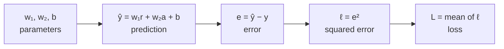
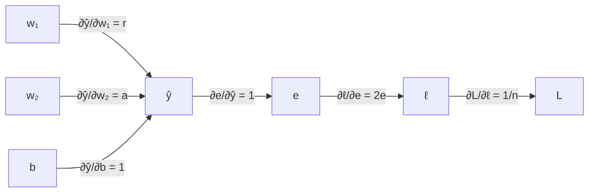

# Lecture 07 — Partial Derivatives, Gradients and the Chain Rule

> **The Big Question:** What is "the slope" of a surface that depends on many dials at once — and of the infinitely many directions you could walk, which one goes downhill fastest?

▶️ **Run the code:** [Open in Colab](https://colab.research.google.com/github/manish7725/deeplearning/blob/main/Lecture%2007%20-%20Partial%20Derivatives%2C%20Gradients%20and%20the%20Chain%20Rule/notebook.ipynb) · [`notebook.ipynb`](<notebook.ipynb>)

## Where We Are

A derivative tells us how the loss changes when we move one parameter.

But a real model has many parameters. Changing one at a time is not enough.

> **Can we describe all those directions of change with one object — and find the direction that rises fastest?**

**Next → Gradients.**

## 1. The Problem: What Is the Slope of a Bowl?

Chapter 06 closed on a question, and it is worth restating in full before we touch any mathematics.

Our house-price office now records two measurements per house — the data from Chapter 02:

| House | Rooms $r$ | Area $a$ (sq ft) | Price $y$ (₹ lakh) |
|---|---:|---:|---:|
| A | 2 | 800 | 9 |
| B | 2 | 1200 | 11 |
| C | 3 | 900 | 11.5 |
| D | 4 | 1600 | 17 |

Chapter 02 found the rule hiding in this table:

$$
\text{price} \;=\; 2 \cdot \text{rooms} \;+\; 0.005 \cdot \text{area} \;+\; 1
$$

Check house C: $2(3) + 0.005(900) + 1 = 6 + 4.5 + 1 = 11.5$ ✓. Our model has the same shape with the numbers left blank:

$$
\hat{y} = w_1 r + w_2 a + b
$$

Three dials. $w_1$ is ₹ lakh per room, $w_2$ is ₹ lakh per square foot, $b$ is the price of the bare plot. And the loss is Chapter 1's mean squared error:

$$
L(w_1, w_2, b) = \frac{1}{4}\sum_{i=1}^{4}\big(\hat{y}_i - y_i\big)^2
$$

Now stand somewhere on that loss and ask Chapter 06's question: **how steep is it here?**

The question has no answer. Not "we don't know the answer yet" — the question is *incomplete*. Turning up $w_1$ might raise the loss. Turning up $b$ at the same moment might lower it. Turning both up together does something else again. There is no single number called "the slope", because the loss does not have one slope; it has a different slope for every direction you could move in.

> 🧠 **Think** — With one dial, "left" and "right" were the only choices, and one number covered both (its sign chose the side). With two dials you can move in a full circle of directions, and with a billion dials in a space of directions so large it has no picture. A single number cannot possibly describe all of them.

### Pinning a dial so we can draw

To keep pictures possible for the next several sections, we do exactly what Chapter 06 did: pin one dial at its true value and watch the other two move. Chapter 06 pinned $b = 1$; we pin

$$
w_2 = 0.005 \quad\text{(the true price per square foot)}
$$

and study the surface $L(w_1, b)$. This is a convenience, not a cheat — and it is temporary. Everything we build will be stated for $n$ dials, and §22 puts $w_2$ back.

With $w_2$ pinned at its true value, the remaining two dials still have a perfect answer waiting at $(w_1, b) = (2, 1)$, where the loss is exactly zero.

### The surface, in closed form

We can write $L(w_1, b)$ down exactly, and it is worth doing because every number in this chapter will be checkable by hand afterwards.

Our prediction for house $i$ is $\hat{y}_i = w_1 r_i + 0.005\,a_i + b$. The truth is $y_i = 2 r_i + 0.005 a_i + 1$. Subtract:

$$
\hat{y}_i - y_i = (w_1 - 2)\,r_i + (b - 1)
$$

The area term cancels completely — both lines price area identically, because we pinned $w_2$ correctly. Write $u = w_1 - 2$ and $\beta = b - 1$ for "how wrong each dial is". Then

$$
L = \frac{1}{4}\sum_{i=1}^{4}\big(u\,r_i + \beta\big)^2
= \frac{1}{4}\sum_i \Big(u^2 r_i^2 + 2u\beta r_i + \beta^2\Big)
$$

Split the sum into three pieces and pull out everything that does not depend on $i$:

$$
L = u^2\underbrace{\left(\frac{1}{4}\sum_i r_i^2\right)}_{\text{a fact about the data}} + 2u\beta\underbrace{\left(\frac{1}{4}\sum_i r_i\right)}_{\text{ditto}} + \beta^2
$$

Both leftovers are properties of the four houses alone:

$$
\frac{1}{4}\sum r_i^2 = \frac{4+4+9+16}{4} = \frac{33}{4} = 8.25,
\qquad
\frac{1}{4}\sum r_i = \frac{2+2+3+4}{4} = \frac{11}{4} = 2.75
$$

$$
\boxed{\;L(w_1, b) = 8.25\,(w_1-2)^2 \;+\; 5.5\,(w_1-2)(b-1) \;+\; (b-1)^2\;}
$$

Sanity-check it at the origin, $w_1 = 0$, $b = 0$. Predictions are $\hat{y} = 0\cdot r + 0.005a + 0 = [4,\,6,\,4.5,\,8]$, errors are $[-5,\,-5,\,-7,\,-9]$, so

$$
L = \frac{25 + 25 + 49 + 81}{4} = \frac{180}{4} = 45
$$

And the formula gives $8.25(4) + 5.5(-2)(-1) + 1 = 33 + 11 + 1 = 45$ ✓. Two completely different routes, same number.

> 💡 Notice the $8.25$. That is exactly the $\frac{1}{n}\sum r_i^2$ that Chapter 02 §10 used to explain why raw features are badly scaled, and the same quantity Chapter 1 §10 called $7.5$ for its own data. The steepness of a loss valley along a feature is always that feature's mean square. It keeps returning because it is the same fact.

---

## 2. What Would a Solution Need?

Before inventing anything, list what an honest answer must do.

1. **Give one number per dial, not one number overall.** We have to know what to do with $w_1$ *and* what to do with $b$, separately, because we have to set them separately.
2. **Combine into an answer for any direction.** Once we know the per-dial numbers, we must be able to say how steep the surface is along *any* direction, including diagonals nobody asked about in advance.
3. **Name the steepest direction.** Of the infinitely many ways to walk, one is downhill fastest. We want it, not just a direction that happens to work.
4. **Scale to a billion dials.** Anything requiring a picture, or requiring us to try each direction, is dead on arrival.
5. **Survive composition.** Our loss is not a formula in $w_1$ — it is a formula in the *predictions*, which are a formula in $w_1$. Whatever we build must handle a quantity that reaches the parameters only through other quantities.

Requirements 1–3 occupy the first half of this chapter. Requirement 5 is the second half, and it is the one that will still be doing work in Chapter 27.

---

## 3. First Attempt: Nudge Both Dials Together

The obvious move is to copy Chapter 06 exactly. It measured a slope by nudging the input and dividing:

$$
\text{slope} \approx \frac{L(w+h) - L(w)}{h}
$$

We have two inputs, so nudge them both:

$$
\text{"slope"} \;\stackrel{?}{=}\; \lim_{h\to 0}\frac{L(w_1 + h,\; b + h) - L(w_1, b)}{h}
$$

This is perfectly well defined. It produces a number. Let us see what the number is worth.

At $(w_1, b) = (0, 0)$ this comes out to $-51.5$ (the notebook checks it numerically in Step 3). Negative — so the loss falls when we turn both dials up together. Useful? A little. But now ask the question we actually need answered: *by how much should we turn up $w_1$, and by how much $b$?* The number $-51.5$ has nothing to say. It would be $-51.5$ whether the truth were "$w_1$ is doing all the work" or "$b$ is doing all the work" or anything in between. **One number cannot instruct two dials.** Requirement 1, violated on the first line.

It is worse than uninformative. It actively lies.

> ⚠️ **A Tempting Wrong Idea**
>
> *"Nudge everything together and read one slope. If it comes out zero, we are at the bottom."*
>
> Stand at $(w_1, b) = (3.5,\, -3.4)$. Nudge both dials together and the measurement reads **exactly zero**. By this test we have arrived: the ground is flat, training is finished, go home.
>
> The loss there is $L = 1.6225$, and the true minimum — where the loss is $0$ — sits at $(2, 1)$, a distance of $4.65$ away. We are nowhere near the bottom and the instrument says we are standing on it.
>
> Why? Because at that point $w_1$ is too *large* and $b$ is too *small* by amounts that happen to cancel. The individual slopes are $+0.55$ and $-0.55$. Moving both dials up in lockstep really does leave the loss unchanged — we have measured one direction out of infinitely many, and picked one that happens to run along the contour. The instrument is not broken; it answered a different question from the one we asked.

The failure is precise, and it tells us what to fix: **we must stop mixing the dials.** If we want to know what $w_1$ is doing, we must move $w_1$ and nothing else.

---

## 4. The Discovery: Nudge One Dial, Hold the Others

Here is the whole idea, and it is almost embarrassingly simple once the failure above has made it necessary.

> **To find out what one dial is doing, freeze every other dial and vary only that one.**

The instant you freeze $b$, the function $L(w_1, b)$ stops being a surface and becomes a curve — a function of the single variable $w_1$ — and Chapter 06 knows exactly what to do with those. So:

$$
\boxed{\;\frac{\partial L}{\partial w_1}(w_1, b) \;=\; \lim_{h \to 0}\frac{L(w_1 + h,\; b) - L(w_1, b)}{h}\;}
$$

Read it aloud, slowly:

> *"Partial dee L by dee $w_1$: nudge $w_1$ by a tiny amount, leave $b$ exactly where it is, see how much $L$ moves, and divide by the size of the nudge."*

This is a **partial derivative**. The word "partial" is doing exactly one job: reminding you that this measurement is about *part* of the input, with the rest held still.

Likewise, freezing $w_1$ and varying $b$:

$$
\frac{\partial L}{\partial b}(w_1, b) \;=\; \lim_{h \to 0}\frac{L(w_1,\; b + h) - L(w_1, b)}{h}
$$

### The curly $\partial$

The symbol $\partial$ is a stylised letter d, and it is **not** the same as Chapter 06's $d$. The difference is a promise about context:

| Symbol | Read as | Promises |
|---|---|---|
| $\dfrac{df}{dx}$ | "dee f by dee x" | $f$ depends on $x$ **and nothing else** |
| $\dfrac{\partial f}{\partial x}$ | "partial dee f by dee x" | $f$ depends on other things too, and **they are being held fixed** |

That is the entire distinction. $\partial$ is a warning label: *other variables exist; I am ignoring them on purpose.*

> ⚠️ Never read $\partial$ as a number being divided. As with $\frac{dy}{dx}$ in Chapter 06 §6, $\frac{\partial L}{\partial w_1}$ is one indivisible symbol shaped like a fraction.

### The three levels

| Level | A partial derivative is… |
|---|---|
| 💡 **Intuition** | A mixing desk has many sliders. To learn what one slider does, you push *that one* and listen. Push three at once and you cannot tell which caused what. |
| ✏️ **Numbers** | At $(w_1,b) = (0,0)$: nudge $w_1$ alone and $L$ falls at a rate of $38.5$ per unit. Nudge $b$ alone and $L$ falls at a rate of $13$ per unit. Two different numbers, from the same point. |
| 🎓 **Abstraction** | $\frac{\partial f}{\partial x_j}(\mathbf{x}) = \lim_{h\to0}\frac{f(\mathbf{x} + h\mathbf{e}_j) - f(\mathbf{x})}{h}$, where $\mathbf{e}_j$ is the vector that is $1$ in slot $j$ and $0$ everywhere else. |

That last line says the general thing in one breath: *move along axis $j$ only*. Chapter 02's basis vectors have quietly come back to work.

### How to actually compute one

The mechanical rule falls straight out of the definition, and it is the only rule you need:

> **Treat every other variable as if it were a constant, then differentiate with Chapter 06's rules.**

Because that is literally what "hold them fixed" means. If $b$ is not moving, then $b$, $b^2$, $5b$ and $\sin b$ are all just numbers as far as $w_1$ is concerned — and Chapter 06 §7 told us the derivative of a constant is zero.

Try it on something small, to build the reflex. Let $f(x,y) = x^2 y + 3y$.

Differentiating with respect to $x$, treat $y$ as a number, say $7$: $f = 7x^2 + 21$, whose derivative is $14x$. Put $y$ back:

$$
\frac{\partial f}{\partial x} = 2xy
$$

Differentiating with respect to $y$, treat $x$ as a number: $f = (x^2)y + 3y = (x^2+3)y$, whose derivative is the coefficient $x^2+3$:

$$
\frac{\partial f}{\partial y} = x^2 + 3
$$

Two different functions, from one $f$. That is normal and it is the point.

---

## 5. Deriving Our Two Partials

Now do it for the loss that matters. We will get the same two answers by three different routes, because agreement between independent derivations is the only real proof that we have not fooled ourselves.

### Route 1 — from the closed form

$$
L = 8.25\,(w_1-2)^2 + 5.5\,(w_1-2)(b-1) + (b-1)^2
$$

Hold $b$ fixed, so $(b-1)$ is a constant. Differentiate term by term with the sum, constant-multiple and power rules from Chapter 06 §7:

- $\dfrac{\partial}{\partial w_1}\Big[8.25(w_1-2)^2\Big] = 8.25 \cdot 2(w_1-2) = 16.5\,(w_1-2)$
- $\dfrac{\partial}{\partial w_1}\Big[5.5(w_1-2)(b-1)\Big] = 5.5(b-1)$ — the bracket $(b-1)$ is a constant multiplier, and $w_1 - 2$ has derivative $1$
- $\dfrac{\partial}{\partial w_1}\Big[(b-1)^2\Big] = 0$ — a pure constant

$$
\boxed{\;\frac{\partial L}{\partial w_1} = 16.5\,(w_1 - 2) + 5.5\,(b-1)\;}
$$

Now hold $w_1$ fixed and do the same in $b$:

- $\dfrac{\partial}{\partial b}\Big[8.25(w_1-2)^2\Big] = 0$
- $\dfrac{\partial}{\partial b}\Big[5.5(w_1-2)(b-1)\Big] = 5.5(w_1-2)$
- $\dfrac{\partial}{\partial b}\Big[(b-1)^2\Big] = 2(b-1)$

$$
\boxed{\;\frac{\partial L}{\partial b} = 5.5\,(w_1-2) + 2\,(b-1)\;}
$$

Look at what the middle term did. $\frac{\partial L}{\partial w_1}$ contains a $(b-1)$, and $\frac{\partial L}{\partial b}$ contains a $(w_1-2)$. **The dials are coupled.** How steeply the loss climbs in the $w_1$ direction depends on where $b$ currently is. This is not an artefact of our algebra — it is why tuning parameters one at a time is such a miserable way to train a model, and it is why the cross term $5.5(w_1-2)(b-1)$ exists at all. It exists because rooms and the bias are correlated across our four houses: every house has some rooms, so raising $b$ and raising $w_1$ do partly overlapping jobs.

### Route 2 — from the sum, without the closed form

The closed form was a luxury of this tiny problem. In general we have only

$$
L = \frac{1}{n}\sum_{i=1}^{n}\big(\hat{y}_i - y_i\big)^2,
\qquad
\hat{y}_i = w_1 r_i + w_2 a_i + b
$$

Differentiate inside the sum — legal, because the sum rule from Chapter 06 §7 says the derivative of a sum is the sum of the derivatives, and $\frac{1}{n}$ is a constant multiple. For one term, with $e_i = \hat{y}_i - y_i$:

$$
\frac{\partial}{\partial w_1}\big(e_i^2\big) = 2 e_i \cdot \frac{\partial e_i}{\partial w_1}
$$

That step used the chain rule, which we have not derived yet — §16 does, properly, and §19 returns to redo this line honestly. For now note only that $e_i = w_1 r_i + w_2 a_i + b - y_i$, so nudging $w_1$ by $h$ changes $e_i$ by exactly $h r_i$, giving $\frac{\partial e_i}{\partial w_1} = r_i$. Therefore

$$
\boxed{\;\frac{\partial L}{\partial w_1} = \frac{2}{n}\sum_{i=1}^{n}\big(\hat{y}_i - y_i\big)\,r_i\;}
\qquad
\boxed{\;\frac{\partial L}{\partial b} = \frac{2}{n}\sum_{i=1}^{n}\big(\hat{y}_i - y_i\big)\;}
$$

These are exactly the two formulas Chapter 1 §11 handed over on trust, promising a derivation later. This is later.

Read them in English:

- $\frac{\partial L}{\partial w_1}$ is *the average error, weighted by how many rooms each house has.* A house with 4 rooms pushes on the rooms-weight four times as hard as a house with 1 room, because changing the rooms-weight moves that house's prediction four times as much.
- $\frac{\partial L}{\partial b}$ is *the average error, plain.* Every house pushes on the bias equally hard, because the bias moves every prediction by the same amount.

The structure is the same in both: **error $\times$ how much this parameter moves that prediction.** Hold onto that sentence. In Chapter 27 it becomes backpropagation, and in Chapter 28 it becomes $dW = \delta^\top X$.

### Route 3 — numerically

The notebook (Step 5) computes both partials with the finite-difference recipe from Chapter 06 §11, $h = 10^{-6}$, and asserts agreement with Routes 1 and 2 at four different points. That is a **gradient check**, and it is the single most useful debugging tool in this entire subject: when you derive a gradient by hand and implement it, you compare it against finite differences before you trust one line of it.

---

## 6. ✏️ Hand Calculation — Both Partials at the Origin

Start ignorant: $w_1 = 0$, $b = 0$ (with $w_2$ pinned at $0.005$).

**Predict.**

$$
\hat{y}_i = 0\cdot r_i + 0.005\,a_i + 0 \;=\; [\,4,\;6,\;4.5,\;8\,]
$$

**Errors.** $\hat{y}_i - y_i = [4-9,\; 6-11,\; 4.5-11.5,\; 8-17] = [-5,\; -5,\; -7,\; -9]$.

**Loss.**

$$
L = \frac{(-5)^2 + (-5)^2 + (-7)^2 + (-9)^2}{4} = \frac{25+25+49+81}{4} = \frac{180}{4} = \mathbf{45}
$$

**Partial with respect to $w_1$** — error times rooms, averaged, doubled:

$$
\frac{\partial L}{\partial w_1} = \frac{2}{4}\Big[(-5)(2) + (-5)(2) + (-7)(3) + (-9)(4)\Big]
= \frac{2}{4}\big[-10 - 10 - 21 - 36\big] = \frac{2(-77)}{4} = \mathbf{-38.5}
$$

**Partial with respect to $b$** — error, averaged, doubled:

$$
\frac{\partial L}{\partial b} = \frac{2}{4}\Big[(-5) + (-5) + (-7) + (-9)\Big] = \frac{2(-26)}{4} = \mathbf{-13}
$$

**Cross-check with the closed form.** $16.5(0-2) + 5.5(0-1) = -33 - 5.5 = -38.5$ ✓ and $5.5(0-2) + 2(0-1) = -11 - 2 = -13$ ✓.

Read the answer. Both partials are negative, so both dials are too small — raising either one lowers the loss. And $w_1$'s slope is nearly three times steeper than $b$'s, which makes sense: a one-unit change in the rooms-weight moves every prediction by 2 to 4 lakh, while a one-unit change in the bias moves every prediction by exactly 1.

> 🧪 The notebook asserts every number in this box: $45$, $-38.5$, $-13$, and the four predictions.

---

## 7. From Many Slopes to One Object: The Gradient

We have two numbers where we used to have one. With three dials we would have three; with a billion, a billion. Carrying them around as loose scalars is exactly the mess Chapter 02 solved for house measurements, and the solution is the same: **put them in a vector.**

$$
\boxed{\;
\nabla L = \begin{bmatrix} \dfrac{\partial L}{\partial w_1} \\[6pt] \dfrac{\partial L}{\partial b} \end{bmatrix}
\;}
$$

This is the **gradient**. The symbol $\nabla$ is an upside-down Greek delta, pronounced **"nabla"** or just spoken as "grad": $\nabla L$ is read *"grad L"* or *"the gradient of L"*.

At our origin:

$$
\nabla L(0,0) = \begin{bmatrix} -38.5 \\ -13 \end{bmatrix}
$$

Three things are true about this object, and each one is doing work:

**It is a vector, so it has a length.** From Chapter 02 §6:

$$
\|\nabla L\| = \sqrt{(-38.5)^2 + (-13)^2} = \sqrt{1482.25 + 169} = \sqrt{1651.25} \approx 40.6356
$$

**It is a vector, so it has a direction.** And §10 will prove that direction is the single most important fact about the point we are standing on.

**It lives in the same space as the parameters.** $\nabla L \in \mathbb{R}^2$ because $\theta = (w_1, b) \in \mathbb{R}^2$. This is not a coincidence, it is a structural guarantee, and §22 makes it a safety check.

> 💡 **Intuition** — The gradient is not "the slope." It is *the complete slope report*: one entry per dial, saying how sensitive the loss is to that dial right now. Chapter 1 wrote $\nabla_\theta L$ in its update rule and told you to take it on faith. Here it is.

### General definition

For any function $f$ of $n$ variables $\theta = (\theta_1, \ldots, \theta_n)$:

$$
\nabla f(\theta) = \begin{bmatrix}
\frac{\partial f}{\partial \theta_1} &
\frac{\partial f}{\partial \theta_2} &
\cdots &
\frac{\partial f}{\partial \theta_n}
\end{bmatrix}^{\!\top}
$$

Nothing changes when $n$ is a billion except the amount of storage. That is requirement 4, satisfied — the gradient is a list, and lists scale.

> ⚠️ **Common Mistake** — saying "the gradient of $L$ at $w_1$." The gradient is evaluated at a **point in parameter space**, $(w_1, b)$, not at a single coordinate. Change $b$ and both entries of $\nabla L$ change, as §5 showed.

---

## 8. The Linear Approximation: What the Gradient Predicts

We have per-dial slopes. Requirement 2 asks for a slope along *any* direction. Getting there needs one idea, and it is the idea that makes the gradient more than bookkeeping.

Suppose we move from $(w_1, b)$ to $(w_1 + \Delta w_1,\; b + \Delta b)$, with both changes small. How much does $L$ change?

Split the move into two legs — first east, then north:

$$
\Delta L = \underbrace{\Big[L(w_1 + \Delta w_1,\, b) - L(w_1, b)\Big]}_{\text{leg 1: only } w_1 \text{ moved}}
\;+\;
\underbrace{\Big[L(w_1 + \Delta w_1,\, b + \Delta b) - L(w_1 + \Delta w_1,\, b)\Big]}_{\text{leg 2: only } b \text{ moved}}
$$

This is exact — the two middle terms cancel, nothing has been approximated yet. Now handle each leg.

Leg 1 varies only $w_1$, which is precisely what $\frac{\partial L}{\partial w_1}$ measures, so for small $\Delta w_1$,

$$
\text{leg 1} \approx \frac{\partial L}{\partial w_1}(w_1, b)\cdot \Delta w_1
$$

Leg 2 varies only $b$, so

$$
\text{leg 2} \approx \frac{\partial L}{\partial b}(w_1 + \Delta w_1,\, b)\cdot \Delta b
$$

That partial is evaluated at a slightly shifted point. If the partials are continuous — which for our polynomial loss they certainly are — the shift changes them by an amount that vanishes as $\Delta w_1 \to 0$, and the error it introduces is second-order small. Replacing it with the partial at our own point:

$$
\boxed{\;\Delta L \;\approx\; \frac{\partial L}{\partial w_1}\,\Delta w_1 \;+\; \frac{\partial L}{\partial b}\,\Delta b\;}
$$

And the right-hand side is a **dot product** — Chapter 02 §7, the operation we invented to multiply a list of weights against a list of measurements:

$$
\boxed{\;\Delta L \;\approx\; \nabla L \cdot \Delta\theta \;}
\qquad\text{where } \Delta\theta = \begin{bmatrix}\Delta w_1 \\ \Delta b\end{bmatrix}
$$

> 💡 This is the multivariable version of "$f(x+h) \approx f(x) + f'(x)h$". With one dial, the derivative told you what a small step does. With many dials, **the gradient dotted with your step tells you what that step does.** The gradient is the machine that converts a proposed move into a predicted change in loss.

### Check it numerically

At $(0,0)$, propose the step $\Delta\theta = (0.01,\, 0.01)$. Prediction:

$$
\Delta L \approx (-38.5)(0.01) + (-13)(0.01) = -0.385 - 0.13 = -0.515
$$

Truth: $L(0.01, 0.01) = 45 - 0.5148...$, so the actual change is $-0.51486$. The prediction is wrong by about $1.4 \times 10^{-4}$ — and the error shrinks like the *square* of the step size, which the notebook checks in Step 8 by halving the step and watching the error fall by four.

### The tangent plane

Geometrically, $L(\theta + \Delta\theta) \approx L(\theta) + \nabla L\cdot\Delta\theta$ is the equation of a **plane** touching the bowl at our point — the exact analogue of Chapter 06 §9's tangent line. One dial gave a tangent line; two dials give a tangent plane; $n$ dials give a tangent hyperplane nobody can draw and everybody can compute with.

---

## 9. Directional Derivatives: Steepness in Any Direction You Choose

Now requirement 2 is one line away.

Pick a direction and walk in it. A direction is a **unit vector** $\mathbf{u}$ — Chapter 02 §6 — meaning $\|\mathbf{u}\| = 1$, so that "distance travelled" means what it says. Step a distance $t$ along it: $\Delta\theta = t\,\mathbf{u}$. The **directional derivative** is the rate of change of $L$ per unit of distance travelled in that direction:

$$
D_{\mathbf{u}}L(\theta) = \lim_{t\to 0}\frac{L(\theta + t\mathbf{u}) - L(\theta)}{t}
$$

Substitute the linear approximation from §8, with $\Delta\theta = t\mathbf{u}$:

$$
L(\theta + t\mathbf{u}) - L(\theta) \approx \nabla L \cdot (t\mathbf{u}) = t\,\big(\nabla L\cdot\mathbf{u}\big)
$$

Divide by $t$ — and the $t$ cancels exactly, as it did in Chapter 06 §4 — leaving

$$
\boxed{\;D_{\mathbf{u}}L = \nabla L \cdot \mathbf{u}\;}
$$

**One dot product answers every direction at once.** We computed two numbers, and from them we can now report the steepness along any of the infinitely many directions in the plane, without measuring any of them.

### The full report at $(0,0)$

$\nabla L = (-38.5,\, -13)$. Dot it with various unit directions:

| Direction $\mathbf{u}$ | Meaning | $D_{\mathbf{u}}L = \nabla L\cdot\mathbf{u}$ | Reading |
|---|---|---:|---|
| $(1, 0)$ | raise $w_1$ only | $-38.5$ | steeply downhill |
| $(-1, 0)$ | lower $w_1$ only | $+38.5$ | steeply uphill |
| $(0, 1)$ | raise $b$ only | $-13$ | downhill, gently |
| $(0, -1)$ | lower $b$ only | $+13$ | uphill, gently |
| $\tfrac{1}{\sqrt2}(1,1)$ | raise both equally | $-36.416$ | downhill — but **not** the best |
| $\tfrac{1}{\sqrt2}(-1,-1)$ | lower both equally | $+36.416$ | uphill |
| $(0.31992,\, -0.94745)$ | along the contour | $0$ | perfectly flat |
| $(0.94745,\, 0.31992)$ | *the* steepest descent | $\mathbf{-40.636}$ | downhill, fastest possible |

Every one of these comes from the same two numbers and one dot product. The notebook verifies each row against a direct finite difference in Step 5.

Two rows deserve attention immediately.

The diagonal $\tfrac{1}{\sqrt2}(1,1)$ — "turn both dials up equally", the intuitive move — gives $-36.416$. The last row gives $-40.636$. The intuitive move is **10% worse** than the best available. With two dials that is a mild waste; with a billion dials, systematically moving in a direction that is not the steepest is the difference between training finishing this week and never.

And the row that reads exactly $0$: there is a direction in which the loss does not change at all, to first order. You can walk along it and get nowhere. That direction is not a curiosity — §11 shows it is the contour line through our point, and §12 shows what happens to people who ignore it.

---

## 10. Why the Gradient Is the Direction of Steepest Ascent

Now requirement 3, and this is the theorem the whole chapter is built to prove.

We want the unit vector $\mathbf{u}$ that makes $D_{\mathbf{u}}L = \nabla L\cdot\mathbf{u}$ as large as possible. Chapter 02 §8 derived, from the law of cosines, the identity that settles it:

$$
\mathbf{p}\cdot\mathbf{q} = \|\mathbf{p}\|\,\|\mathbf{q}\|\cos\theta
$$

Apply it with $\mathbf{p} = \nabla L$ and $\mathbf{q} = \mathbf{u}$, remembering $\|\mathbf{u}\| = 1$:

$$
D_{\mathbf{u}}L = \|\nabla L\|\,\underbrace{\|\mathbf{u}\|}_{=\,1}\cos\theta = \|\nabla L\|\cos\theta
$$

where $\theta$ is the angle between our chosen direction and the gradient. Now stare at that for a second, because it contains the entire answer.

$\|\nabla L\|$ is a fixed positive number — it does not depend on which direction we pick. The **only** thing we control is $\cos\theta$, and cosine lives in $[-1, 1]$. So:

| $\theta$ | $\cos\theta$ | $D_{\mathbf{u}}L$ | Meaning |
|---:|---:|---|---|
| $0°$ | $+1$ | $+\|\nabla L\|$ | **maximum** — steepest ascent |
| $90°$ | $0$ | $0$ | flat — along the contour |
| $180°$ | $-1$ | $-\|\nabla L\|$ | **minimum** — steepest descent |

$$
\boxed{\;\text{The gradient points in the direction of steepest ascent, and } \|\nabla L\| \text{ is that steepness.}\;}
$$

$$
\boxed{\;-\nabla L \text{ points in the direction of steepest descent.}\;}
$$

That is not a definition, a convention or an analogy. It is a consequence of the dot product formula, which was itself a consequence of the law of cosines in Chapter 02. We derived it.

### Check the numbers

At $(0,0)$, $\|\nabla L\| = 40.6356$. The theorem says no direction can beat $-40.6356$ for descent. Look back at §9's table: east gave $-38.5$, the diagonal gave $-36.416$, and the direction $-\nabla L/\|\nabla L\| = (0.94745,\, 0.31992)$ gave exactly $-40.6356$ ✓. Nothing beat it, and the steepest-descent direction hit the bound exactly, as it must.

> ⚠️ **Precision matters here.** "Steepest" is measured with respect to the ordinary Euclidean length of a step — the $\|\cdot\|$ we have been using since Chapter 02. Measure step size differently and a different direction wins. This is not pedantry: it is exactly the door that Chapter 32's optimizers (Adam rescales each coordinate) and Chapter 56's metrized deep learning walk through. For now, Euclidean, and we will say so every time it matters.

> ⚠️ And "steepest" means **locally**, at this point, for an infinitesimal step. Nothing here says the gradient direction is a good direction to travel any appreciable distance. §12 is about people who forget this.

---

## 11. The Geometry: Contour Lines and Perpendicularity

There is a picture underneath §10, and it is the picture to carry for the rest of the course.

A **contour** (or level set) of $L$ is the set of parameter pairs that produce the same loss — the loop you would walk along a hillside without going up or down. On a map they are the concentric rings around a peak; on our loss they are concentric rings around $(2, 1)$.

For our quadratic loss they are ellipses. The set $L(w_1,b) = c$ is

$$
8.25(w_1-2)^2 + 5.5(w_1-2)(b-1) + (b-1)^2 = c
$$

and the cross term $5.5(w_1-2)(b-1)$ is exactly what tilts them off the axes.

```text
   b
   │        ╱‾‾‾‾‾‾‾‾╲               each ring is one loss value
 3 │      ╱   ╱‾‾‾╲   ╲
   │     │   │  ⭐  │   │            ⭐ = (2, 1), L = 0
 1 │     │   ╲ ___ ╱   │
   │      ╲           ╱              rings are long and thin:
-1 │        ╲_______╱                one direction is ~122× steeper
   └──────────────────────── w₁
      0     1    2    3    4
```

Now the key fact, and it follows immediately from §9 and §10:

> **The gradient at a point is perpendicular to the contour through that point.**

*Why:* walking along the contour leaves $L$ unchanged, so the directional derivative along the contour's tangent $\mathbf{t}$ is zero. But $D_{\mathbf{t}}L = \nabla L \cdot \mathbf{t}$, so $\nabla L\cdot\mathbf{t} = 0$ — and Chapter 02 §8 told us a zero dot product means **orthogonal**, a $90°$ angle. Nothing more is needed.

Verify it at $(0,0)$. The gradient is $(-38.5, -13)$. A perpendicular direction is $(13, -38.5)$ normalised, i.e. $(0.31992,\, -0.94745)$ — flip the components and negate one, the standard trick in two dimensions. Dot them:

$$
(-38.5)(0.31992) + (-13)(-0.94745) = -12.3169 + 12.3169 = 0 \;\checkmark
$$

And the notebook walks a distance $0.001$ along that tangent and finds the loss moved from $45$ to $45.00000007$ — flat to seven decimal places, exactly as first-order theory demands.

> 💡 **Intuition** — Water poured on a hillside runs perpendicular to the contour lines, because that is the fastest way down. The gradient is the same statement written in algebra.

---

## 12. ⚠️ A Tempting Wrong Idea: The Gradient Points At the Minimum

Here is a belief that is almost universal among people meeting gradients for the first time, is very nearly true in easy cases, and is flatly false.

> *"The gradient points uphill, so minus the gradient points towards the bottom. Follow it and you go straight to the answer."*

The first clause is proven. The second does not follow from it, and the difference is the reason Chapter 32 exists.

Stand at $(w_1, b) = (2, 3)$. Read that point carefully: **$w_1$ is already exactly correct.** The rooms-weight is 2, the truth. Only the bias is wrong — it is 3 when it should be 1. The minimum is straight below us: the direction to it is $(0, -1)$.

Compute the gradient:

$$
\frac{\partial L}{\partial w_1} = 16.5(2-2) + 5.5(3-1) = 0 + 11 = +11
$$

$$
\frac{\partial L}{\partial b} = 5.5(2-2) + 2(3-1) = 0 + 4 = +4
$$

$$
\nabla L(2,3) = \begin{bmatrix}11 \\ 4\end{bmatrix}
\qquad
-\frac{\nabla L}{\|\nabla L\|} = (-0.93979,\; -0.34174)
$$

Steepest descent says: **decrease $w_1$.** Decrease the one dial that is already perfect, and decrease it hard — $94\%$ of the step is spent on $w_1$ and only $34\%$ on the bias, the parameter that is actually wrong.

The angle between the steepest-descent direction and the direction to the minimum is

$$
\cos\theta = (-0.93979)(0) + (-0.34174)(-1) = 0.34174
\qquad\Longrightarrow\qquad
\theta \approx 70.0°
$$

Seventy degrees off target. And yet it is not a mistake — the loss really does fall faster that way. Step a distance $0.1$ downhill and the loss drops from $4$ to $2.9212$. Step the same distance *straight at the minimum* and it only drops to $3.61$. The gradient is telling the truth about the next instant and saying nothing whatever about the destination.

> 💡 **Why this happens.** The contours are tilted ellipses, not circles. On a circular bowl, perpendicular-to-the-contour really does aim at the centre, and gradient descent goes straight home. On a stretched, tilted bowl it does not, and the more stretched the bowl, the worse the aim. The stretch factor has a name we already met: Chapter 02 §10 called it the **condition number**, and Chapter 08 will compute it for this exact loss.

**What to take from this:** the gradient is a local instrument. It is a compass, not a map. Chapter 08 builds an algorithm that uses a compass repeatedly and shows exactly what that costs.

---

## 13. When Partials Are Not Enough

Everything from §8 onward rested on one approximation: $\Delta L \approx \nabla L\cdot\Delta\theta$. It is worth knowing that this can fail, because the failure explains why textbooks are careful about a word we have been using loosely.

Having partial derivatives is *weaker* than being well approximated by a plane. Partials only probe two directions — along the axes. A function can be perfectly well behaved along both axes and insane everywhere else.

The standard example:

$$
f(x,y) = \frac{xy}{x^2+y^2}, \qquad f(0,0) = 0
$$

Along the $x$-axis, $y = 0$, so $f(x, 0) = 0$ for every $x$. Flat. So $\frac{\partial f}{\partial x}(0,0) = 0$. By symmetry $\frac{\partial f}{\partial y}(0,0) = 0$. Both partials exist and are zero, so $\nabla f(0,0) = (0,0)$, and the linear approximation predicts $f$ is flat near the origin.

Now walk the diagonal, $y = x$:

$$
f(t, t) = \frac{t\cdot t}{t^2+t^2} = \frac{t^2}{2t^2} = \frac{1}{2}
$$

for **every** non-zero $t$, however small. Approach the origin along the diagonal and $f$ sits stubbornly at $0.5$; approach along an axis and it is $0$. The function is not even continuous at the origin, let alone flat. The directional derivative along the diagonal is $\lim_{t\to0}\frac{0.5 - 0}{t} = \infty$ — it does not exist.

> 🧠 So $\nabla f\cdot\mathbf{u}$ gave $0$ and the truth was $\infty$. Partials existing is not enough.

The condition that *is* enough, and that is what "differentiable" means for several variables, is the existence of a genuine linear approximation:

$$
f(\theta + \Delta\theta) = f(\theta) + \nabla f\cdot\Delta\theta + \varepsilon(\Delta\theta),
\qquad
\frac{\varepsilon(\Delta\theta)}{\|\Delta\theta\|}\to 0 \text{ as } \Delta\theta \to 0
$$

The useful practical theorem: **if all the partial derivatives exist and are continuous near a point, the function is differentiable there.** Our loss is a polynomial, so its partials are polynomials, so they are continuous everywhere, so we are safe everywhere. Every loss in this course built from sums, products and smooth activations is safe for the same reason — and the exceptions (ReLU's corner, Chapter 06 §13) are known, named and handled deliberately rather than accidentally.

---

## 14. The Problem Again: Our Loss Is Built By Composition

We have the gradient and we know what it means. But look back at §5, Route 2, where an unexplained step sat in the middle of the derivation:

$$
\frac{\partial}{\partial w_1}\big(e_i^2\big) = 2 e_i \cdot \frac{\partial e_i}{\partial w_1}
$$

We got away with it because our model is linear and the algebra was easy to check another way. That luck is about to run out, and it is worth seeing why now rather than in Chapter 27.

The loss does not depend on $w_1$ directly. It depends on it through a chain:



Change $w_1$, and the prediction moves; because the prediction moved, the error moves; because the error moved, its square moves; because the squares moved, their average moves. Four links, and we want the rate of change across the whole chain.

This is not a quirk of our example. **Every model in this course is a composition**, and the deeper the model the longer the chain. A 50-layer network has a chain of 50 links between a first-layer weight and the loss. If we cannot differentiate through composition, we cannot train anything.

That is requirement 5, and it needs its own discovery cycle.

---

## 15. First Attempt: Expand Everything

The direct approach: substitute every link into the next until only $w_1$ remains, then differentiate the result.

Take house A alone: $r = 2$, $a = 800$, $y = 9$, with $w_2$ pinned at $0.005$ and the bias written as $b$.

$$
\hat{y} = 2w_1 + 4 + b
\quad\Longrightarrow\quad
e = 2w_1 + b - 5
\quad\Longrightarrow\quad
\ell = (2w_1 + b - 5)^2
$$

Expand:

$$
\ell = 4w_1^2 + b^2 + 25 + 4w_1 b - 20 w_1 - 10 b
$$

Differentiate with §4's rule, holding $b$ fixed:

$$
\frac{\partial \ell}{\partial w_1} = 8w_1 + 4b - 20
$$

At $w_1 = 0, b = 0$ this is $-20$. Correct — the notebook confirms it.

So it works. Why is it not the answer?

**Because the expansion is a dead end.** Three reasons, in increasing order of seriousness:

1. **It does not survive size.** That was one house with a linear model. Four houses triples the algebra. A two-layer network with a nonlinearity in between produces an expression you cannot write on a page, and a 50-layer network produces one you cannot write in this universe.
2. **It throws away structure.** The expansion mixes $8w_1 + 4b - 20$ into one lump, destroying the information that this number is *twice the error, times the number of rooms*. That structure is what makes the formula computable at scale.
3. **It cannot be automated as written.** A framework cannot symbolically expand a 50-layer network. It needs a rule that works link by link, locally, using only what is at hand.

> ⚠️ **A Tempting Wrong Idea**
>
> *"$\ell$ depends on $e$ and $e$ depends on $w_1$, so $\frac{\partial\ell}{\partial w_1}$ is just $\frac{\partial \ell}{\partial e}$ — the rate at which the square grows."*
>
> That is $2e = -10$ at our point, and the true answer is $-20$. Off by a factor of exactly $2$ — which is $r$, the number of rooms.
>
> The missing factor is the whole content of the next section. The error does not move at the same speed as $w_1$; it moves **twice as fast**, because one extra ₹ lakh per room raises a two-room house's prediction by ₹2 lakh. Ignoring the exchange rate between links is the most common gradient bug there is.

What we need is a rule that composes rates of change. Something that says: *if $\ell$ changes $p$ times as fast as $e$, and $e$ changes $q$ times as fast as $w_1$, then $\ell$ changes $\underline{\hspace{1.2em}}$ times as fast as $w_1$.*

Everyone's instinct fills that blank with $pq$. Let us find out whether the instinct is right.

---

## 16. The Discovery: The Chain Rule

### The child's version

Bicycle gears. Turn the pedals once and the chainring turns once. The chainring drives the rear sprocket at 3 turns per turn. The wheel is bolted to the sprocket, so it turns 1-for-1 with it, and the bike moves 2 metres per wheel turn.

How far does the bike go per pedal turn?

$$
3 \;\times\; 2 = 6 \text{ metres}
$$

Nobody hesitates over that. Rates along a chain **multiply**. The chain rule says calculus behaves exactly like gears, and the honest question is why that needs proving at all.

It needs proving because a derivative is an *instantaneous* rate, and each gear ratio in a real function changes as you move. The chainring ratio at $e = -5$ is not the ratio at $e = -1$. So the multiplication has to be justified, and the justification has to say *where* each factor is evaluated.

### The derivation

Let $y = g(x)$ and $z = f(y)$, so $z = f(g(x))$ — read *"f of g of x"*, the composition. We want $\frac{dz}{dx}$.

Start from Chapter 06's definition. Nudge $x$ by $h$ and let $k$ be the resulting change in $y$:

$$
k \;=\; g(x+h) - g(x)
$$

Then $z$ changes from $f(g(x))$ to $f(g(x) + k)$, and

$$
\frac{z(x+h) - z(x)}{h} \;=\; \frac{f(g(x)+k) - f(g(x))}{h}
$$

Now the trick, and it is a single algebraic move: multiply and divide by $k$.

$$
= \frac{f(g(x)+k) - f(g(x))}{k}\cdot\frac{k}{h}
= \underbrace{\frac{f(y+k) - f(y)}{k}}_{\text{rate of } f \text{ at } y}\cdot\underbrace{\frac{g(x+h)-g(x)}{h}}_{\text{rate of } g \text{ at } x}
$$

Two difference quotients, exactly the shape Chapter 06 defined. Now let $h \to 0$. Because $g$ is differentiable it is continuous, so $k \to 0$ too — the inner nudge shrinks along with the outer one. The first factor heads to $f'(y)$ and the second to $g'(x)$:

$$
\boxed{\;\frac{dz}{dx} = f'\big(g(x)\big)\cdot g'(x)\;}
$$

or, in Leibniz's notation, in the form everybody remembers:

$$
\boxed{\;\frac{dz}{dx} = \frac{dz}{dy}\cdot\frac{dy}{dx}\;}
$$

> 💡 This is why Chapter 06 §6 insisted that Leibniz's notation was worth learning even though it is not a fraction. Written this way the chain rule looks like cancelling $dy$ — which is *not* what is happening, but the notation was deliberately designed so that the true rule looks like the false operation. That is good design, and it is why $\frac{dy}{dx}$ won.

**Where each factor is evaluated matters, and the boxed formula says so:** $f'$ is evaluated at $g(x)$ — the value the inner function actually produced — not at $x$. Getting this wrong is the second most common gradient bug, after forgetting a factor entirely.

> ⚠️ **A gap worth naming.** The step "multiply and divide by $k$" needs $k \neq 0$, and $k$ can be zero for arbitrarily small $h$ (if $g$ is locally constant). The repair is standard: define $\phi(k) = \frac{f(y+k)-f(y)}{k}$ for $k \neq 0$ and $\phi(0) = f'(y)$, which makes $\phi$ continuous at $0$; then $\frac{z(x+h)-z(x)}{h} = \phi(k)\cdot\frac{k}{h}$ holds for **every** small $h$, including those where $k = 0$, and the limit goes through. The idea is unchanged; the bookkeeping is just made airtight. Berkeley (Chapter 06 §5) would have asked, and he would have deserved an answer.

### Use it on our chain

Back to house A, the chain $w_1 \to \hat{y} \to e \to \ell$, at $w_1 = 0$, $b = 0$.

Compute each link's local rate — each one is a one-line derivative of a simple function:

| Link | Function | Local rate | Value at our point |
|---|---|---|---|
| $\ell$ from $e$ | $\ell = e^2$ | $\dfrac{d\ell}{de} = 2e$ | $2(-5) = -10$ |
| $e$ from $\hat{y}$ | $e = \hat{y} - y$ | $\dfrac{de}{d\hat{y}} = 1$ | $1$ |
| $\hat{y}$ from $w_1$ | $\hat{y} = w_1 r + w_2 a + b$ | $\dfrac{\partial \hat{y}}{\partial w_1} = r$ | $2$ |

Multiply along the chain:

$$
\frac{\partial \ell}{\partial w_1} = \frac{d\ell}{de}\cdot\frac{de}{d\hat{y}}\cdot\frac{\partial\hat{y}}{\partial w_1}
= (-10)(1)(2) = \mathbf{-20}
$$

Exactly the $-20$ that §15's brute-force expansion produced — and obtained without expanding anything. Each factor came from differentiating a formula with at most two symbols in it.

And the same three factors, with the last one swapped, give the bias:

$$
\frac{\partial \ell}{\partial b} = (-10)(1)(1) = \mathbf{-10}
$$

> 💡 **This is the shape of backpropagation.** You never differentiate the whole network. You differentiate each link — one tiny, local, obvious derivative — and multiply along the path. Chapter 27 gives this an algorithm and a direction of travel; the mathematics is already here.

---

## 17. The Multivariable Chain Rule: Adding Up the Paths

One gap remains. Our real loss is an average over four houses, so $w_1$ reaches $L$ through **four** separate predictions, not one. Chains that fork need a rule for recombining.

### The statement

Suppose $z = f(y_1, y_2, \ldots, y_m)$ and each $y_j$ depends on $t$. Then

$$
\boxed{\;\frac{dz}{dt} = \sum_{j=1}^{m}\frac{\partial z}{\partial y_j}\cdot\frac{dy_j}{dt}\;}
$$

In English: **multiply along each path, then add over the paths.** Every route from $t$ to $z$ contributes, and their contributions are independent, so they sum.

### The derivation

It falls straight out of §8's linear approximation. Nudge $t$ by $h$. Each intermediate moves by approximately $\Delta y_j \approx \frac{dy_j}{dt}h$. The linear approximation for $f$ says

$$
\Delta z \;\approx\; \sum_j \frac{\partial z}{\partial y_j}\,\Delta y_j \;\approx\; \sum_j \frac{\partial z}{\partial y_j}\frac{dy_j}{dt}\,h
$$

Divide by $h$ and let $h\to 0$; the approximations become exact in the limit because their errors are second-order in $h$:

$$
\frac{dz}{dt} = \sum_j \frac{\partial z}{\partial y_j}\frac{dy_j}{dt}
$$

> 💡 **Why a sum, intuitively** — if a change in $t$ raises your electricity bill by ₹30 and your water bill by ₹20, your total bill rises by ₹50. Separate channels of influence add.

### A test we can check completely

Let $p = uv$, with $u = t^2$ and $v = t^3$. Two paths from $t$ to $p$.

Local rates: $\frac{\partial p}{\partial u} = v$, $\frac{\partial p}{\partial v} = u$, $\frac{du}{dt} = 2t$, $\frac{dv}{dt} = 3t^2$.

Multiply along paths and add:

$$
\frac{dp}{dt} = v\cdot 2t + u\cdot 3t^2 = t^3(2t) + t^2(3t^2) = 2t^4 + 3t^4 = 5t^4
$$

Now check directly: $p = t^2\cdot t^3 = t^5$, and the power rule gives $\frac{dp}{dt} = 5t^4$ ✓. At $t=2$: $80$ both ways. The rule survives a case where we know the answer independently.

---

## 18. The Product Rule, For Free

Chapter 06 §7 derived four differentiation rules and postponed two. One of them just fell out of §17 without any extra work — notice that the calculation above never used the specific forms $u = t^2$, $v = t^3$ until the last step.

Redo it in general. Let $p = uv$ where $u$ and $v$ are both functions of $t$. The multivariable chain rule with $m = 2$ gives

$$
\frac{dp}{dt} = \frac{\partial p}{\partial u}\frac{du}{dt} + \frac{\partial p}{\partial v}\frac{dv}{dt}
= v\frac{du}{dt} + u\frac{dv}{dt}
$$

$$
\boxed{\;(uv)' = u'v + uv'\;}
$$

The **product rule**, derived rather than memorised. And the multivariable chain rule explains the thing that makes students suspicious about it: *why two terms?* Because there are two paths — $t$ can reach the product by moving $u$, or by moving $v$, and both happen at once.

> ✏️ **Check from the definition too**, so it rests on more than one argument. Expand $\frac{u(t+h)v(t+h) - u(t)v(t)}{h}$ by adding and subtracting $u(t+h)v(t)$ in the numerator:
>
> $$\frac{u(t+h)\big[v(t+h)-v(t)\big] + v(t)\big[u(t+h)-u(t)\big]}{h} = u(t+h)\frac{v(t+h)-v(t)}{h} + v(t)\frac{u(t+h)-u(t)}{h}$$
>
> Let $h\to0$: $u(t+h)\to u(t)$ by continuity, and the two quotients become $v'$ and $u'$. Same answer, $uv' + u'v$.

The quotient rule follows the same way and we will not need it until Chapter 14's sigmoid, where we will derive it there.

---

## 19. Rebuilding Our Partials With the Chain Rule

Now return to §5 Route 2 and pay off the step we borrowed.

$L$ depends on $w_1$ through the four predictions $\hat{y}_1,\ldots,\hat{y}_4$. That is four paths, so §17 applies with $m = 4$:

$$
\frac{\partial L}{\partial w_1} = \sum_{i=1}^{4}\frac{\partial L}{\partial \hat{y}_i}\cdot\frac{\partial \hat{y}_i}{\partial w_1}
$$

Compute the two kinds of factor separately.

**How the loss responds to one prediction.** $L = \frac{1}{n}\sum_j(\hat{y}_j - y_j)^2$. Only the $j = i$ term contains $\hat{y}_i$; all the others are constants as far as $\hat{y}_i$ is concerned. So

$$
\frac{\partial L}{\partial \hat{y}_i} = \frac{1}{n}\cdot 2(\hat{y}_i - y_i) = \frac{2}{n}e_i
$$

**How one prediction responds to $w_1$.** $\hat{y}_i = w_1 r_i + w_2 a_i + b$, so nudging $w_1$ by $h$ moves $\hat{y}_i$ by exactly $h r_i$:

$$
\frac{\partial \hat{y}_i}{\partial w_1} = r_i
\qquad\text{and likewise}\qquad
\frac{\partial\hat{y}_i}{\partial b} = 1,
\qquad
\frac{\partial\hat{y}_i}{\partial w_2} = a_i
$$

Multiply along each path and add over paths:

$$
\frac{\partial L}{\partial w_1} = \sum_{i=1}^{n}\frac{2}{n}e_i\cdot r_i = \frac{2}{n}\sum_i (\hat{y}_i - y_i)\,r_i
\qquad
\frac{\partial L}{\partial b} = \sum_{i=1}^{n}\frac{2}{n}e_i\cdot 1 = \frac{2}{n}\sum_i(\hat{y}_i - y_i)
$$

The formulas Chapter 1 asserted, now derived twice from two directions, with no unexplained steps left.

> ✏️ **Hand Calculation — the paths, one by one, at $(0,0)$**
>
> Errors $e = [-5,\,-5,\,-7,\,-9]$, so the four "how much does the loss care about this prediction" factors are $\frac{2}{4}e_i = \frac{1}{2}e_i$:
>
> $$\frac{\partial L}{\partial\hat{\mathbf{y}}} = [\,-2.5,\;-2.5,\;-3.5,\;-4.5\,]$$
>
> | House | $\frac{\partial L}{\partial \hat y_i}$ | $\times$ | $\frac{\partial \hat y_i}{\partial w_1} = r_i$ | contribution |
> |---|---:|---|---:|---:|
> | A | $-2.5$ | | $2$ | $-5$ |
> | B | $-2.5$ | | $2$ | $-5$ |
> | C | $-3.5$ | | $3$ | $-10.5$ |
> | D | $-4.5$ | | $4$ | $-18$ |
> | | | | **sum** | $\mathbf{-38.5}$ |
>
> For the bias every $\frac{\partial\hat y_i}{\partial b} = 1$, so the contributions are the factors themselves: $-2.5 - 2.5 - 3.5 - 4.5 = \mathbf{-13}$.
>
> Both match §6 exactly. Note who pushed hardest: house D, with the largest error *and* the most rooms, supplied $-18$ of the $-38.5$ — almost half. **Large-error, large-input examples dominate a gradient.** That single observation explains outlier sensitivity (Chapter 22), why inputs are normalised (Chapter 33), and why gradients explode in badly scaled networks.

---

## 20. The Computational Graph

The chain rule suggests a way of organising a calculation that will become, in Chapter 31, an actual data structure.

Draw the computation as a graph: nodes are quantities, edges are "this is computed from that", and each edge carries its local derivative.



Two passes over this graph do everything:

**Forward** — walk left to right, computing values. $w_1 \to \hat y \to e \to \ell \to L$. This is just making a prediction and scoring it.

**Backward** — walk right to left, multiplying local derivatives. Start at $L$ with the seed $\frac{\partial L}{\partial L} = 1$, and at each edge multiply by that edge's local rate. Where edges merge, add, by §17.

Run it backward for house A at $(0,0)$:

| At node | Accumulated $\dfrac{\partial L}{\partial \text{node}}$ | Reached by |
|---|---:|---|
| $L$ | $1$ | seed |
| $\ell_A$ | $1/4 = 0.25$ | $\times\;1/n$ |
| $e_A$ | $0.25 \times 2(-5) = -2.5$ | $\times\;2e$ |
| $\hat{y}_A$ | $-2.5 \times 1 = -2.5$ | $\times\;1$ |
| $w_1$ (A's share) | $-2.5 \times 2 = -5$ | $\times\;r_A$ |
| $b$ (A's share) | $-2.5 \times 1 = -2.5$ | $\times\;1$ |

Those are exactly house A's rows in §19's table. Do it for all four houses and add at the parameter nodes, and you have the full gradient.

> 🎯 Count the work. The forward pass evaluates the model once. The backward pass walks the same graph once more, doing one multiplication per edge. **One backward pass produces the derivative with respect to every parameter**, for a cost comparable to one forward pass — regardless of how many parameters there are.
>
> Compare with Chapter 06 §11's numerical derivative, which needs a fresh forward pass *per parameter*. For $10^{11}$ parameters that is $10^{11}$ forward passes per step versus one. This ratio is the reason deep learning is possible at all, and Chapters 27 and 31 are where we build it properly.

---

## 21. 📜 History Lens — Leibniz, and the Naming of $\nabla$

Imagine you are **Gottfried Wilhelm Leibniz** in the 1670s. You have no derivative notation, because nobody does. You are working on tangents to curves, and you keep meeting quantities built out of other quantities — a curve defined through an auxiliary variable, which is itself defined through another.

You need two things at once: a way to *write* a rate of change, and a way to *combine* rates along a chain. Leibniz produced both in the same years, and they are the same invention. He wrote the rate of change of $y$ with respect to $x$ as $\frac{dy}{dx}$, picturing it as a ratio of infinitely small differences. Then chaining is immediate on the page: $\frac{dz}{dx} = \frac{dz}{dy}\frac{dy}{dx}$, which *looks* like cancellation.

The notation was shaped so that true rules would look obvious. Newton's dot notation, $\dot{x}$, said nothing about *with respect to what*, and the chain rule in it is a thing you must remember rather than a thing you can see. Leibniz's notation won across Europe, and it is the notation this course uses.

📜 The manipulation was not rigorous at the time — that is Berkeley's complaint from Chapter 06 §5, and it took Cauchy and Weierstrass to repair. The repaired version is §16: no infinitely small quantities, just two difference quotients and a limit.

The symbol $\nabla$ has a stranger history. **William Rowan Hamilton** used an inverted delta as a differential operator in his work on quaternions in the 1840s. It had no spoken name for years, which made lecturing awkward. The name "nabla" — after an ancient harp of roughly that triangular shape — is generally credited to a suggestion made to **Peter Guthrie Tait**, who used and popularised the operator; Tait's collaborators, including Maxwell, corresponded about the name with some amusement. Accounts of exactly who proposed it differ, so we will not pretend to a single definitive story.

> 🧠 Two centuries separate the chain rule from its first use in training a machine. The mathematics was finished long before anybody had a reason to run it a trillion times.

---

## 22. Shapes

From Chapter 03 onward we track dimensions, because shapes rule out wrong formulas before arithmetic gets a chance to.

Take the honest three-parameter model, $\theta = (w_1, w_2, b)$, with $n = 4$ houses and $d = 2$ features.

| Object | Shape | Why |
|---|---|---|
| $X$ — feature matrix | $(n, d) = (4, 2)$ | one row per house, one column per feature |
| $\mathbf{w}$ — weights | $(d,) = (2,)$ | one weight per feature |
| $b$ — bias | scalar | one number added to every prediction |
| $\hat{\mathbf{y}} = X\mathbf{w} + b$ | $(n,) = (4,)$ | one prediction per house |
| $\mathbf{e} = \hat{\mathbf{y}} - \mathbf{y}$ | $(4,)$ | one error per house |
| $L$ | scalar | one number for the whole dataset |
| $\dfrac{\partial L}{\partial \hat{\mathbf{y}}}$ | $(4,)$ | one sensitivity per prediction |
| $\nabla_{\mathbf{w}} L$ | $(2,)$ | **one slope per weight** |
| $\dfrac{\partial L}{\partial b}$ | scalar | one slope for the bias |

> 💡 **The rule worth memorising:** *the gradient of a scalar with respect to a thing has the same shape as that thing.* $L$ is a scalar and $\mathbf{w}$ is $(2,)$, so $\nabla_\mathbf{w}L$ is $(2,)$. If your gradient has a different shape from your parameter, you cannot even perform the update $\mathbf{w} \leftarrow \mathbf{w} - \eta\nabla_\mathbf{w}L$ — the subtraction is undefined. This check catches real bugs, and it is the check that will keep you alive in Chapter 28.

### Shape reasoning rules out a wrong formula

Suppose someone proposes $\nabla_\mathbf{w}L = \frac{2}{n}X^\top X \mathbf{w}$ and someone else proposes $\nabla_\mathbf{w}L = \frac{2}{n}X^\top\mathbf{e}$. Check shapes without computing anything:

$$
X^\top: (2,4) \qquad \mathbf{e}: (4,) \qquad X^\top\mathbf{e}: (2,) \;\checkmark
$$

$$
X^\top X: (2,2) \qquad X^\top X\mathbf{w}: (2,) \;\checkmark
$$

Both pass, so shapes do not settle it — but a third proposal, $\frac{2}{n}X\mathbf{e}$, has $X: (4,2)$ against $\mathbf{e}: (4,)$ and does not even multiply. Rejected in two seconds, no arithmetic. (The correct one is $\frac{2}{n}X^\top\mathbf{e}$; Chapter 13 derives the matrix form in full.)

### The full gradient, in real units

Put $w_2$ back and compute $\nabla L$ at $\theta = (0,0,0)$ — all three dials ignorant. Predictions are all zero, so errors are $-\mathbf{y} = [-9,\,-11,\,-11.5,\,-17]$ and $L = \frac{81+121+132.25+289}{4} = 155.8125$.

$$
\frac{\partial L}{\partial w_1} = \tfrac{2}{4}\big[(-9)(2)+(-11)(2)+(-11.5)(3)+(-17)(4)\big] = \tfrac{2}{4}(-142.5) = -71.25
$$

$$
\frac{\partial L}{\partial w_2} = \tfrac{2}{4}\big[(-9)(800)+(-11)(1200)+(-11.5)(900)+(-17)(1600)\big] = \tfrac{2}{4}(-57950) = -28{,}975
$$

$$
\frac{\partial L}{\partial b} = \tfrac{2}{4}(-48.5) = -24.25
$$

$$
\nabla L(0,0,0) = \begin{bmatrix}-71.25 \\ -28975 \\ -24.25\end{bmatrix}
$$

Look at those magnitudes. The area component is **1,195 times** larger than the bias component — not because area matters more, but because area is measured in hundreds while rooms are measured in ones. A single step size $\eta$ has to serve all three. Chapter 02 §10 predicted exactly this disaster from the condition number; here it is, written as a gradient. Chapter 08 will show what it does to training, and Chapter 33 will fix it properly.

---

## 23. 🔬 The Experiment: Which Direction Is Really Steepest?

> 🧠 **Predict before reading on.** Stand at $(w_1, b) = (0,0)$, where $\nabla L = (-38.5,\,-13)$. Sweep a unit direction all the way around the circle, from $0°$ to $360°$, and plot the directional derivative $D_\mathbf{u}L$ against the angle.
>
> 1. What shape is that plot? A straight line, a parabola, a sine wave, or something spikier?
> 2. How many angles give exactly zero, and are they related?
> 3. The most negative value is $-40.6356$. What is the most positive?
> 4. The direction "raise both dials equally" gives $-36.416$. Roughly how many degrees off the best direction is it?

Run it (notebook Step 9) and the answer to (1) is a **cosine wave** — not approximately, exactly. §10 already told us why:

$$
D_\mathbf{u}L = \|\nabla L\|\cos\theta
$$

That *is* a cosine of amplitude $\|\nabla L\| = 40.6356$. The plot is a scaled cosine, and the following are immediate:

| Question | Answer | Why |
|---|---|---|
| Shape | cosine, amplitude $40.6356$ | $D_\mathbf{u}L = \|\nabla L\|\cos\theta$, §10 |
| Zeros | exactly **two**, $180°$ apart | $\cos\theta = 0$ at $90°$ and $270°$ — the two ways to walk the contour |
| Maximum | $+40.6356$ | at $\theta = 0°$, along $\nabla L$ |
| Diagonal's penalty | about $26.3°$ off | $\cos^{-1}(36.416/40.6356) = 26.3°$ |

The last row is the one to sit with. "Turn both dials up equally" is nearly $26$ degrees away from the best direction here, and gives up $10\%$ of the available descent — on a two-parameter problem with a mild tilt. Chapter 08 measures what that costs when it is repeated a thousand times.

> 🧠 **Second prediction.** Now move to $(2, 3)$, where $\nabla L = (11, 4)$. Before running: will the cosine wave have a different amplitude? A different phase? Both?

---

## 24. How It Breaks

| Failure | What it looks like | Why |
|---|---|---|
| **Nudging several parameters together** | "slope is zero" at a point that is not a minimum | §3. One number cannot instruct many dials, and the direction you happened to pick may lie along a contour. |
| **Forgetting a chain factor** | gradient off by a constant factor; training too slow or explosive | §15. The $-10$ vs $-20$ mistake: the exchange rate between links was dropped. |
| **Evaluating $f'$ at the wrong place** | gradient plausible but wrong; loss falls then stalls | §16. $f'$ must be evaluated at $g(x)$, the value produced, not at $x$. |
| **Forgetting to sum over paths** | gradient is one house's worth instead of all four | §17. Forked chains add; using one branch silently divides the gradient by $n$. |
| **Assuming $-\nabla L$ aims at the minimum** | surprise that training zig-zags | §12. It is perpendicular to the contour, not aimed at the centre, unless the contours are circles. |
| **Trusting partials without differentiability** | linear approximation confidently wrong | §13. $\frac{xy}{x^2+y^2}$ has both partials zero at a point where it is not continuous. |
| **Unnormalised direction vector** | directional derivative scales with the vector's length | §9. $D_\mathbf{u}$ is per unit distance; if $\|\mathbf{u}\|=2$ your "rate" is doubled. |
| **Mismatched shapes** | `ValueError` at the update, or worse, silent broadcasting | §22. $\nabla_\mathbf{w}L$ must have $\mathbf{w}$'s shape. |

---

## 25. 🎯 Machine Learning Connection

| This chapter | In machine learning |
|---|---|
| partial derivative $\partial L/\partial\theta_j$ | how sensitive the loss is to **one** weight, everything else fixed |
| the gradient $\nabla L$ | the object every optimizer consumes; `w.grad` in PyTorch |
| $\|\nabla L\|$ | gradient norm — monitored during training; the quantity in *gradient clipping* (Ch 32, 40) |
| $-\nabla L$ is steepest descent | why the update rule has a minus sign, now for many dials |
| $\Delta L \approx \nabla L\cdot\Delta\theta$ | the first-order model that *every* gradient method is built on |
| gradient ⊥ contours | why training zig-zags in a stretched valley (Ch 08, 32) |
| chain rule | **backpropagation** (Ch 27) — the entire algorithm is this rule plus bookkeeping |
| multivariable chain rule, summing over paths | why gradients accumulate at a node used more than once (Ch 31) |
| $\partial L/\partial\hat{y}_i$ | the "upstream gradient" or $\delta$ that flows backward through a layer (Ch 28) |
| computational graph | what an autodiff framework literally builds at runtime (Ch 31) |
| finite-difference check | `gradcheck` — how you verify a hand-derived gradient before trusting it |

Chapter 1's update rule can finally be read with nothing taken on faith:

$$
\theta \;\leftarrow\; \theta - \eta\,\nabla_\theta L
$$

*"Compute how the loss responds to every parameter (§4–§7); that collection points in the direction of steepest increase (§10); so move against it (the minus sign), scaled by $\eta$."*

Every clause is now a theorem we proved. Except one — the $\eta$.

---

## 26. Distinctions That Matter

| | |
|---|---|
| $\frac{df}{dx}$ — $f$ depends on $x$ alone | $\frac{\partial f}{\partial x}$ — others exist and are held fixed |
| **Partial derivative** — a number, along one axis | **Gradient** — a vector, all axes at once |
| **Gradient** — a vector of slopes | **Directional derivative** — a number, for one chosen direction |
| **Direction of steepest ascent** — $\nabla L$ | **Rate of steepest ascent** — $\|\nabla L\|$ |
| $\nabla L$ — points uphill | $-\nabla L$ — points downhill |
| **Perpendicular to the contour** — always true | **Pointing at the minimum** — only for circular contours (§12) |
| **Partials exist** — weak | **Differentiable** — a genuine tangent plane exists (§13) |
| **Chain rule** — one path, multiply | **Multivariable chain rule** — many paths, multiply then add |
| **Forward pass** — values, left to right | **Backward pass** — derivatives, right to left |
| $\hat{y}$ — an intermediate quantity | $\theta$ — a parameter we are allowed to change |

---

## 27. What We Discovered

1. A function of many variables has no single slope; "how steep is it here?" is incomplete until a direction is named.
2. Nudging all the dials together gives one number that cannot instruct them separately — and can read exactly zero at a point that is not a minimum.
3. The fix is to freeze everything but one dial, which turns the surface back into a curve that Chapter 06 already understands. That is the partial derivative.
4. Computing one is mechanical: treat every other variable as a constant.
5. Our loss's partials are coupled — $\partial L/\partial w_1$ contains $b$ — because rooms and the bias do overlapping work across the data.
6. Collected into a vector, the partials form the gradient, which lives in the same space as the parameters.
7. The gradient converts a proposed step into a predicted change in loss: $\Delta L \approx \nabla L\cdot\Delta\theta$. That is a tangent plane.
8. Hence the steepness along any direction is one dot product, $D_\mathbf{u}L = \nabla L\cdot\mathbf{u}$ — two numbers answer infinitely many questions.
9. Because $\nabla L\cdot\mathbf{u} = \|\nabla L\|\cos\theta$, the steepest ascent is along $\nabla L$ and the steepest descent along $-\nabla L$. Chapter 02's law of cosines proved it.
10. The gradient is perpendicular to the contour through the point — and therefore does **not** generally point at the minimum. At $(2,3)$ it is $70°$ off.
11. Partials existing is not enough for the linear approximation to hold; continuity of the partials is the practical guarantee.
12. A loss is a composition, and rates along a chain multiply: $\frac{dz}{dx} = \frac{dz}{dy}\frac{dy}{dx}$, derived by multiplying and dividing by the intermediate change.
13. Where a chain forks, contributions add — and that single fact hands us the product rule for free.
14. Together they let a gradient be computed link by link on a graph, never by expanding the whole expression. One backward pass, all parameters.

## 28. Mathematics We Built

$$
\frac{\partial f}{\partial x_j}(\mathbf{x}) = \lim_{h\to0}\frac{f(\mathbf{x} + h\mathbf{e}_j) - f(\mathbf{x})}{h}
$$

$$
\nabla f = \left[\frac{\partial f}{\partial \theta_1},\;\ldots,\;\frac{\partial f}{\partial \theta_n}\right]^{\!\top}
\qquad
\Delta L \approx \nabla L\cdot\Delta\theta
$$

$$
D_\mathbf{u}L = \nabla L\cdot\mathbf{u} = \|\nabla L\|\cos\theta
\qquad
\max_\mathbf{u} D_\mathbf{u}L = \|\nabla L\| \text{ at } \mathbf{u} = \frac{\nabla L}{\|\nabla L\|}
$$

$$
\frac{dz}{dx} = \frac{dz}{dy}\cdot\frac{dy}{dx}
\qquad
\frac{dz}{dt} = \sum_{j}\frac{\partial z}{\partial y_j}\frac{dy_j}{dt}
\qquad
(uv)' = u'v + uv'
$$

For our house-price loss with $w_2$ pinned at $0.005$:

$$
L(w_1,b) = 8.25(w_1-2)^2 + 5.5(w_1-2)(b-1) + (b-1)^2
$$

$$
\frac{\partial L}{\partial w_1} = 16.5(w_1-2) + 5.5(b-1)
\qquad
\frac{\partial L}{\partial b} = 5.5(w_1-2) + 2(b-1)
$$

and in the general form, for any linear model:

$$
\frac{\partial L}{\partial w_j} = \frac{2}{n}\sum_{i=1}^{n}(\hat{y}_i - y_i)\,x_{ij}
\qquad
\frac{\partial L}{\partial b} = \frac{2}{n}\sum_{i=1}^{n}(\hat{y}_i - y_i)
$$

## 29. What Each Symbol Means

| Symbol | English | In code |
|---|---|---|
| $\partial$ | "partial" — others held fixed | — |
| $\frac{\partial L}{\partial w_1}$ | nudge $w_1$ only; how fast does $L$ move? | `dL_dw1` |
| $\nabla L$ | "grad L" — all the partials, as a vector | `grad` |
| $\nabla_\theta L$ | the gradient with respect to $\theta$ specifically | `grad` |
| $\|\nabla L\|$ | steepness in the steepest direction | `np.linalg.norm(grad)` |
| $\mathbf{u}$ | a unit direction, $\|\mathbf{u}\| = 1$ | `u / np.linalg.norm(u)` |
| $D_\mathbf{u}L$ | rate of change per unit distance along $\mathbf{u}$ | `grad @ u` |
| $\mathbf{e}_j$ | the axis direction: 1 in slot $j$, 0 elsewhere | `np.eye(n)[j]` |
| $\Delta\theta$ | a proposed step in parameter space | `delta` |
| $\theta$ | all parameters together | `(w1, w2, b)` |
| $e_i$ | error on example $i$, $\hat y_i - y_i$ | `e[i]` |
| $\frac{\partial L}{\partial \hat{y}_i}$ | how much the loss cares about prediction $i$ | `dL_dyhat[i]` |
| $u = w_1 - 2$, $\beta = b-1$ | how wrong each dial is | — |
| $\lambda$ | (returning in Ch 08) an eigenvalue of the curvature | `eigvals` |

## 30. One-Minute Explanation

Explain this with no equations at all:

> You are standing on a hillside in fog. You cannot see the valley. You are allowed to feel the ground in exactly two directions — due east and due north — and nothing else. How can two measurements tell you which of the infinitely many directions is the steepest way down, and why is that direction *not* the direction the valley bottom is in?

If your explanation uses the word "gradient" without saying what was measured to get it, you are quoting.

---

## 31. Exercises

**Level 1 — Observe.** Look at §9's table of directional derivatives. (a) Two rows differ only in sign — why must that always happen for opposite directions? (b) One row is exactly zero; what are you standing on if you walk that way? (c) Now look at §12: the gradient at $(2,3)$ has a positive $w_1$ component even though $w_1$ is already perfect. Explain in one sentence what the cross term $5.5(w_1-2)(b-1)$ has to do with this. (d) In §22, $\partial L/\partial w_2 = -28975$ while $\partial L/\partial b = -24.25$. Does that mean area matters a thousand times more than the plot? Justify your answer in terms of units.

**Level 2 — Calculate (by hand, no code).** For $f(x,y) = x^2y + 3xy^2 - 4y$:
(a) find $\frac{\partial f}{\partial x}$ and $\frac{\partial f}{\partial y}$;
(b) evaluate both at $(2, 1)$ and write $\nabla f(2,1)$;
(c) compute $\|\nabla f(2,1)\|$ and the unit vector of steepest ascent;
(d) compute $D_\mathbf{u}f(2,1)$ for $\mathbf{u} = \frac{1}{\sqrt2}(1,1)$, and confirm it is smaller than your answer to (c);
(e) find a non-zero direction in which $f$ does not change at $(2,1)$, and verify it by taking a dot product.

**Level 3 — Derive.** (a) Starting from $L = \frac{1}{n}\sum_i(\hat y_i - y_i)^2$ with $\hat y_i = w_1 r_i + w_2 a_i + b$, derive $\frac{\partial L}{\partial w_2}$ using the multivariable chain rule, showing every path. (b) Show that setting all three partials to zero gives three linear equations in $(w_1, w_2, b)$ — the *normal equations* that Chapter 13 solves. (c) Prove from $D_\mathbf{u}L = \|\nabla L\|\cos\theta$ that if $\nabla L \neq \mathbf{0}$ there are exactly two directions with $D_\mathbf{u}L = 0$, and that they are opposite. (d) Derive the quotient rule $\left(\frac{u}{v}\right)' = \frac{u'v - uv'}{v^2}$ from the product rule plus the chain rule applied to $v^{-1}$.

**Level 4 — Investigate** (notebook Steps 8–11). Reproduce §23's cosine sweep at $(0,0)$, then at $(2,3)$, then at $(1.5, 0.5)$. The amplitude and phase both change — explain what each one is measuring. Then do the sweep at the minimum $(2,1)$: what happens to the plot, and what does that tell you about how gradient methods behave as they converge? Finally, break something on purpose: implement $\frac{\partial L}{\partial w_1}$ with the factor $r_i$ omitted and see how far off the finite-difference check is at three different points. Is the error a constant factor, or does it vary?

**Level 5 — Design.** A colleague proposes "coordinate descent": instead of using the gradient, minimise the loss over $w_1$ alone (with $b$ fixed), then over $b$ alone (with $w_1$ fixed), then repeat. (a) For our loss, derive the closed-form optimal $w_1$ given $b$, and the optimal $b$ given $w_1$. (b) Will it reach $(2,1)$? (c) On which loss surfaces would it be fast, and on which would it crawl? Relate your answer to the cross term. (d) Now design a variant that is guaranteed to be at least as fast as steepest descent on *every* quadratic, and say honestly what it costs to compute.

---

## 32. Common Mistakes

| Mistake | Why it is wrong |
|---|---|
| "$\partial$ and $d$ are interchangeable." | $\partial$ promises other variables exist and are frozen. Using $d$ hides a dependency you must not forget. §4 |
| "The gradient is a slope." | It is a **vector** of slopes. It has a length and a direction; a slope has neither. §7 |
| "$\nabla L$ points at the minimum." | It is perpendicular to the contour. At $(2,3)$ it misses by $70°$. §12 |
| "$\nabla L$ points downhill." | It points **uphill**. $-\nabla L$ is downhill. That is where the minus sign comes from. §10 |
| "The direction vector's length does not matter." | $D_\mathbf{u}L$ is per unit distance; an unnormalised $\mathbf{u}$ scales the answer. §9 |
| "Both partials are zero, so we are at a minimum." | Zero gradient also happens at maxima and saddle points. Chapter 08 §11. |
| "$\frac{\partial \ell}{\partial w} = \frac{\partial \ell}{\partial e}$ because $\ell$ depends on $e$." | Missing the factor $\frac{\partial e}{\partial w}$. Off by exactly the exchange rate between the links. §15 |
| "Evaluate $f'$ at $x$ in the chain rule." | Evaluate it at $g(x)$ — the value the inner function produced. §16 |
| "One path is enough." | Forked chains **add** over paths. Using one branch silently scales the gradient. §17 |
| "Partials exist, so the tangent plane is valid." | $\frac{xy}{x^2+y^2}$ is the counterexample. Continuity of the partials is what you need. §13 |

## 33. Socratic Questions

Answers are deliberately not given.

1. §3's "nudge both together" reading was $\nabla L\cdot(1,1)$, un-normalised. Is that a *bad* measurement or a *correct answer to the wrong question*? What exactly did it measure?
2. The gradient is perpendicular to the contour. Contours are curves in 2-D and surfaces in 3-D. In a billion dimensions, what is the contour, and how many independent directions are there in which the loss does not change to first order?
3. §10 proved steepest descent **given** that step size is measured by Euclidean length. What would the "steepest" direction become if you instead measured a step by its largest single coordinate? (This is not idle — it is roughly what Adam does. Ch 32.)
4. The product rule has two terms because there are two paths. How many terms does the derivative of $uvw$ have, and can you say why without doing any algebra?
5. Chapter 06 said the derivative of a constant is zero. In $\frac{\partial L}{\partial w_1}$ we treated $b$ as a constant — yet $b$ is a variable we intend to change. Is there any contradiction? What precisely does the partial derivative claim, and what does it *not* claim?
6. Backpropagation costs about one forward pass for **all** parameters. Numerical differentiation costs one forward pass **per** parameter. Where did the saving come from — what is the backward pass reusing that the numerical method recomputes?
7. Our loss had a cross term, so its contours are tilted ellipses. What would have to be true of the four houses for the cross term to vanish? (Compute $\frac{1}{n}\sum r_i$ and think about what would make it zero.)

---

## 34. 🔭 Bridge to Chapter 08

We came in with an incomplete question and we are leaving with a complete answer.

"How steep is a bowl?" had no answer. "How steep is it in direction $\mathbf{u}$?" has exactly one, $\nabla L\cdot\mathbf{u}$ — and of all the directions, $-\nabla L$ is provably the fastest way down. Our loss at $(0,0)$ is $45$, and the gradient $(-38.5,\,-13)$ says: raise both dials, and raise the rooms-weight about three times harder than the bias.

So we know **which way**. We do not know anything else.

Look at the size of that gradient: $\|\nabla L\| \approx 40.64$. If we take that literally as a step — move $38.5$ in $w_1$ and $13$ in $b$ — we land at $(38.5, 13)$, which is absurdly far past the answer at $(2,1)$. The loss there is not $45$; it is enormous. **The gradient's length is a rate, not a distance.** It tells you how fast the ground is falling *right here*, and that promise expires immediately, because §12 showed the direction itself changes as soon as you move.

So the questions pile up, and none of them is answered by anything in this chapter:

- **How far should we step?** Chapter 1 called the scale factor $\eta$ and chose it by taste. Chapter 06 showed that for one parameter the ceiling is $\eta < 2/L''$ — but $L''$ was a single number, and our curvature now has *four* entries: $\partial^2 L/\partial w_1^2$, $\partial^2 L/\partial b^2$, and two mixed ones. What is the ceiling now?
- **How often?** One step took us nowhere near the bottom. Ten? Two thousand? How do we know when to stop?
- **Does repeating it even work?** The gradient is honest only about the next instant. Nothing yet proves that following it over and over arrives anywhere at all.

> **We know which way is downhill — but how far do we step, and how often?**

That is where Chapter 08 begins. It turns the compass into an algorithm, proves when the algorithm converges and when it explodes, and — using Chapter 05's eigenvalues on Chapter 06's curvature — predicts the exact learning rate at which our own loss blows up, before running a single step.

➡️ **Next:** [Chapter 08 — Gradient Descent: Teaching a Model to Improve](<../Lecture 08 - Gradient Descent: Teaching a Model to Improve/blog.md>)
