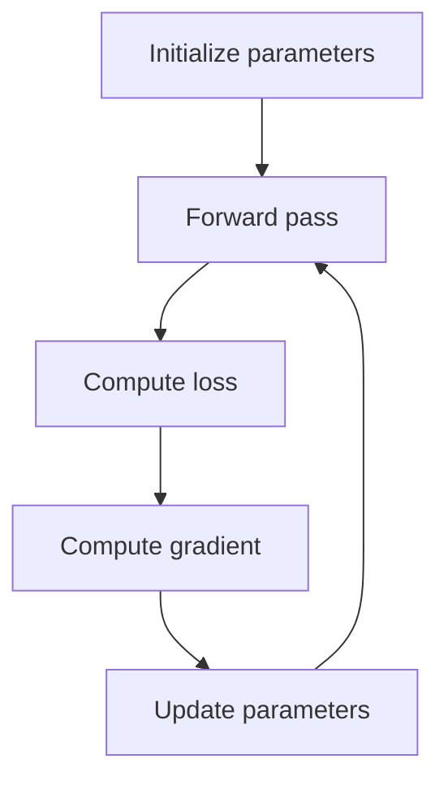

# Lecture 08 — Gradient Descent: Teaching a Model to Improve

> **The Big Question:** Once the gradient tells us which way is downhill, how do we choose a step that is useful rather than dangerous?

▶️ **Run the code:** [Open in Colab](https://colab.research.google.com/github/manish7725/deeplearning/blob/main/Lecture%2008%20-%20Gradient%20Descent%202/notebook.ipynb) · [`notebook.ipynb`](<notebook.ipynb>)

## Where We Are

**Previously:** Chapter 07 assembled partial derivatives into a gradient and used the chain rule to calculate it.

**Today:** We turn the gradient into an iterative learning algorithm. We discover the update rule, learning rate, convergence, overshooting, and batch variants.

**Next:** The mathematics of the loss itself becomes the next question: where do sensible loss functions come from?

---

## 1. The Problem: We Know the Direction, But Not the Distance

Suppose

$$
L(w)=(w-3)^2
$$

and we start at $w=0$.

The gradient is

$$
\frac{dL}{dw}=2(w-3)=-6.
$$

So the loss decreases if we move to the right.

But how far?

A tiny move may help but waste time. A huge move may leap over the valley.

That leaves us with a precise question:

> **How can the derivative become a controlled parameter update?**

---

## 2. What Would a Solution Need?

A training step should:

1. move opposite the gradient;
2. let us control the step size;
3. repeat the same rule many times;
4. reduce loss on the simple example when the step is sensible;
5. reveal when the step is too aggressive.

The second requirement gives us a new quantity: the **learning rate**.

---

## 3. First Attempt: Always Move by One Unit

At $w=0$, the derivative is $-6$. One tempting rule is simply

$$
w_{new}=w_{old}+1.
$$

This moves in the correct direction. But notice the problem: the derivative is ignored.

At a nearly flat point such as $w=2.9$, the derivative is only $-0.2$, yet the same rule still jumps by 1.

> ⚠️ **A Tempting Wrong Idea**
>
> *"Once I know the direction, use a fixed-size step."*
>
> This throws away the gradient magnitude. A steep region and a flat region deserve different step suggestions.

We want the gradient to influence both **direction** and the raw size of the proposed move.

---

## 4. The Discovery: Move Opposite the Gradient

The gradient points toward local increase. Therefore the negative gradient points toward local decrease.

Scale that direction by a positive number $\eta$:

$$
\boxed{w_{new}=w_{old}-\eta\frac{dL}{dw}}.
$$

For many parameters,

$$
\boxed{\boldsymbol\theta_{new}=\boldsymbol\theta_{old}-\eta\nabla_{\theta}L}.
$$

Here $\eta$ is the **learning rate**.

| Level | The same idea |
|---|---|
| 💡 **Intuition** | The gradient tells you which way the hill rises. $\eta$ decides how large your walking step is. |
| ✏️ **Numbers** | At $w=0$, gradient $=-6$, $\eta=0.1$: $w_{new}=0-0.1(-6)=0.6$. |
| 🎓 **Abstraction** | Parameters move along the negative gradient by a step scaled by $\eta$. |

---

## 5. Follow the Same Rule Repeatedly

Start with

$$
w_0=0,\qquad \eta=0.1.
$$

Then

$$
\begin{aligned}
\nabla L(w_0)&=-6,\\
w_1&=0.6.
\end{aligned}
$$

At $w=0.6$:

$$
\nabla L=2(0.6-3)=-4.8,
$$

so

$$
w_2=0.6-0.1(-4.8)=1.08.
$$

At $w=1.08$:

$$
\nabla L=-3.84,
$$

and

$$
w_3=1.464.
$$

The sequence

$$
0\rightarrow0.6\rightarrow1.08\rightarrow1.464\rightarrow\cdots
$$

moves toward 3.

The important discovery is not the particular numbers. It is the loop: **measure slope → move → measure again**.

---

## 6. Why the Learning Rate Matters

The same gradient can produce very different behavior depending on $\eta$.

For our quadratic,

$$
w_{new}=w-\eta\,2(w-3).
$$

Rearrange around the optimum by defining $e=w-3$:

$$
e_{new}=(1-2\eta)e.
$$

Now the behavior is visible.

### Small step

If $0<\eta<0.5$, then $|1-2\eta|<1$, so the error shrinks each step.

### Critical edge

At $\eta=0.5$:

$$
e_{new}=0.
$$

For this particular quadratic, the method reaches the minimum in one update.

### Too large

If $\eta>1$, then $|1-2\eta|>1$ and the error grows. Training becomes unstable.

This is a useful precision point: **the safe range depends on the curvature of the loss**, not on a universal magic number.

---

## 7. Geometry: Walking Across a Bowl

Imagine a bowl-shaped loss surface.

At any point, the gradient is the local uphill arrow. The update uses the arrow pointing the other way.

```text
loss
 ↑
 |        ↘  gradient points uphill
 |      /   \
 |     /  ↓  \
 |____/___●___\____→ parameter
          
       −gradient
```

Each step uses only local information. Gradient descent does **not** need the full loss landscape stored in memory.

It asks the same small question again and again:

> *Given where I am now, which nearby direction decreases loss?*

---

## 8. The Training Loop

The complete learning process is:



This is the skeleton behind a huge family of machine-learning training systems.

The sophistication comes from the model, data, loss, hardware, and optimization details. The skeleton remains recognizable.

---

## 9. What If There Are Many Examples?

Suppose the model has training examples

$$
(x_1,y_1),\ldots,(x_n,y_n).
$$

A loss such as mean squared error is

$$
L(\theta)=\frac{1}{n}\sum_{i=1}^{n}\ell_i(\theta).
$$

We can calculate the gradient using all examples, one example, or a small batch.

### Batch gradient descent

Use the entire dataset for each update.

### Stochastic gradient descent

Use one example for each update.

### Mini-batch gradient descent

Use a small subset such as 32 or 128 examples.

Mini-batches usually provide a practical balance between noisy estimates and efficient matrix operations on modern hardware.

---

## 10. A Tiny House-Price Training Example

Return to the running house model:

$$
\hat y=wx+b.
$$

For the four houses from Chapter 1,

$$
(x,y)=(1,3),(2,5),(3,7),(4,9).
$$

Suppose we begin with $w=1$, $b=0$.

Predictions are $1,2,3,4$, so the errors are

$$
-2,-3,-4,-5.
$$

The MSE is

$$
\frac{4+9+16+25}{4}=13.5.
$$

The gradients are

$$
\frac{\partial L}{\partial w}
=\frac{2}{n}\sum_i(\hat y_i-y_i)x_i,
$$

$$
\frac{\partial L}{\partial b}
=\frac{2}{n}\sum_i(\hat y_i-y_i).
$$

Compute them:

$$
\frac{\partial L}{\partial w}
=\frac{2}{4}[(-2)(1)+(-3)(2)+(-4)(3)+(-5)(4)]
=-25,
$$

and

$$
\frac{\partial L}{\partial b}
=\frac{2}{4}(-14)=-7.
$$

With $\eta=0.1$:

$$
w_1=1-0.1(-25)=3.5,
$$
$$
b_1=0-0.1(-7)=0.7.
$$

One gradient step moves the parameters toward the true relationship.

The exact next loss is not the point yet. What matters is that the update was produced by a reusable rule, not by guessing the answer.

---

## 11. 🔬 Experiment: Make Gradient Descent Fail

This is the experiment you should not skip.

Train the same quadratic with three learning rates:

$$
\eta=0.1,\quad 0.5,\quad 1.1.
$$

Predict the behavior before running:

| Learning rate | Prediction |
|---:|---|
| 0.1 | converge smoothly |
| 0.5 | reach the minimum immediately for this quadratic |
| 1.1 | oscillate and grow in magnitude |

The notebook plots all three.

A method is not understood until you know how it fails.

---

## 12. History Lens — Cauchy and the Search for Descent

Imagine Augustin-Louis Cauchy in the nineteenth century studying how to minimize complicated functions numerically. The problem was not merely to solve equations exactly, but to construct a sequence that moves toward a minimum.

The steepest-descent idea emerged from this broader numerical-optimization tradition. What machine learning later inherited was a powerful pattern: use local derivative information to decide a direction, then make repeated updates.

The historical lesson is simple: gradient descent did not appear as "AI magic." It grew from a much older mathematical problem — **how do we optimize a function when solving it exactly is difficult?**

---

## 13. Distinctions That Matter

| Confusable pair | Difference |
|---|---|
| gradient vs update | gradient is information; update is an action using that information |
| learning rate vs gradient | $\eta$ sets scale; gradient supplies direction and local magnitude |
| convergence vs zero loss | parameters may settle at a local stationary point without perfect training loss |
| batch vs epoch | batch is one parameter-update group; epoch is one pass through the training data |
| stochastic vs random guessing | stochastic training uses a computed gradient from sampled data; it is not directionless |

---

## What We Discovered

1. **The negative gradient gives a local downhill direction.**
2. **The learning rate turns that direction into a step size.**
3. **Repeating the update creates an optimization trajectory.**
4. **Learning rate controls stability and speed.**
5. **Real datasets lead naturally to batch and mini-batch gradient estimates.**
6. **Failure at large learning rates is a mathematical behavior, not a mysterious software bug.**

---

## Mathematics We Built

$$
\boldsymbol\theta_{new}=\boldsymbol\theta_{old}-\eta\nabla_\theta L
$$

For $L(w)=(w-3)^2$:

$$
\frac{dL}{dw}=2(w-3)
$$

and with $e=w-3$:

$$
 e_{new}=(1-2\eta)e.
$$

For MSE:

$$
\frac{\partial L}{\partial w}=\frac{2}{n}\sum_i(\hat y_i-y_i)x_i,
\qquad
\frac{\partial L}{\partial b}=\frac{2}{n}\sum_i(\hat y_i-y_i).
$$

---

## What Each Symbol Means

| Symbol | Read it as | Meaning | In code |
|---|---|---|---|
| $\eta$ | “eta” | learning rate | `learning_rate` |
| $\boldsymbol\theta$ | “theta” | all trainable parameters | `theta` |
| $\nabla L$ | “gradient of L” | vector of partial derivatives | `gradient` |
| $e$ | “error coordinate” | distance from the quadratic minimum in our analysis | `e` |
| $n$ | “n” | number of training examples | `n` |

---

## One-Minute Explanation

Gradient descent is a loop. Calculate the current loss, calculate how each parameter changes that loss, then move the parameters slightly in the direction that reduces the loss. The gradient gives the direction and local strength. The learning rate controls how big the move is. Repeat until progress becomes small or another stopping rule is reached.

---

## Exercises

### Level 1 — Observe

Look at the three learning-rate curves. Identify which one converges and which one diverges.

### Level 2 — Calculate

For $L(w)=(w-5)^2$, $w_0=0$, and $\eta=0.2$, calculate the first three updates by hand.

### Level 3 — Derive

Derive the recurrence $e_{new}=(1-2\eta)e$ for $L(w)=(w-3)^2$.

### Level 4 — Investigate

Change only $\eta$ in the notebook. Find an approximate largest stable value for this quadratic and compare it with the algebraic condition $|1-2\eta|<1$.

### Level 5 — Design

Design a two-parameter quadratic loss with different curvature in the two directions. Predict which coordinate will require smaller steps and test your prediction.

---

## Common Mistakes

| Mistake | Why it is wrong |
|---|---|
| Removing the minus sign | that reverses downhill into uphill movement |
| Treating learning rate as part of the model | it controls optimization; it is not usually a learned prediction parameter |
| Assuming a bigger learning rate always learns faster | large steps can overshoot or diverge |
| Confusing one batch with one epoch | many batches usually make one epoch |
| Believing convergence guarantees the global minimum | non-convex losses can contain local minima and other stationary behavior |

---

## Socratic Questions

1. Why does the gradient need a learning-rate multiplier?
2. Why can a larger learning rate make convergence worse?
3. Why is the recurrence $e_{new}=(1-2\eta)e$ so useful for understanding stability?
4. Why are mini-batches computationally attractive as well as statistically imperfect?
5. What changes when the loss landscape is not a simple bowl?

---

## 🔭 Bridge to Chapter 09

We now know how to minimize a loss once one has been chosen.

But that exposes a deeper question:

> **Why did we choose squared error in the first place?**

A loss function is not magic. It encodes assumptions about data and what errors should matter.

> **Next: Describing Data — mean, variance and distributions, so we can reason about what a dataset is actually telling us.**
