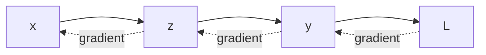

# Lecture 09 — Backpropagation: How Error Travels Backward

<!-- NOTEBOOK-LAB-NAV -->

## 🧪 Interactive Lab

The matching notebook is the hands-on laboratory for this lesson.

**[📓 Open the notebook on GitHub](https://github.com/manish7725/deeplearning/blob/main/Lecture%2009%20-%20Backpropagation:%20How%20Error%20Travels%20Backward/notebook.ipynb)** · **[▶ Open in Google Colab](https://colab.research.google.com/github/manish7725/deeplearning/blob/main/Lecture%2009%20-%20Backpropagation:%20How%20Error%20Travels%20Backward/notebook.ipynb)**

## 🧭 Where this lesson fits

**Previous lesson:** Gradient Descent — we learned how a parameter should move when we know its gradient.

**Today:** We learn how to calculate those gradients efficiently when a prediction is made through several connected operations.

**Next lesson:** Multiple neurons become layers, and matrix multiplication lets us compute an entire layer at once.

The big question is simple:

> If the loss depends on a parameter through many intermediate steps, how can we know how strongly that parameter affected the final error?

---

## 1. A tiny chain of calculations

Start with three operations:

$$
x \rightarrow z \rightarrow y \rightarrow L$$

Let

$$
z = 2x$$

$$
y = z + 3$$

$$
L = y^2
$$

Suppose $x=1$.

Then

$$
z=2,
\qquad y=5,
\qquad L=25
$$

The computer can move forward easily.

But learning asks the reverse question:

> **How would changing $x$ change the loss?**

That is

$$
\frac{dL}{dx}
$$

---

## 2. The chain rule is the bridge

The loss does not depend on $x$ directly.

It depends on $x$ through $z$ and $y$.

So we break one difficult derivative into three understandable pieces:

$$
\frac{dL}{dx}
=
\frac{dL}{dy}
\frac{dy}{dz}
\frac{dz}{dx}
$$

For our example:

$$
\frac{dL}{dy}=2y=10
$$

$$
\frac{dy}{dz}=1
$$

$$
\frac{dz}{dx}=2
$$

Therefore

$$
\frac{dL}{dx}=10\times1\times2=20
$$

A small change in $x$ produces an approximately $20$ times larger change in the loss near this point.

> 💡 **The chain rule turns a long dependency into a product of local effects.**

That is the mathematical heart of backpropagation.

---

## 3. Why go backward?

During the forward pass we calculate:

```text
x → z → y → loss
```

After the loss is known, we travel in the opposite direction:

```text
loss → y → z → x
```

At every step we ask:

> How much does the current quantity affect the quantity immediately before it?

Then we multiply that local derivative by the gradient already flowing from the right.



The forward pass computes **values**.

The backward pass computes **sensitivities**.

---

## 4. A complete two-parameter example

Now let the model be a single neuron:

$$
z = wx+b$$

and use squared loss:

$$
L=(z-y)^2
$$

Take

$$
x=2,\quad y=7,\quad w=1,\quad b=0
$$

Forward pass:

$$
z=1(2)+0=2
$$

So

$$
L=(2-7)^2=25
$$

Now work backward.

First:

$$
\frac{dL}{dz}=2(z-y)=2(2-7)=-10
$$

Because

$$
z=wx+b
$$

we have

$$
\frac{dz}{dw}=x=2
$$

and

$$
\frac{dz}{db}=1
$$

Therefore

$$
\frac{dL}{dw}
=
\frac{dL}{dz}\frac{dz}{dw}
=(-10)(2)=-20
$$

and

$$
\frac{dL}{db}
=
\frac{dL}{dz}\frac{dz}{db}
=(-10)(1)=-10
$$

The two parameters have different gradients because they influence the output differently.

---

## 5. Turn gradients into learning

Now gradient descent can take over.

Choose

$$
\eta=0.1
$$

Then

$$
w_{new}=w-\eta\frac{dL}{dw}
=1-0.1(-20)=3
$$

and

$$
b_{new}=b-\eta\frac{dL}{db}
=0-0.1(-10)=1
$$

The parameters moved in directions that should reduce the loss.

So the complete learning story is now:

$$
\boxed{
\text{forward}\rightarrow\text{loss}\rightarrow\text{backward}\rightarrow\text{update}
}
$$

---

## 6. Backpropagation is not a different derivative

This distinction matters.

**Calculus** gives us the chain rule.

**Backpropagation** is an efficient procedure for applying that rule to a computational graph.

So:

| Idea | What it means |
|---|---|
| Derivative | sensitivity of one quantity to another |
| Chain rule | how sensitivities multiply through a chain |
| Computational graph | the operations connecting inputs to loss |
| Backpropagation | systematic reverse traversal of that graph |

Backpropagation is therefore an **algorithm built from calculus**, not a new law of mathematics.

---

## 7. The computational graph

Write a model as small operations:

```text
x ----× w----+
              |
              +---- z ---- loss
              |
b ------------+
```

Each operation has a local derivative.

For multiplication:

$$
z=wx
$$

we know

$$
\frac{\partial z}{\partial w}=x
$$

and

$$
\frac{\partial z}{\partial x}=w
$$

For addition:

$$
z=a+b
$$

both local derivatives are $1$.

Backpropagation simply connects these local rules together.

---

## 8. Why this scales

A neural network may have thousands, millions, or billions of parameters.

Differentiating one giant expression by hand would be painful.

Backpropagation instead stores intermediate values from the forward pass and reuses local derivatives during the backward pass.

The important computational idea is **reuse**.

If one intermediate value affects many later operations, we do not repeatedly rebuild the entire calculation from scratch.

This is why automatic differentiation systems can calculate gradients for enormous networks.

---

## 9. A small manual implementation

```python
x = 2.0
w = 1.0
b = 0.0
y = 7.0

# forward
z = w * x + b
loss = (z - y) ** 2

# backward
_dloss_dz = 2 * (z - y)
dloss_dw = _dloss_dz * x
dloss_db = _dloss_dz

print("prediction:", z)
print("loss:", loss)
print("dL/dw:", dloss_dw)
print("dL/db:", dloss_db)
```

Nothing here is magic.

We wrote every derivative ourselves.

That is the best way to understand what a deep-learning framework later automates.

---

## 10. PyTorch does the bookkeeping

```python
import torch

x = torch.tensor(2.0)
w = torch.tensor(1.0, requires_grad=True)
b = torch.tensor(0.0, requires_grad=True)
y = torch.tensor(7.0)

z = w * x + b
loss = (z - y) ** 2

loss.backward()

print(w.grad)
print(b.grad)
```

PyTorch builds a computation graph while evaluating the forward pass and then applies reverse-mode automatic differentiation when `backward()` is called.

The values should match our manual calculation.

---

## 11. The most important mental model

Think of every operation as a tiny machine.

The forward pass asks:

> What value comes out?

The backward pass asks:

> How much does the output care about each input?

For a multiplication node:

$$
z=ab
$$

if the gradient arriving from the right is $g=\partial L/\partial z$, then the node sends back

$$
\frac{\partial L}{\partial a}=gb
$$

and

$$
\frac{\partial L}{\partial b}=ga
$$

That local rule can be reused everywhere.

---

## Think Like a Scientist 🧠

For

$$
u=3x+2,
\qquad L=(u-10)^2
$$

start with $x=1$.

1. Calculate $u$ and $L$.
2. Calculate $dL/du$.
3. Calculate $du/dx$.
4. Multiply them to obtain $dL/dx$.
5. Predict what happens to the loss if $x$ increases by a tiny amount.

The goal is not memorization. The goal is to see the chain.

---

## What you should remember

> **Backpropagation is the chain rule applied backward through a computational graph so that every parameter receives its gradient.**

The pattern is:

$$
\boxed{
\text{forward values}
\rightarrow
\text{loss}
\rightarrow
\text{local derivatives}
\rightarrow
\text{backward gradients}
}
$$

We now have all the ingredients for one trainable neuron.

But a real network does not contain only one number flowing through one equation.

> **Next: layers — many neurons working together as matrices.**

---

# 📚 Go Deeper

Draw a computational graph for any expression you know, such as

$$
L=(2x+1)^2
$$

Then derive its gradient in two ways: expand the square first, or apply the chain rule node by node. You should get the same answer.
