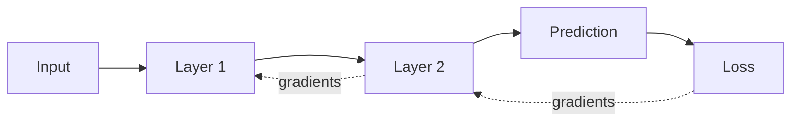

# Blog 10 — Backpropagation: Sending the Error Backward

<!-- NOTEBOOK-LAB-NAV -->

## 🧪 Interactive Lab

The matching notebook is the complete hands-on laboratory for this lesson. It contains the runnable code, experiments, visualizations, and challenges.

**[📓 Open the notebook on GitHub](https://github.com/manish7725/deeplearning/blob/main/Lecture%2010%20-%20Backpropagation%3A%20Sending%20the%20Error%20Backward/notebook.ipynb)**  · **[▶ Open the notebook in Google Colab](https://colab.research.google.com/github/manish7725/deeplearning/blob/main/Lecture%2010%20-%20Backpropagation%3A%20Sending%20the%20Error%20Backward/notebook.ipynb)**


## 🧭 Where this lesson fits

**Previous lesson:** Blog 09 — Gradient Descent: Teaching a Model to Improve.

**Today:** Blog 10 — Backpropagation: Sending the Error Backward.

**Next lesson:** Blog 11 — Tensors: Numbers in Many Dimensions.

**Student rule:** if you cannot explain why this lesson follows the previous one, stop and reread the final takeaway of the previous blog. The equations below should feel like a continuation, not a new language.


## 1. A tiny two-step network

Imagine

$$
x\rightarrow z\rightarrow \hat y
$$

where

$$
z=wx
$$

and

$$
\hat y=vz
$$

The loss is

$$
L=(\hat y-y)^2
$$

The question is:

> How much should $w$ and $v$ change to reduce $L$?

---

## 2. The chain rule does the work

Because

$$
w\rightarrow z\rightarrow\hat y\rightarrow L
$$

we can write

$$
\frac{dL}{dw}
=
\frac{dL}{d\hat y}
\frac{d\hat y}{dz}
\frac{dz}{dw}
$$

Each term describes one local effect.

The chain rule connects them into the total effect.

---

## 3. Calculate every piece

We have

$$
L=(\hat y-y)^2
$$

so

$$
\frac{dL}{d\hat y}=2(\hat y-y)
$$

Since

$$
\hat y=vz
$$

we have

$$
\frac{d\hat y}{dz}=v
$$

and because

$$
z=wx
$$

we have

$$
\frac{dz}{dw}=x
$$

Therefore

$$
\boxed{
\frac{dL}{dw}=2(\hat y-y)vx
}
$$

We have just calculated a gradient through a two-layer computation.

---

## 4. A numerical example

Let

$$
x=2,\quad w=3,\quad v=4,\quad y=30
$$

Forward pass:

$$
z=wx=3(2)=6
$$

$$
\hat y=vz=4(6)=24
$$

Loss:

$$
L=(24-30)^2=36
$$

Now the gradient for $w$ is

$$
\frac{dL}{dw}=2(24-30)(4)(2)=-96
$$

The negative sign says increasing $w$ would locally reduce this loss.

---

## 5. Why “backpropagation”?

The forward pass goes

```text
input → layer 1 → layer 2 → prediction
```

The backward pass goes

```text
loss → layer 2 → layer 1 → input-side parameters
```

It propagates derivatives from the output toward earlier parameters.



The arrows going backward represent gradient information, not data flowing backward through time.

---

## 6. Computational graphs

A neural network can be represented as a graph of operations:

$$
x\rightarrow w x\rightarrow v(wx)\rightarrow(\hat y-y)^2
$$

Each node knows its local derivative.

Backpropagation combines these local derivatives using the chain rule.

This is why automatic differentiation systems can work with complicated programs.

---

## 7. Backpropagation is not the optimizer

This distinction is important.

**Backpropagation calculates gradients.**

**Gradient descent or Adam uses those gradients to update parameters.**

So the training process is better written as:

$$
\text{forward}
\rightarrow
\text{loss}
\rightarrow
\text{backward}
\rightarrow
\text{optimizer step}
$$

---

## 8. PyTorch makes the backward pass simple

```python
import torch

x = torch.tensor(2.0)
w = torch.tensor(3.0, requires_grad=True)
v = torch.tensor(4.0, requires_grad=True)
y = torch.tensor(30.0)

z = w * x
y_hat = v * z
loss = (y_hat - y) ** 2

loss.backward()

print("loss:", loss.item())
print("dw:", w.grad.item())
print("dv:", v.grad.item())
```

PyTorch builds a computational graph while evaluating the expressions and then calculates derivatives when `backward()` is called.

---

## 9. Why this scales

A modern network may have millions or billions of parameters.

Writing a separate derivative formula by hand for every parameter would be impractical.

Backpropagation provides a systematic way to reuse intermediate calculations and compute gradients efficiently.

That efficiency is one of the reasons deep learning became practical.

---

## 10. A useful mental model

Think of every operation as a small machine.

The forward pass records what happened.

The backward pass asks:

> “If the final loss changed a little, how much did this operation contribute to that change?”

Each operation passes responsibility backward using its local derivative.

This is sometimes called **credit assignment**.

---

## Think Like a Scientist 🧠

Draw the computation:

$$
x=2\rightarrow z=wx\rightarrow\hat y=vz\rightarrow L=(\hat y-y)^2
$$

For each arrow, write the local derivative.

Then multiply them.

You will have reconstructed backpropagation from first principles.

---

## What you should remember

> **Backpropagation is the systematic application of the chain rule to calculate gradients through a computational graph.**

It is not magic and it is not the optimizer.

The roles are:

- forward pass → calculate prediction;
- loss → measure error;
- backpropagation → calculate gradients;
- optimizer → update parameters.

We have now seen vectors, matrices, neurons, activations, loss, derivatives, gradient descent and backpropagation.

Next we need a larger mathematical container capable of representing images, batches, sequences and much more.

> **Next: tensors — numbers in many dimensions.**

---

# 📚 Go Deeper — Backpropagation From Multiple Angles

**Welch Labs** is particularly valuable for this exact topic: its backpropagation material explicitly derives the algorithm using high-school-level calculus and provides supporting code and equations.

**3Blue1Brown** is the visual companion for understanding what gradients mean inside a network and how the algebra maps onto the architecture.

Use **MrJensenMath10** for chain-rule and calculus fluency, and **Frame Zero** for another intuitive ML explanation.

Later, **ZacharyLLM** and **Visual Kernel** can help you connect the same computational-graph idea to attention and transformer systems.

### The key distinction to preserve

Never collapse these four concepts into one:

```text
Forward pass       → what does the network predict?
Loss               → how wrong is it?
Backpropagation    → how does each parameter affect the loss?
Optimizer          → how should parameters change?
```

That separation will make PyTorch training loops much easier to understand later.
