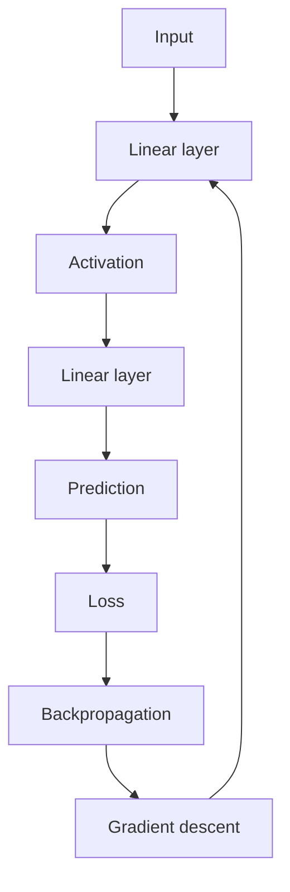

# Lecture 11 — Activation Functions: Making Networks Nonlinear

<!-- NOTEBOOK-LAB-NAV -->

## 🧪 Interactive Lab

**[📓 Open the notebook on GitHub](https://github.com/manish7725/deeplearning/blob/main/Lecture%2011%20-%20Activation%20Functions:%20Making%20Networks%20Nonlinear/notebook.ipynb)** · **[▶ Open in Google Colab](https://colab.research.google.com/github/manish7725/deeplearning/blob/main/Lecture%2011%20-%20Activation%20Functions:%20Making%20Networks%20Nonlinear/notebook.ipynb)**

## 🧭 Where this lesson fits

**Previous lesson:** We turned many neurons into matrix operations and built layers.

**Today:** We discover why layers of only linear operations are still just one linear operation, and how an activation function breaks that limitation.

**Next lesson:** With neurons, layers, activations and backpropagation in place, we can assemble and train a complete multilayer network.

The big question:

> **Why can a network with many layers learn things that one straight line cannot?**

---

## 1. A network made only of linear layers looks deep

Suppose one layer is

$$
\mathbf h=W_1\mathbf x+\mathbf b_1
$$

and another is

$$
\mathbf z=W_2\mathbf h+\mathbf b_2
$$

Substitute the first equation into the second:

$$
\mathbf z=W_2(W_1\mathbf x+\mathbf b_1)+\mathbf b_2
$$

Distribute:

$$
\mathbf z=W_2W_1\mathbf x+W_2\mathbf b_1+\mathbf b_2
$$

Define

$$
W=W_2W_1,
\qquad
\mathbf b=W_2\mathbf b_1+\mathbf b_2
$$

Then

$$
\mathbf z=W\mathbf x+\mathbf b
$$

The two layers collapsed into one.

Add ten linear layers and the same kind of collapse happens.

> ⚠️ **Depth without nonlinearity does not buy us expressive power.**

We need a new operation between layers.

---

## 2. The activation function

After a neuron computes

$$
z=\mathbf w^T\mathbf x+b
$$

we apply a function:

$$
a=\phi(z)
$$

The function $\phi$ is the **activation function**.

A layer becomes

$$
\mathbf a=\phi(W\mathbf x+\mathbf b)
$$

where the activation is usually applied element by element.

For example, if

$$
\mathbf z=
\begin{bmatrix}-2\\0.5\\3\end{bmatrix}
$$

then

$$
\phi(\mathbf z)=
\begin{bmatrix}
\phi(-2)\\
\phi(0.5)\\
\phi(3)
\end{bmatrix}
$$

---

## 3. ReLU: the simplest useful example

The most familiar activation in modern deep networks is ReLU:

$$
\operatorname{ReLU}(z)=\max(0,z)
$$

It behaves like this:

```text
negative z  →  0
positive z  →  z
```

Examples:

$$
\operatorname{ReLU}(-3)=0
$$

$$
\operatorname{ReLU}(0)=0
$$

$$
\operatorname{ReLU}(4)=4
$$

So ReLU keeps positive evidence and removes negative values.

---

## 4. Draw ReLU as a graph

For negative values, the graph lies on the horizontal axis.

For positive values, it follows the line $y=z$.

That tiny bend at zero is important.

A straight line cannot bend.

ReLU can.

And once we compose many functions that can bend, we can build complicated shapes.

> 💡 **Nonlinearity is what prevents a deep stack from collapsing into one big linear transformation.**

---

## 5. Another activation: sigmoid

The sigmoid function is

$$
\sigma(z)=\frac{1}{1+e^{-z}}
$$

Its output lies between $0$ and $1$.

For example,

$$
\sigma(0)=0.5
$$

and large positive numbers approach $1$, while large negative numbers approach $0$.

This makes sigmoid useful when we want to interpret one output as a probability-like quantity, especially in binary classification.

But sigmoid has an important training problem: its derivative can become very small for large positive or negative inputs.

---

## 6. Why derivatives matter again

Backpropagation needs derivatives.

For ReLU:

$$
\frac{d}{dz}\operatorname{ReLU}(z)=
\begin{cases}
0,&z<0\\
1,&z>0
\end{cases}
$$

At $z=0$ the ordinary derivative is not defined, but implementations can choose a convenient subgradient convention.

For sigmoid:

$$
\sigma'(z)=\sigma(z)(1-\sigma(z))
$$

Notice what this means for learning.

The activation is not only changing the forward computation.

It is also changing how gradients flow backward.

---

## 7. A complete neuron with ReLU

Take

$$
z=w_1x_1+w_2x_2+b
$$

with

$$
\mathbf x=
\begin{bmatrix}2\\-1\end{bmatrix},
\quad
\mathbf w=
\begin{bmatrix}1\\3\end{bmatrix},
\quad
b=1
$$

First calculate the pre-activation:

$$
z=1(2)+3(-1)+1=0
$$

Then

$$
a=\operatorname{ReLU}(0)=0
$$

Try changing the bias to $b=2$:

$$
z=1(2)+3(-1)+2=1
$$

Now

$$
a=\operatorname{ReLU}(1)=1
$$

A one-unit change in the bias moved the neuron across the nonlinear boundary.

---

## 8. Two layers with activation

Now write a genuine two-layer network:

$$
\mathbf h=\operatorname{ReLU}(W_1\mathbf x+\mathbf b_1)
$$

$$
\mathbf y=W_2\mathbf h+\mathbf b_2
$$

This cannot generally be collapsed into one linear transformation.

The first layer creates intermediate features.

The ReLU bends the representation.

The second layer combines those transformed features into an output.

This is the basic recipe behind a huge family of neural networks.

---

## 9. A surprising example: XOR

Consider the XOR rule:

| $x_1$ | $x_2$ | XOR |
|---:|---:|---:|
| 0 | 0 | 0 |
| 0 | 1 | 1 |
| 1 | 0 | 1 |
| 1 | 1 | 0 |

No single straight line can separate the two classes perfectly in the input plane.

A linear model cannot solve this classification problem.

A small network with a hidden layer and nonlinear activations can transform the input space so that the final classes become separable.

This is one of the clearest demonstrations of why nonlinearity matters.

---

## 10. Activation is not “decision making”

It is tempting to say that a neuron activates when it “decides” something.

That metaphor can be useful, but it can also become misleading.

Mathematically, an activation is simply a function:

$$
a=\phi(z)
$$

There is no tiny person inside the neuron making a conscious choice.

The network learns weights and biases so that these transformations produce useful intermediate representations.

Keeping the mathematics visible prevents the metaphor from taking over.

---

## 11. Compare common activations

| Activation | Formula | Typical role |
|---|---|---|
| ReLU | $\max(0,z)$ | common hidden-layer activation |
| Sigmoid | $1/(1+e^{-z})$ | binary output probability / gates |
| Tanh | $(e^z-e^{-z})/(e^z+e^{-z})$ | older hidden-layer choice, centered at 0 |
| Softmax | $e^{z_i}/\sum_j e^{z_j}$ | multi-class output probabilities |

There is no single activation that is best for every location.

The hidden layers and output layer can use different choices because they serve different mathematical purposes.

---

## 12. Softmax as a special case

Suppose three output scores are

$$
\mathbf z=[2,1,0]
$$

Softmax converts them into positive values that sum to $1$:

$$
\operatorname{softmax}(z_i)
=
\frac{e^{z_i}}{e^2+e^1+e^0}
$$

The largest score gets the largest probability.

The scores are often called **logits** before softmax.

The important idea is that softmax couples the outputs: changing one logit changes all normalized probabilities.

---

## 13. Code the functions yourself

```python
import numpy as np

z = np.array([-2., -0.5, 0., 1., 3.])

relu = np.maximum(0, z)
sigmoid = 1 / (1 + np.exp(-z))

print('z      :', z)
print('ReLU   :', relu)
print('sigmoid:', sigmoid)
```

Try plotting both curves.

Look at where each function changes rapidly and where its derivative becomes small.

---

## 14. PyTorch activation modules

```python
import torch
import torch.nn as nn

x = torch.tensor([-2.0, -0.5, 1.0, 3.0])

print(nn.ReLU()(x))
print(nn.Sigmoid()(x))
```

Again, the framework is implementing equations we already understand.

Knowing the equation first makes the library easier to use correctly.

---

## 15. The full neuron recipe

We can finally write the basic sequence clearly:

$$
\boxed{
\mathbf x
\xrightarrow{W,\mathbf b}
\mathbf z=W\mathbf x+\mathbf b
\xrightarrow{\phi}
\mathbf a=\phi(\mathbf z)
}
$$

A multilayer network repeats this recipe:

$$
\mathbf a_1=\phi(W_1\mathbf x+\mathbf b_1)
$$

$$
\mathbf a_2=\phi(W_2\mathbf a_1+\mathbf b_2)
$$

and so on.

Now there is genuine depth because each activation changes the function being composed.

---

## 16. The training loop now has a complete shape

We can connect everything learned so far:



The network learns by repeatedly moving through this loop.

The architecture creates a function.

The loss judges it.

Backpropagation calculates responsibility.

Gradient descent changes the parameters.

---

## Think Like a Scientist 🧠

Consider

$$
L(x)=(\operatorname{ReLU}(x)-2)^2.
$$

1. What is the loss when $x=-1$?
2. What is the loss when $x=1$?
3. What is the derivative of the loss for $x>0$?
4. What happens to the gradient for $x<0$?

This exercise shows something subtle: an activation can change not only the prediction, but whether a gradient is allowed to pass backward.

---

## What you should remember

> **Activation functions add nonlinearity, stop stacked layers from collapsing into one linear transformation, and shape how gradients flow during training.**

The complete hidden-layer pattern is

$$
\boxed{
\mathbf a=\phi(W\mathbf x+\mathbf b)
}
$$

At this point, the pieces of a basic deep-learning system fit together:

- vectors represent inputs;
- matrices represent many neurons;
- activations add nonlinearity;
- losses measure error;
- backpropagation calculates gradients;
- gradient descent updates parameters.

> **Next: put all of these pieces together and train a complete neural network from scratch.**

---

# 📚 Go Deeper

Experiment with the same two-layer network using ReLU, sigmoid and tanh. Keep the weights fixed and change only the activation. Compare the resulting outputs and gradients. This turns “activation function” from a vocabulary word into something you can observe.
