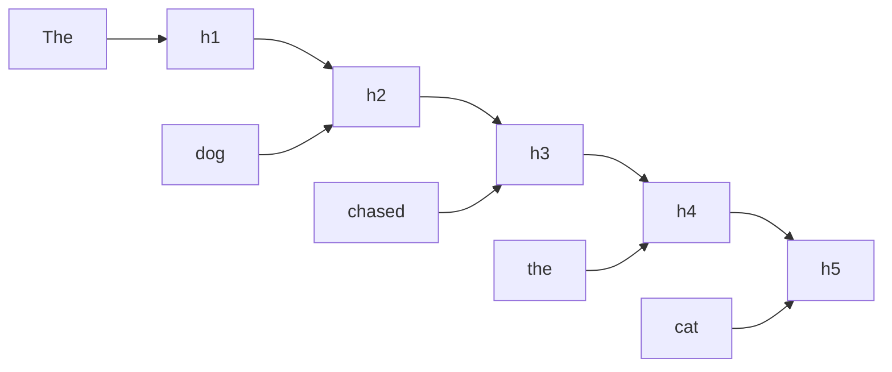
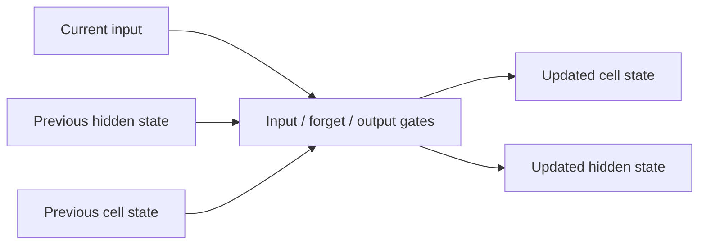

# Blog 14 — When Order Matters: Learning From Sequences

<!-- NOTEBOOK-LAB-NAV -->

## 🧪 Interactive Lab

The matching notebook is the complete hands-on laboratory for this lesson. It contains the runnable code, experiments, visualizations, and challenges.

**[📓 Open the notebook on GitHub](https://github.com/manish7725/deeplearning/blob/main/Lecture%2014%20-%20When%20Order%20Matters%3A%20Learning%20From%20Sequences/notebook.ipynb)**  · **[▶ Open the notebook in Google Colab](https://colab.research.google.com/github/manish7725/deeplearning/blob/main/Lecture%2014%20-%20When%20Order%20Matters%3A%20Learning%20From%20Sequences/notebook.ipynb)**


## 🧭 Where this lesson fits

**Previous lesson:** Blog 13 — How a Neural Network Learns to See: Convolution.

**Today:** Blog 14 — When Order Matters: Learning From Sequences.

**Next lesson:** Blog 15 — How Can a Computer Represent the Meaning of a Word?.

**Student rule:** if you cannot explain why this lesson follows the previous one, stop and reread the final takeaway of the previous blog. The equations below should feel like a continuation, not a new language.


## 1. What is a sequence?

A sequence is an ordered collection:

$$
x_1,x_2,x_3,\ldots,x_T
$$

Examples include:

- words in a sentence;
- audio samples;
- stock measurements over time;
- sensor readings;
- user actions.

The model often needs information from earlier positions to interpret later ones.

---

## 2. The basic recurrent idea

A recurrent neural network maintains a hidden state:

$$
h_t=f(W_xx_t+W_hh_{t-1}+b)
$$

Read this as:

- $x_t$ = current input
- $h_{t-1}$ = memory from the previous step
- $h_t$ = updated memory

The same weights are reused across time steps.

---

## 3. Walk through a sentence

Imagine the words arrive one at a time:

```text
The → dog → chased → the → cat
```

The hidden state changes:



The state at each step contains a learned representation of information carried forward from earlier steps.

---

## 4. Why ordinary RNNs can struggle

Suppose information from time 1 needs to influence the output at time 100.

During backpropagation through time, gradients are repeatedly multiplied by derivatives and weight matrices.

If typical factors are smaller than 1, repeated multiplication can make gradients extremely small:

$$
0.5^{100}\approx7.9\times10^{-31}
$$

This is the intuition behind the **vanishing-gradient problem**.

If factors are repeatedly larger than 1, gradients can instead become extremely large: the **exploding-gradient problem**.

---

## 5. LSTM: a better memory mechanism

Long Short-Term Memory networks introduce a more structured memory state and gates.

A simplified view is:



The gates learn what to keep, what to discard and what to expose.

The equations are more involved, but the conceptual goal is simple:

> **Give the network a better way to control information flow across time.**

---

## 6. GRU

A Gated Recurrent Unit provides a simpler gated recurrent design.

It uses fewer states than an LSTM while still providing controlled information flow.

Both LSTM and GRU were important milestones in sequence modeling.

---

## 7. PyTorch RNN example

```python
import torch
import torch.nn as nn

rnn = nn.RNN(
    input_size=16,
    hidden_size=32,
    batch_first=True
)

x = torch.randn(8, 10, 16)
output, hidden = rnn(x)

print(output.shape)
print(hidden.shape)
```

Interpret the input as:

```text
8  → batch size
10 → sequence length
16 → features per time step
```

The output keeps a hidden representation for every time step.

---

## 8. Why Transformers changed the story

RNNs process sequences step by step.

That creates a natural dependency across time.

Transformers take a different approach: they allow positions in a sequence to directly interact through **attention**.

This makes it much easier to compute many positions in parallel during training.

That is the bridge to modern language models.

---

## Think Like a Scientist 🧠

Consider:

> “I went to the bank to deposit money.”

and

> “I sat beside the river bank.”

The word “bank” is the same, but the surrounding sequence changes its meaning.

Ask yourself:

> What information from the neighboring words should influence the representation of “bank”?

That question leads directly to attention.

---

## What you should remember

> **Sequence models must represent not only what happened, but also where it happened in the sequence.**

RNNs introduce hidden state and recurrence.

LSTM and GRU improve control of information flow.

But a new mechanism offers a radically different idea:

> **Instead of carrying everything through one memory state, let each token look directly at the other tokens it needs.**

> **Next: attention.**

---

# 📚 Go Deeper — From Recurrence to Attention

Use **3Blue1Brown** for visual intuition around neural networks and mathematical transformations.

Use **Welch Labs** for the hands-on neural-network mindset and supporting code. Its material emphasizes building models rather than only describing them.

Use **Frame Zero** for first-principles sequence/ML intuition, **MrJensenMath10** for the mathematics, and **ZacharyLLM/Visual Kernel** when you are ready to connect sequence modeling to modern attention-based systems.

The important historical progression is:

```text
Sequence
   ↓
RNN
   ↓
Vanishing / exploding gradients
   ↓
LSTM / GRU
   ↓
Attention
   ↓
Transformer
```

Understanding *why* each step was useful is more valuable than memorizing the names.
