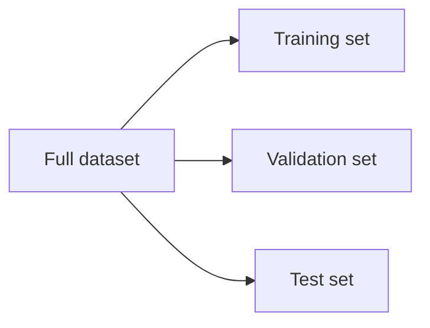

# Lecture 20 — How Do We Know If Our Model Really Learned?

> **The Big Question:** How can a model look brilliant on the data we gave it and still fail when the world gives it something new?

▶️ **Run the code:** [Open in Colab](https://colab.research.google.com/github/manish7725/deeplearning/blob/main/Lecture%2020%20-%20How%20Do%20We%20Know%20If%20Our%20Model%20Really%20Learned/notebook.ipynb) · [`notebook.ipynb`](<notebook.ipynb>)

## Where We Are

We just learned **How Do We Know If Our Model Really Learned**.

But using it creates a new question.

> **What problem does this idea still leave us unable to solve?**

That question leads naturally to **Meet the Smallest Neural Network**.

**Next → Meet the Smallest Neural Network.**

## 1. The Problem: A Perfect Student Who Fails the Exam

Imagine a student who has memorized every question from yesterday's worksheet.

You give the same worksheet again:

```text
score = 100%
```

Then you change the numbers slightly:

```text
score = 52%
```

Did the student learn mathematics?

This is the machine-learning problem.

A model can memorize its training examples without learning a rule that generalizes.

> 🧠 **Think** — What experiment would distinguish **memorization** from **learning**?

The obvious answer is: test the model on examples it did not use to learn its parameters.

But that simple sentence hides several difficult questions:

- Which examples should we hold out?
- Can we use those examples while choosing the model?
- What exactly should we measure?
- What if our preprocessing accidentally looks at the answer?

We need a protocol, not just a number.

---

## 2. What Would a Solution Need?

A trustworthy evaluation should:

1. measure performance on examples not used to fit the model;
2. keep development decisions separate from the final evaluation;
3. use a metric that reflects the actual cost of mistakes;
4. reveal when the model is too simple or too flexible;
5. prevent information from the future or evaluation set leaking into training.

These requirements lead naturally to the train/validation/test split.

---

## 3. First Attempt: Report Training Accuracy

Suppose a classifier sees 1,000 training examples and predicts all 1,000 correctly.

Training accuracy is

$$
\frac{1000}{1000}=1=100\%.
$$

That sounds fantastic.

But the model was allowed to see those examples while adjusting its parameters. We have measured **fit to the learning material**, not generalization to new material.

> ⚠️ **A Tempting Wrong Idea**
>
> *“A high training score proves that the model learned.”*
>
> It proves only that the model fits the training set well. A sufficiently flexible model can memorize arbitrary labels.

So we need unseen data.

---

## 4. The Discovery: Split the Data

A dataset can be divided into three conceptual parts:



### Training set
Used to learn model parameters.

### Validation set
Used during model development for decisions such as hyperparameters, feature choices or when to stop training.

### Test set
Held back for a final estimate after development choices are complete.

The central rule is:

> **The test set should behave like an exam you were not allowed to study from.**

The exact splitting protocol depends on the problem. Time series, grouped observations and tiny datasets may require specialized procedures.

---

## 5. The Hidden Trap: Reusing the Test Set

Suppose we train five different models and choose the one with the highest test accuracy.

We have now used the test set to make a development decision.

The test set is no longer a clean final evaluation.

The problem is subtle because nothing in the model code necessarily says “train on the test set.” The information can leak through our decisions.

```text
model A → test → 78%
model B → test → 81%
model C → test → 84%   ← chosen
```

We indirectly optimized for the test set.

This is why a validation set exists: **development happens against validation; final reporting happens against test.**

---

## 6. The Discovery: Underfitting and Overfitting

Suppose we increase model complexity.

At first, the model may be too simple to capture the useful pattern.

That is **underfitting**.

Training error is high, and validation error is also high.

As the model becomes more expressive, both errors may decrease.

Eventually, the model may start fitting peculiar details of the training examples. Training error keeps falling, but validation error starts rising.

That is **overfitting**.

| Situation | Training error | Validation error |
|---|---:|---:|
| Underfitting | high | high |
| Good generalization | low | low |
| Overfitting | very low | high |

These are useful patterns, not rigid laws.

---

## 7. A Learning Curve as Evidence

Imagine training for more epochs:

```text
error
 ↑
 |\\ training
 | \\
 |  \\
 |   \\
 |    \\
 |     \\
 |      \\
 |   validation
 |  /     \\
 | /       \\
 +----------------→ epochs
```

Training error often decreases with more optimization.

Validation error may decrease first and then increase.

The point where validation error is smallest is evidence about how far useful learning has progressed.

This motivates **early stopping**: stop when the validation signal says further training is hurting generalization.

---

## 8. A Second Problem: Accuracy Can Lie

Suppose a medical screening dataset has:

```text
99 healthy
 1 sick
```

A model that always predicts “healthy” gets

$$
\frac{99}{100}=99\%\text{ accuracy}.
$$

Yet it identifies **zero** sick cases.

So the question “How accurate is the model?” is incomplete.

We need to understand the four possible outcomes of a binary classifier.

---

## 9. The Discovery: The Confusion Matrix

For binary classification:

| | Predicted positive | Predicted negative |
|---|---:|---:|
| **Actual positive** | TP | FN |
| **Actual negative** | FP | TN |

Each cell describes a different kind of event.

- **TP**: correctly found a positive.
- **TN**: correctly rejected a negative.
- **FP**: raised a false alarm.
- **FN**: missed a real positive.

Now metrics become ratios of these counts.

### Precision
Of all predicted positives, how many were actually positive?

$$
\boxed{\text{Precision}=\frac{TP}{TP+FP}}
$$

### Recall
Of all actual positives, how many did we find?

$$
\boxed{\text{Recall}=\frac{TP}{TP+FN}}
$$

### F1 score
A harmonic mean that balances precision and recall:

$$
\boxed{F_1=\frac{2PR}{P+R}}
$$

where $P$ is precision and $R$ is recall.

> ✏️ **Hand Calculation** — Suppose $TP=8$, $FP=2$, $FN=4$. Then precision is $8/10=0.8$, recall is $8/12\approx0.667$, and $F_1\approx0.727$.

---

## 10. Why There Is No Universal Best Metric

Imagine two applications.

### Application A: spam filter
A false positive can hide an important email.

Precision may matter greatly.

### Application B: disease screening
Missing a true case can be much more costly.

Recall may matter greatly.

The metric is not merely a mathematical decoration.

> 🎯 **ML Connection** — A model should be evaluated according to the decision problem it will serve. The cost of an error belongs in the evaluation design.

---

## 📜 History Lens — The Confusion Matrix and Classification Trade-offs

Long before modern deep learning, statisticians and signal-detection researchers had to separate different kinds of correct and incorrect decisions rather than collapsing everything into one percentage.

Imagine being an engineer evaluating a radar detector: a missed aircraft and a false alarm are not the same failure. That practical need is the reason counts such as true positives, false positives, false negatives and true negatives are more informative than accuracy alone.

The durable lesson is not the vocabulary. It is the habit of asking **which mistake is expensive?**

---

## 11. The Silent Disaster: Data Leakage

Consider a hospital dataset where we predict whether a patient will be admitted.

Suppose one feature records a code that is assigned **after** the admission decision.

That feature may be highly predictive.

It may also be impossible to know at the moment we need the prediction.

The model appears brilliant because the future has leaked backward into the past.

This is **data leakage**.

Another common version happens during preprocessing.

Suppose we standardize using the mean and standard deviation of the entire dataset before splitting it.

Then information from the validation/test sets has influenced the training transformation.

The safer pattern is:

```text
split data
   ↓
fit preprocessing on training only
   ↓
apply the learned preprocessing to validation/test
```

> ⚠️ Leakage can produce a score that looks scientific while the experiment is invalid.

---

## 12. Shapes: Evaluation Has Data Too

For $n$ examples:

```text
X_train : (n_train, d)
y_train : (n_train,)
X_val   : (n_val, d)
y_val   : (n_val,)
X_test  : (n_test, d)
y_test  : (n_test,)
```

For binary predictions:

```text
predictions : (n_test,)
```

The confusion matrix is

```text
2 × 2
```

For $k$ classes it becomes

```text
k × k
```

Shape checks are useful because they expose a surprising number of evaluation bugs before any metric is computed.

---

## 🔬 The Experiment

Change exactly one variable: model complexity.

Use a decision tree with different `max_depth` values.

Predict first:

> What should happen to training accuracy as the tree gets deeper? What should happen to validation accuracy after the model becomes too flexible?

The notebook plots the two curves so you can see the transition from underfitting to stronger fit and, depending on the dataset, overfitting.

---

## How It Breaks

| Failure | What it looks like | Why |
|---|---|---|
| Training-only evaluation | nearly perfect score | model is judged on data it learned from |
| Test-set tuning | test score seems unusually strong | test information influenced model choices |
| Severe class imbalance | high accuracy, poor positive detection | majority class dominates |
| Leakage | unrealistically high validation/test score | forbidden information entered the pipeline |
| Overfitting | training improves, validation worsens | model fits sample-specific details |
| Underfitting | both training and validation poor | model cannot capture enough structure |

---

## Distinctions That Matter

| Confusable pair | Real distinction |
|---|---|
| training score vs generalization | fit to seen examples vs performance on appropriate unseen examples |
| validation vs test | development feedback vs final estimate |
| precision vs recall | purity of predicted positives vs coverage of actual positives |
| overfitting vs underfitting | too much sample-specific fitting vs insufficient expressive power |
| error vs metric | an individual mistake vs an aggregate measurement designed for a purpose |
| leakage vs overfitting | invalid information flow vs excessive fitting; leakage can occur even with a simple model |

---

## What We Discovered

1. A training score measures fit, not automatically learning.
2. Generalization requires evaluation on appropriate unseen data.
3. Validation data guide development; the test set should remain isolated for final evaluation.
4. Underfitting and overfitting appear through the relationship between training and validation behavior.
5. Accuracy can hide catastrophic performance on minority classes.
6. Precision, recall and F1 expose different aspects of classification behavior.
7. Data leakage can make an invalid experiment look extremely successful.

---

## Mathematics We Built

Training accuracy:

$$
\mathrm{Accuracy}=\frac{TP+TN}{TP+TN+FP+FN}
$$

Precision:

$$
\mathrm{Precision}=\frac{TP}{TP+FP}
$$

Recall:

$$
\mathrm{Recall}=\frac{TP}{TP+FN}
$$

F1:

$$
F_1=\frac{2PR}{P+R}
$$

---

## What Each Symbol Means

| Symbol | Read it as | Meaning | In code |
|---|---|---|---|
| $TP$ | true positive | predicted positive and actually positive | `tp` |
| $TN$ | true negative | predicted negative and actually negative | `tn` |
| $FP$ | false positive | predicted positive but actually negative | `fp` |
| $FN$ | false negative | predicted negative but actually positive | `fn` |
| $P$ | precision | $TP/(TP+FP)$ | `precision` |
| $R$ | recall | $TP/(TP+FN)$ | `recall` |
| $F_1$ | F-one | harmonic mean of precision and recall | `f1` |

---

## One-Minute Explanation

A model can memorize the training data and still fail on new data. So we separate training from evaluation.

Validation data help us choose and tune the model. The test set should remain untouched until the end.

Then we ask a second question: **what kind of mistake did the model make?** Accuracy counts all correct predictions, but precision and recall distinguish false alarms from missed positives.

Finally, we check that no information from the future or held-out data leaked into the experiment.

A trustworthy model is not the one with the prettiest training score. It is the one whose evaluation survives careful scientific scrutiny.

---

## Exercises

### Level 1 — Observe
A model has training accuracy 99%, validation accuracy 72%. What pattern does this suggest?

### Level 2 — Calculate
Given $TP=40$, $FP=10$, $FN=20$, compute precision, recall and F1.

### Level 3 — Derive
Starting from the confusion-matrix counts, derive the F1 expression as the harmonic mean of precision and recall.

### Level 4 — Investigate
Change only the decision-tree `max_depth`. Plot training and validation accuracy and identify where your hypothesis changes.

### Level 5 — Design
Design an evaluation protocol for a fraud detector where positive cases are only 0.2% of all transactions. Explain the split strategy, leakage risks and metrics you would report.

---

## Common Mistakes

| Mistake | Why it is wrong |
|---|---|
| “99% accuracy means 99% useful.” | It depends on class balance and the cost of errors. |
| “The test set can guide tuning.” | Then it is no longer a clean final evaluation. |
| “Normalize before the split.” | The transformation can absorb information from held-out examples. |
| “Validation and test are interchangeable.” | They serve different roles in development. |
| “Overfitting only means a complicated model.” | It means fitting sample-specific patterns that do not generalize; complexity is one cause, not the definition. |

---

## Socratic Questions

Why can a model with 100% training accuracy be less trustworthy than one with 95%?

What would happen if you repeatedly chose the model with the best test score?

Why can precision be high while recall is low?

Why does class imbalance change how we should interpret accuracy?

Can data leakage occur even when the model architecture is extremely simple?

Why is early stopping a model-selection decision rather than merely an optimization detail?

---

## 🔭 Bridge to Chapter 21

We now know that “accuracy” is only one measurement.

But machine learning has many kinds of outputs and many kinds of mistakes.

So the next question is:

> **How do we choose the right metric for regression, classification, ranking and imbalanced problems — and how do we know what a metric is hiding?**

That is the job of **Chapter 21: Evaluation Metrics**.
