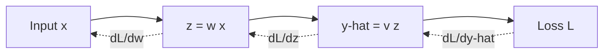

# Lecture 27 — Backpropagation: Sending the Error Backward

> **The Big Question:** We know how one parameter changes the loss. How can we send that information backward through several computations without guessing?

▶️ **Run the code:** [Open in Colab](https://colab.research.google.com/github/manish7725/deeplearning/blob/main/Lecture%2027%20-%20Backpropagation%3A%20Sending%20the%20Error%20Backward/notebook.ipynb) · [`notebook.ipynb`](<notebook.ipynb>)

## Where We Are

**Previously:** A neural network can represent complicated functions once activations make the model nonlinear. But representation alone is not learning.
**Today:** We follow the error backward through a tiny network and discover backpropagation as repeated chain rule.
**Next:** One scalar derivative is not enough for a real layer. We will pack the same reasoning into matrix formulas for $dW$, $db$ and $dX$.

---

## 1. The Problem: The First Layer Cannot See the Final Error

Consider the smallest useful two-stage network:

$$
x\rightarrow z\rightarrow \hat y
$$

with

$$
z=wx,
\qquad
\hat y=vz.
$$

Suppose the target is $y$ and the loss is

$$
L=(\hat y-y)^2.
$$

The second weight $v$ touches the prediction directly. The first weight $w$ does not.

So here is the training problem:

> **How can $w$ know whether increasing it would make the final loss better or worse?**

The answer cannot simply be “look at the loss.” The loss is several operations away.

---

## 2. What Would a Solution Need?

We need a method that:

1. starts at the final loss;
2. moves backward one operation at a time;
3. measures the local effect of each operation;
4. combines those local effects into the total effect on the loss;
5. works for deeper networks without inventing a new rule for every architecture.

Notice the shape of the answer already: **local pieces + a rule for connecting them**.

---

## 3. First Attempt: Differentiate the Whole Expression at Once

Substitute everything into the loss:

$$
L=(vwx-y)^2.
$$

Then expand it mentally and differentiate directly with respect to $w$.

For this tiny example, you can do it:

$$
\frac{dL}{dw}=2(vwx-y)vx.
$$

But this approach becomes ugly when the network contains many layers and nonlinear functions.

Worse, the long expression hides the structure we actually need: every operation only has to answer a tiny local question.

> ⚠️ **A Tempting Wrong Idea**
>
> *“Just expand the whole neural network into one giant formula and differentiate that.”*
>
> You can sometimes do this on paper. But the expression grows with the network, repeated computation becomes wasteful, and it becomes difficult to see which local operation caused which part of the gradient.

We need to preserve the computation as a sequence of small operations.

---

## 4. The Discovery: Follow One Tiny Effect Backward

Start at the loss.

To understand how $w$ affects $L$, ask three smaller questions:

1. How does $L$ change when $\hat y$ changes?
2. How does $\hat y$ change when $z$ changes?
3. How does $z$ change when $w$ changes?

The chain rule says we can multiply those local answers:

$$
\boxed{
\frac{dL}{dw}
=
\frac{dL}{d\hat y}
\frac{d\hat y}{dz}
\frac{dz}{dw}}
$$

This is the central discovery of the chapter.

Backpropagation is not a new kind of derivative. It is the **systematic organization of the chain rule over a computation graph**.

---

## 5. Three Levels of the Same Idea

| Level | The same idea |
|---|---|
| 💡 **Intuition** | Three connected machines. Ask each machine, “If your output changed a little, how much would that affect the final error?” Multiply the answers as you walk backward. |
| ✏️ **Tiny numbers** | If one stage has local effect $2$, the next $-3$, and the previous $4$, the total effect is $2(-3)(4)=-24$. |
| 🎓 **Abstraction** | Along a path, total sensitivity is the product of local derivatives. |

The chain rule turns many small sensitivities into one global sensitivity.

---

## 6. Calculate Every Local Derivative

Our computation is

$$
w\rightarrow z\rightarrow\hat y\rightarrow L.
$$

First:

$$
L=(\hat y-y)^2
$$

so

$$
\frac{dL}{d\hat y}=2(\hat y-y).
$$

Second:

$$
\hat y=vz
$$

so

$$
\frac{d\hat y}{dz}=v.
$$

Third:

$$
z=wx
$$

so

$$
\frac{dz}{dw}=x.
$$

Now multiply them:

$$
\boxed{
\frac{dL}{dw}
=
2(\hat y-y)vx
}
$$

The long derivative came from three tiny derivatives.

---

## 7. ✏️ Hand Calculation: The Error Travels Back

Choose

$$
x=2,\qquad w=3,\qquad v=4,\qquad y=30.
$$

### Forward pass

First operation:

$$
z=wx=3(2)=6.
$$

Second operation:

$$
\hat y=vz=4(6)=24.
$$

Loss:

$$
L=(24-30)^2=36.
$$

### Backward pass

Start from the loss:

$$
\frac{dL}{d\hat y}=2(24-30)=-12.
$$

Move one step backward:

$$
\frac{d\hat y}{dz}=4.
$$

So

$$
\frac{dL}{dz}=(-12)(4)=-48.
$$

One more step:

$$
\frac{dz}{dw}=2.
$$

Therefore

$$
\frac{dL}{dw}=(-48)(2)=-96.
$$

The negative sign is information: **locally, increasing $w$ would decrease the loss.**

---

## 8. Why “Backward”?

The forward computation is

```text
input → layer 1 → layer 2 → prediction → loss
```

The derivative computation reverses direction:

```text
loss → prediction → layer 2 → layer 1 → parameter
```



The backward arrows are **gradient information**, not data travelling backward through the network.

---

## 9. Computational Graphs: The Network as Small Operations

Write the same computation as a graph:

$$
x
\rightarrow wx
\rightarrow v(wx)
\rightarrow (\hat y-y)^2.
$$

Every node performs a local operation. Every operation has a local derivative.

Backpropagation stores the intermediate values from the forward pass and then reuses them while moving backward.

That last part matters. A good algorithm should not repeatedly rebuild the same forward calculations just to differentiate them.

---

## 10. Local Derivatives Become a Reusable Vocabulary

Here are three tiny rules:

| Operation | Local derivative |
|---|---|
| $z=wx$ wrt $w$ | $x$ |
| $z=wx$ wrt $x$ | $w$ |
| $z=u^2$ wrt $u$ | $2u$ |

A complex network is then assembled from simple operations whose local derivatives can be chained together.

This is why the method scales conceptually even when the network becomes much larger.

---

## 11. The Subtle Part: A Variable Can Have Multiple Paths

So far $w$ had only one route to the loss.

Real computation graphs can branch.

Suppose

$$
z=xw
$$

and then

$$
a=z+1,
\qquad
b=2z.
$$

The final quantity is

$$
L=a+b.
$$

The variable $z$ influences $L$ through **two paths**.

The total derivative must add the contributions from both paths:

$$
\frac{dL}{dz}
=
\frac{dL}{da}\frac{da}{dz}
+
\frac{dL}{db}\frac{db}{dz}.
$$

That gives us an important rule:

> **Along one path, multiply local derivatives. When several paths meet, add their contributions.**

This is one reason computational graphs are a better mental model than one enormous formula.

---

## 12. Backpropagation Is Not the Optimizer

There are four separate jobs:

```text
Forward pass       → calculate predictions
Loss               → measure wrongness
Backpropagation    → calculate gradients
Optimizer          → change parameters
```

The optimizer uses a gradient such as $dL/dw$:

$$
w\leftarrow w-\eta\frac{dL}{dw}.
$$

Here $\eta$ is the learning rate.

With our gradient $-96$, a positive learning rate would increase $w$ because subtracting a negative number moves it upward.

Backpropagation does **not** choose the learning rate or perform the update. It supplies the direction and sensitivity information.

---

## 13. 🔬 The Experiment: Change One Variable

Keep

$$
x=2,\qquad v=4,\qquad y=30
$$

fixed. Change only $w$.

From

$$
\frac{dL}{dw}=2(vwx-y)vx,
$$

we can predict the gradient for several values of $w$.

At $w=3$, it is $-96$.

If $w$ increases toward the value that makes $vwx=30$, the error should shrink and the gradient should move toward zero.

The gradient is therefore not “the error.” It is a **local sensitivity of the loss to the parameter**.

---

## 14. Why This Idea Scales

Imagine a network with thousands of operations.

We do not want thousands of giant symbolic formulas.

Instead:

1. run the network forward once;
2. store the intermediate results we need;
3. start with the loss gradient;
4. move backward, applying local derivative rules;
5. reuse the same intermediate calculations where paths overlap.

The computation becomes systematic.

This is the conceptual foundation of automatic differentiation systems used by frameworks such as PyTorch.

---

## 15. 📜 History Lens — Backpropagation in the 1980s

Imagine working on multilayer networks when the major difficulty is not writing a neuron, but finding a practical way to train all the hidden weights.

David Rumelhart, Geoffrey Hinton and Ronald Williams published the influential 1986 paper *Learning representations by back-propagating errors*. Their work helped establish the practical use of backpropagation for multilayer neural networks.

The chain rule itself was much older. The contribution was showing how to organise repeated chain-rule calculations into a usable learning procedure for layered models.

That distinction matters: **backpropagation is an algorithmic way of applying old calculus to a new computational structure.**

---

## 🎯 Machine Learning Connection

At training time, a neural network repeatedly executes

$$
\text{forward}
\rightarrow
\text{loss}
\rightarrow
\text{backward}
\rightarrow
\text{update}.
$$

The backward stage computes quantities such as

$$
\frac{\partial L}{\partial w},\nobreakspace
\frac{\partial L}{\partial v}.
$$

The optimizer then uses them to move parameters.

Once we have many weights and many examples, these scalar derivatives naturally become **arrays of derivatives**. That is the exact problem waiting in Chapter 28.

---

## Distinctions That Matter

| Do not confuse | With |
|---|---|
| derivative | value of the variable itself |
| gradient | loss |
| backpropagation | gradient descent |
| local derivative | total derivative through the graph |
| gradient direction | update size |
| backward pass | data flowing backward |

---

## What We Discovered

1. A parameter can affect the loss through a chain of intermediate computations.
2. The chain rule turns local sensitivities into a total derivative.
3. Backpropagation is the systematic application of that rule backward through a computational graph.
4. Along a single path, derivatives multiply.
5. When paths merge, their gradient contributions add.
6. Backpropagation computes gradients; an optimizer uses them to change parameters.
7. The same idea can be packed into matrix operations when many values are involved.

---

## Mathematics We Built

Network:

$$
z=wx,
\qquad
\hat y=vz,
\qquad
L=(\hat y-y)^2.
$$

Chain rule:

$$
\frac{dL}{dw}
=
\frac{dL}{d\hat y}
\frac{d\hat y}{dz}
\frac{dz}{dw}.
$$

Local derivatives:

$$
\frac{dL}{d\hat y}=2(\hat y-y),
\qquad
\frac{d\hat y}{dz}=v,
\qquad
\frac{dz}{dw}=x.
$$

Therefore:

$$
\boxed{\frac{dL}{dw}=2(\hat y-y)vx}.
$$

Parameter update:

$$
\boxed{w\leftarrow w-\eta\frac{dL}{dw}}.
$$

---

## What Each Symbol Means

| Symbol | Read it as | Meaning | In code |
|---|---|---|---|
| $x$ | input | value entering the network | `x` |
| $w$ | weight | learned parameter in the first step | `w` |
| $z$ | intermediate | output of the first operation | `z` |
| $v$ | weight | learned parameter in the second step | `v` |
| $\hat y$ | y-hat | prediction | `y_hat` |
| $y$ | target | correct answer | `y` |
| $L$ | loss | numerical measure of wrongness | `loss` |
| $dL/dw$ | derivative of loss wrt weight | sensitivity of loss to $w$ | `w.grad` |
| $\eta$ | learning rate | update step size | `learning_rate` |

---

## One-Minute Explanation

Imagine a chain of machines. The first machine uses a weight to turn an input into an intermediate value. The next machine turns that into a prediction. The loss tells us how wrong the final prediction is.

Backpropagation starts at the loss and walks backward. At each machine it asks: “If my input changed a little, how much would my output change?” It multiplies that local answer by the amount of error arriving from downstream.

If there are several paths, their contributions are added.

So backpropagation is simply the chain rule organised as an algorithm for a computation graph.

---

## Exercises

### Level 1 — Observe

Look at the graph $w\rightarrow z\rightarrow\hat y\rightarrow L$. Which quantity is furthest upstream from the loss?

### Level 2 — Calculate

For $x=3$, $v=2$, $\hat y-y=-4$, compute $dL/dw=2(\hat y-y)vx$.

### Level 3 — Derive

Starting from $L=(vwx-y)^2$, derive $dL/dw$ using the chain rule without expanding the square first.

### Level 4 — Investigate

In the notebook, change only $w$ and plot the loss and gradient. Predict where the gradient becomes zero before running the code.

### Level 5 — Design

Build a three-stage scalar computation with at least one branching path. Derive the gradient to the first parameter by multiplying along paths and adding where paths merge.

---

## Common Mistakes

| Mistake | Why it is wrong |
|---|---|
| Calling the gradient the error | the gradient measures sensitivity of the loss to a parameter |
| Multiplying gradients across two separate branches | separate paths contribute by addition |
| Updating parameters inside backpropagation | gradient calculation and optimization are separate steps |
| Forgetting intermediate values | local derivatives often depend on values produced by the forward pass |
| Thinking backward propagation sends data backward | it sends derivative information backward |

---

## Socratic Questions

Why does a weight far from the output still receive a useful learning signal?

Why do local derivatives multiply along one path?

Why must gradients from two branches be added?

Why would differentiating one giant expanded expression become difficult to maintain?

What changes when one scalar parameter becomes an entire weight matrix?

---

## 🔭 Bridge to Chapter 28

Our scalar example is complete. But real layers do not have one input, one output and two weights.

A dense layer may have thousands of weights. Every training example contributes to those weights. Writing one scalar derivative after another would hide the repeated structure we just discovered.

> **Next question:** Can we take the same chain-rule reasoning and pack all those repeated scalar derivatives into three matrix formulas — one for the weights, one for the bias, and one for the input?

Yes. The next chapter derives

$$
\boxed{dW=X^TdZ,\qquad db=\sum dZ,\qquad dX=dZW^T}.
$$
