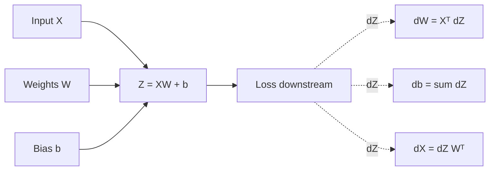

# Lecture 28 — Matrix Backpropagation: dW, db, dX by Hand

> **The Big Question:** We just backpropagated through one number at a time. What changes when one layer transforms an entire matrix of numbers at once?

▶️ **Run the code:** [Open in Colab](https://colab.research.google.com/github/manish7725/deeplearning/blob/main/Lecture%2028%20-%20Matrix%20Backpropagation%3A%20dW%2C%20db%2C%20dX%20by%20Hand/notebook.ipynb) · [`notebook.ipynb`](<notebook.ipynb>)

## Where We Are

**Previously:** We followed one derivative backward through a tiny network. The chain rule told us how a change in an early weight changes the final loss.
**Today:** A real dense layer has many inputs, many outputs, many weights and a bias vector. We will derive every gradient — $dW$, $db$, and $dX$ — from one small matrix example.
**Next:** Matrix notation is still not enough for images and batches. We need one container that can hold numbers in many dimensions: **tensors**.

---

## 1. The Problem: One Neuron Was Too Small

Our previous network had

$$
z=wx$$

with one input and one weight. Real layers look more like this:

$$
Z = XW + b
$$

Suppose two students each have three scores — maths, science and English — and we want two outputs: a science-strength score and an overall readiness score.

For a batch of two students:

$$
X=
\begin{bmatrix}
1&2&3\\
2&1&4
\end{bmatrix}
$$

and let the layer have two outputs:

$$
W=
\begin{bmatrix}
1&0\\
0&2\\
1&1
\end{bmatrix},
\qquad
b=
\begin{bmatrix}
1&2
\end{bmatrix}
$$

The forward pass is easy. But now ask the training question:

> **If the final loss changes, how much should every entry of $W$, every entry of $b$, and every input value in $X$ change?**

There are already $6+2+6=14$ numbers involved. We need a rule that works for *all* of them, not fourteen separate tricks.

---

## 2. What Would a Solution Need?

A useful backward calculation must:

1. give one gradient for every weight;
2. give one gradient for every bias;
3. give one gradient for every input value;
4. preserve matrix shapes so a wrong formula can be caught before arithmetic;
5. reuse the same intermediate values rather than recomputing every path separately.

The last requirement is the reason backpropagation becomes efficient rather than a giant collection of repeated algebra.

---

## 3. First Attempt: Different Formula for Every Weight

One tempting strategy is to differentiate $L$ with respect to $w_{11}$, then $w_{12}$, then $w_{21}$, and so on.

For six weights this is annoying. For six million it is absurd.

> ⚠️ **A Tempting Wrong Idea**
>
> *"Because every weight is different, every derivative needs a different derivation."*
>
> No. The local computation is the same for every connection. The only thing that changes is **which input and which downstream error signal meet at that connection**.

So the real task is to discover the pattern.

---

## 4. The Discovery: One Weight Receives Two Pieces of Evidence

Start with a single entry of the matrix.

For one output neuron,

$$
z_j = \sum_i x_i w_{ij} + b_j
$$

Pick one weight, $w_{ij}$.

Changing $w_{ij}$ changes $z_j$ in proportion to the corresponding input $x_i$:

$$
\frac{\partial z_j}{\partial w_{ij}} = x_i
$$

Backpropagation also tells us how much the loss cares about $z_j$:

$$
\frac{\partial L}{\partial z_j}
$$

Chain rule joins the two pieces:

$$
\boxed{\frac{\partial L}{\partial w_{ij}}
=
\frac{\partial L}{\partial z_j}x_i}
$$

That is the key pattern:

> **weight gradient = input × downstream gradient.**

The formula is simple because the computation is simple: a weight only acts by multiplying its input.

---

## 5. Three Levels of the Same Idea

| Level | The same idea |
|---|---|
| 💡 **Intuition** | Each connection asks: *"How much error was waiting downstream, and how much input was flowing through me?"* Multiply those two numbers. |
| ✏️ **Tiny numbers** | If $x_i=3$ and $dL/dz_j=-2$, then $dL/dw_{ij}=3(-2)=-6$. |
| 🎓 **Abstraction** | For every connection, $dW$ is built by pairing each input with the corresponding output-side gradient. |

Now the scalar pattern is visible. The only remaining question is how to write all those pairings at once.

---

## 6. Two Students Instead of One: Why a Matrix Appears

Return to our batch.

$$
X\in\mathbb{R}^{2\times3},
\qquad
W\in\mathbb{R}^{3\times2},
\qquad
b\in\mathbb{R}^{1\times2}
$$

The output is

$$
Z=XW+b
$$

so

$$
Z\in\mathbb{R}^{2\times2}
$$

Suppose the gradient arriving from the next part of the network is

$$
G=\frac{\partial L}{\partial Z}
=
\begin{bmatrix}
1&2\\
-1&3
\end{bmatrix}
$$

Read $G$ in plain English:

> entry $(r,j)$ says how sensitive the loss is to output $Z_{rj}$.

Now inspect one weight gradient by hand.

For $w_{11}$, the first input of each student contributes:

$$
\frac{\partial L}{\partial w_{11}}
=1(1)+2(-1)=-1
$$

For $w_{12}$:

$$
\frac{\partial L}{\partial w_{12}}
=1(2)+2(3)=8
$$

Notice what happened: **we multiplied input values by output gradients and added over the batch.**

That is exactly matrix multiplication.

---

## 7. The Discovery: $dW = X^T dZ$

The transpose appears because we want the dimensions to line up.

$$
X^T\in\mathbb{R}^{3\times2}
$$

and

$$
X^TdZ
\in
\mathbb{R}^{3\times2}
$$

which is exactly the shape of $W$.

So the whole weight gradient is

$$
\boxed{dW=X^TdZ}
$$

For our numbers:

$$
X^T=
\begin{bmatrix}
1&2\\
2&1\\
3&4
\end{bmatrix}
$$

therefore

$$
X^TdZ=
\begin{bmatrix}
1&2\\
2&1\\
3&4
\end{bmatrix}
\begin{bmatrix}
1&2\\
-1&3
\end{bmatrix}
=
\begin{bmatrix}
-1&8\\
1&7\\
-1&18
\end{bmatrix}
$$

Check the first column by hand:

$$
\begin{bmatrix}
1(1)+2(-1)\\
2(1)+1(-1)\\
3(1)+4(-1)
\end{bmatrix}
=
\begin{bmatrix}
-1\\1\\-1
\end{bmatrix}
$$

The matrix formula did not appear from nowhere. It is just the scalar chain rule repeated and packed efficiently.

---

## 8. What About the Bias?

The bias is easier because

$$
z_j=\cdots+b_j
$$

and

$$
\frac{\partial z_j}{\partial b_j}=1
$$

So every example simply contributes its downstream gradient.

For our batch:

$$
\frac{\partial L}{\partial b}
=
\begin{bmatrix}
1+(-1)&2+3
\end{bmatrix}
=
\begin{bmatrix}
0&5
\end{bmatrix}
$$

Hence

$$
\boxed{db=\sum_{\text{batch}}dZ}
$$

If $dZ$ has shape $(B,m)$, then $db$ has shape $(m,)$. The sum is across the batch axis because each example touches the same shared bias.

> 🧠 **Think** — Why do we sum the bias gradient but not the weight gradient in exactly the same notation?
>
> The weight already has an input-specific multiplier. The bias has no input. Every example pushes directly on the same bias value, so their effects add.

---

## 9. Now Reverse the Question: What Is $dX$?

A weight can ask, *"How much did I affect the loss?"*

The input asks the opposite:

> **"How much did the downstream layer care about me?"**

Take one input entry $x_i$.

Because

$$
 z_j=\sum_i x_iw_{ij}+b_j,
$$

we have

$$
\frac{\partial z_j}{\partial x_i}=w_{ij}
$$

There are several output neurons, so their effects add:

$$
\frac{\partial L}{\partial x_i}
=
\sum_j
\frac{\partial L}{\partial z_j}w_{ij}
$$

Pack the sums into a matrix product:

$$
\boxed{dX=dZW^T}
$$

Check the shapes:

$$
(2\times2)(2\times3)=(2\times3)
$$

which matches the shape of $X$.

Using our values:

$$
W^T=
\begin{bmatrix}
1&0&1\\
0&2&1
\end{bmatrix}
$$

so

$$
dX=
\begin{bmatrix}
1&2\\
-1&3
\end{bmatrix}
\begin{bmatrix}
1&0&1\\
0&2&1
\end{bmatrix}
=
\begin{bmatrix}
1&4&3\\
-1&6&2
\end{bmatrix}
$$

Again, the shape is a proof-check. If someone wrote $W dZ$ here, the dimensions would be $(3\times2)(2\times2)=(3\times2)$ — wrong shape, wrong answer.

---

## 10. One Layer, Three Gradients

We have reached the compact backward rule for a dense layer:

$$
\boxed{
\begin{aligned}
dW &= X^T dZ\\
db &= \sum_{\text{batch}} dZ\\
dX &= dZW^T
\end{aligned}}
$$

The forward pass was

$$
Z=XW+b
$$

The backward pass mirrors it:

This is the matrix version of the scalar chain rule from Chapter 27.

---

## 11. Shapes Catch Mistakes Before Arithmetic

Write the shapes first:

| Quantity | Shape |
|---|---|
| $X$ | $(B,n)$ |
| $W$ | $(n,m)$ |
| $b$ | $(m,)$ |
| $Z$ | $(B,m)$ |
| $dZ$ | $(B,m)$ |
| $dW$ | $(n,m)$ |
| $db$ | $(m,)$ |
| $dX$ | $(B,n)$ |

Then verify:

$$
(B,n)^T(n,m)=(n,B)(B,m)=(n,m)
$$

and

$$
(B,m)(n,m)^T=(B,m)(m,n)=(B,n)
$$

This is more than notation. **Shape algebra is a debugging tool.**

---

## 12. 🔬 The Experiment: Change One Number

Take the same layer and change only the first student's first feature.

The first column of $dW$ tells you how that feature influences the corresponding weights. Predict:

> What happens to $dW$ when $x_{11}$ doubles while everything else stays fixed?

The answer should not require running code. From

$$
dW=X^TdZ,
$$

the contribution from the first sample doubles. Other samples are unchanged.

This is exactly what a derivative should mean: **a local sensitivity with respect to one quantity while the others are held fixed.**

---

## 13. History Lens — Rumelhart, Hinton and Williams

📜 **History Lens — the 1980s**

Imagine having the chain rule but no convenient matrix notation for a layered neural network. David Rumelhart, Geoffrey Hinton and Ronald Williams published the influential 1986 paper *Learning representations by back-propagating errors*, showing a practical procedure for propagating error derivatives through multilayer networks.

The important historical lesson is not that the chain rule was new. It was not. The breakthrough was turning a familiar mathematical idea into a systematic training method for layered representations.

Our matrix formulas are the same philosophy made explicit: **reuse local derivatives and arrange the repeated arithmetic as matrix operations.**

---

## 14. 🎯 Machine Learning Connection

Every dense layer in a neural network performs a transformation like

$$
Z=XW+b.
$$

During training, the framework repeatedly needs exactly these three quantities:

$$
dW,\quad db,\quad dX.
$$

The optimizer usually updates parameters using

$$
W\leftarrow W-\eta dW,
\qquad
b\leftarrow b-\eta db.
$$

The input gradient $dX$ is not normally updated by the optimizer. It is passed backward to the previous layer so that the previous layer can compute *its* gradients.

That is why deep networks can have dozens or hundreds of layers without requiring a new kind of mathematics for every layer.

---

## Distinctions That Matter

| Do not confuse | With |
|---|---|
| $dW$ | the weights $W$ themselves |
| $dX$ | the input data $X$ |
| $dZ$ | the output activations $Z$ |
| backpropagation | parameter update |
| transpose | inverse |
| shape compatibility | numerical correctness |

A transpose changes how a matrix is arranged; it is not an inverse.

---

## What We Discovered

1. Every scalar weight gradient is **input × downstream gradient**.
2. A matrix is a compact way to compute all those scalar products at once.
3. The transpose in $X^TdZ$ is forced by which dimensions must pair.
4. Bias gradients add over examples because one shared bias affects every example.
5. $dX$ is the downstream gradient moved backward through the transpose of the weight matrix.
6. Shapes let us reject many wrong formulas before calculating a single number.

---

## Mathematics We Built

Forward:

$$
Z=XW+b
$$

Backward:

$$
\boxed{dW=X^TdZ}
$$

$$
\boxed{db=\sum_{\text{batch}}dZ}
$$

$$
\boxed{dX=dZW^T}
$$

These are not three unrelated memorized formulas. They are one chain-rule idea expressed for a matrix operation.

---

## What Each Symbol Means

| Symbol | Read it as | Meaning | In code |
|---|---|---|---|
| $X$ | input | batch of feature rows | `X` |
| $W$ | weights | learned connections | `W` |
| $b$ | bias | one offset per output | `b` |
| $Z$ | pre-activation | layer output before activation | `Z` |
| $dZ$ | loss gradient wrt $Z$ | downstream sensitivity | `dZ` |
| $dW$ | loss gradient wrt $W$ | how each weight affects loss | `dW` |
| $db$ | loss gradient wrt $b$ | how each bias affects loss | `db` |
| $dX$ | loss gradient wrt $X$ | signal sent to previous layer | `dX` |
| $B$ | batch size | number of examples | `batch_size` |
| $n$ | input width | number of input features | `input_features` |
| $m$ | output width | number of neurons | `output_features` |

---

## One-Minute Explanation

A dense layer takes a matrix of inputs, multiplies it by a weight matrix, and adds a bias. During backpropagation, the layer receives a matrix of "how much the loss cares" about each output.

To find how much the loss cares about each weight, pair the input that flowed through that weight with the downstream gradient, and sum across examples: $dW=X^TdZ$.

To find the bias gradient, sum the downstream gradients: $db=\sum dZ$.

To send the error toward the previous layer, multiply the downstream gradient by the transposed weights: $dX=dZW^T$.

The formulas are just the chain rule organized so a matrix library can compute many derivatives together.

---

## Exercises

### Level 1 — Observe

Look at

$$
X\in\mathbb{R}^{8\times5},\qquad W\in\mathbb{R}^{5\times3}.
$$

What shape must $Z$ have? What shape must $dW$ have?

### Level 2 — Calculate

For one connection, $x_i=4$ and $dZ_j=-0.5$. Calculate $dW_{ij}$.

### Level 3 — Derive

Starting from

$$
z_j=\sum_i x_iw_{ij}+b_j,
$$

derive $\partial L/\partial w_{ij}$ using the chain rule.

### Level 4 — Investigate

In the notebook, double one row of $X$ while holding $W$, $b$ and $dZ$ fixed. Predict which rows or columns of $dW$ change, then test your prediction.

### Level 5 — Design

Design a tiny two-layer network where you can compute every gradient by hand. Choose shapes that make matrix multiplication possible, then verify the gradients with a numerical finite-difference check.

---

## Common Mistakes

| Mistake | Why it is wrong |
|---|---|
| Writing $dW=X dZ$ | shapes usually do not match; the input features must be summed in the correct orientation |
| Forgetting the batch sum for $db$ | every example uses the same bias |
| Using $W$ instead of $W^T$ for $dX$ | the gradient must have the same shape as $X$ |
| Treating $dW$ as an updated weight | a gradient tells the optimizer which direction to move |
| Ignoring shapes | a formula can look plausible while being mathematically impossible |

---

## Socratic Questions

Why does each weight gradient contain the corresponding input?

Why do examples add together in the bias gradient?

Why is the transpose forced in the formula for $dX$?

Why can a wrong gradient formula sometimes still produce numbers without immediately crashing?

What would happen if the layer had no bias?

---

## 🔭 Bridge to Chapter 29

We can now differentiate a matrix layer completely by hand.

But a real image is not naturally represented by one matrix. A batch of RGB images has four meaningful axes: batch, channel, height and width. Sequences, videos and feature maps need even more.

> **Next question:** What single mathematical container can hold numbers in any number of dimensions while still giving us shapes and operations?

That container is the **tensor**.
