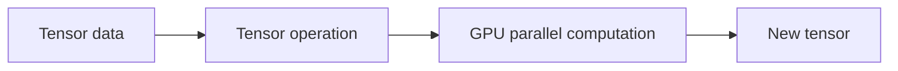

# Lecture 29 — Tensors: Numbers in Many Dimensions

<!-- NOTEBOOK-LAB-NAV -->

## 🧪 Interactive Lab

The matching notebook is the complete hands-on laboratory for this lesson. It contains the runnable code, experiments, visualizations, and challenges.

**[📓 Open the notebook on GitHub](https://github.com/manish7725/deeplearning/blob/main/Lecture%2029%20-%20Tensors%3A%20Numbers%20in%20Many%20Dimensions/notebook.ipynb)**  · **[▶ Open the notebook in Google Colab](https://colab.research.google.com/github/manish7725/deeplearning/blob/main/Lecture%2029%20-%20Tensors%3A%20Numbers%20in%20Many%20Dimensions/notebook.ipynb)**


## 🧭 Where this lesson fits

**Previous lesson:** Blog 10 — Backpropagation: Sending the Error Backward.

**Today:** Blog 11 — Tensors: Numbers in Many Dimensions.

**Next lesson:** Blog 12 — How Do We Know If Our Model Really Learned?.

**Student rule:** if you cannot explain why this lesson follows the previous one, stop and reread the final takeaway of the previous blog. The equations below should feel like a continuation, not a new language.


## 1. The family tree

Think of tensors as a hierarchy:

```text
scalar  →  one number
vector  →  one dimension
matrix  →  two dimensions
tensor  →  three or more dimensions
```

The word tensor is also used more broadly in mathematics, but in deep-learning programming it commonly means a multidimensional numerical array with a shape and data type.

---

## 2. Scalar, vector, matrix

A scalar:

$$
7
$$

A vector:

$$
\begin{bmatrix}1\\2\\3\end{bmatrix}
$$

A matrix:

$$
\begin{bmatrix}1&2\\3&4\end{bmatrix}
$$

A 3D tensor can be visualized as a stack of matrices.

```text
Tensor
 ├── Matrix 1
 │    ├── Row 1
 │    └── Row 2
 ├── Matrix 2
 │    ├── Row 1
 │    └── Row 2
 └── Matrix 3
      ├── Row 1
      └── Row 2
```

---

## 3. Shape is the first thing to inspect

In PyTorch:

```python
import torch

x = torch.tensor([
    [1, 2, 3],
    [4, 5, 6]
])

print(x.shape)
print(x.ndim)
print(x.numel())
```

Output:

```text
torch.Size([2, 3])
2
6
```

So:

- `shape` = 2 × 3
- `ndim` = 2
- `numel()` = 6 values

These three ideas should become automatic habits.

---

## 4. A batch of images

Suppose we have 32 RGB images.

Each image is 224 × 224 pixels and has 3 channels.

A common tensor shape is

$$
(32,3,224,224)
$$

Read it as:

```text
32  → number of images
3   → color channels
224 → height
224 → width
```

The total number of values is

$$
32\times3\times224\times224
$$

which is 4,816,896 numbers.

One tensor can therefore hold millions of values.

---

## 5. Why GPUs love tensors

Deep learning performs huge amounts of numerical computation.

A GPU contains hardware designed for highly parallel numerical operations.

Instead of thinking about one number at a time, frameworks such as PyTorch express operations on whole tensors.



The programming abstraction stays mathematical while the hardware performs the work in parallel.

---

## 6. Broadcasting

One powerful tensor concept is broadcasting.

Suppose

```python
x = torch.tensor([
    [1., 2., 3.],
    [4., 5., 6.]
])

b = torch.tensor([10., 20., 30.])

print(x + b)
```

The vector is added to each row:

$$
\begin{bmatrix}
1&2&3\\
4&5&6
\end{bmatrix}
+
\begin{bmatrix}
10&20&30
\end{bmatrix}
=
\begin{bmatrix}
11&22&33\\
14&25&36
\end{bmatrix}
$$

Broadcasting is convenient, but it is important to understand the shapes rather than rely on memorized rules.

---

## 7. Tensor operations are the language of deep learning

You will repeatedly see operations such as:

```python
x @ W       # matrix multiplication
a + b       # element-wise addition / broadcasting
x * y       # element-wise multiplication
x.mean()    # reduction
x.sum()     # reduction
x.reshape(...) 
x.transpose(...)
```

The key skill is not memorizing commands.

It is being able to predict the shape and mathematical meaning of each operation.

---

## 8. A tensor is not automatically an image

A tensor has no inherent meaning until we define what its dimensions represent.

The shape

$$
(3,224,224)
$$

could mean RGB channels × height × width.

But another application could assign completely different meanings.

Always ask:

> **What does each axis represent?**

---

## 9. Code: inspect a tensor

```python
x = torch.randn(8, 3, 64, 64)

print("shape:", x.shape)
print("dimensions:", x.ndim)
print("number of values:", x.numel())
print("dtype:", x.dtype)
print("device:", x.device)
```

These are excellent debugging questions when a model behaves unexpectedly.

---

## Think Like a Scientist 🧠

Suppose

$$
X\in\mathbb R^{16\times3\times32\times32}
$$

Explain each number if this represents a batch of RGB images.

Then calculate the total number of values.

Finally ask: what would shape $(16,32,32,3)$ mean?

Both can describe image data, but the axis convention is different.

---

## What you should remember

> **A tensor is the natural numerical container for modern deep learning.**

Remember:

- scalar → 0 dimensions;
- vector → 1 dimension;
- matrix → 2 dimensions;
- higher-dimensional tensors represent richer structures;
- shape tells us how the axes are arranged;
- every axis should have a meaning;
- tensor operations are the language in which neural networks are implemented.

Now we have a model that can learn.

But there is another scientific problem:

> **How do we know whether it learned something useful, rather than simply memorizing the examples?**

That is the problem of training, validation and testing.

---

# 📚 Go Deeper — Tensors, Code and Hardware

Use **PyTorch's official tutorials** when you want to move from the mathematical tensor abstraction into real framework usage.

Use **3Blue1Brown** for the linear-algebra intuition that sits underneath tensor operations.

Use **Welch Labs** when you want to see tensors and numerical operations inside complete neural-network experiments; its AI material emphasizes hands-on exercises, graphics and supporting code.

Use **Frame Zero** for first-principles ML intuition and **Visual Kernel** when you want to connect tensor operations to modern model internals.

Use **MrJensenMath10** for the underlying arithmetic and algebraic fluency.

### The debugging habit

Whenever PyTorch gives a shape error, do not immediately reshape randomly.

Print:

```python
print(x.shape)
print(weight.shape)
print(bias.shape)
```

Then ask:

> **What mathematical operation am I trying to perform?**

The code should follow the mathematics—not the other way around.
