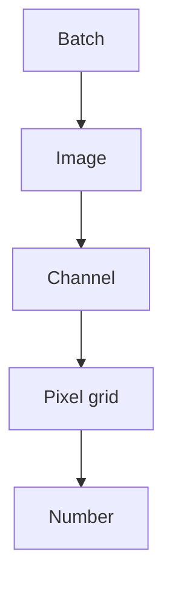

# Lecture 29 — Tensors: Numbers in Many Dimensions

> **The Big Question:** We can backpropagate through a matrix layer. What mathematical container lets the same ideas describe batches of images, sequences, feature maps and other data with many dimensions?

▶️ **Run the code:** [Open in Colab](https://colab.research.google.com/github/manish7725/deeplearning/blob/main/Lecture%2029%20-%20Tensors%3A%20Numbers%20in%20Many%20Dimensions/notebook.ipynb) · [`notebook.ipynb`](<notebook.ipynb>)

## Where We Are

We just learned **Tensors: Numbers in Many Dimensions**.

But using it creates a new question.

> **What problem does this idea still leave us unable to solve?**

That question leads naturally to **Build a Tiny Neural Network From Scratch**.

**Next → Build a Tiny Neural Network From Scratch.**

## 1. The Problem: A Matrix Cannot Naturally Hold an Image Batch

Suppose a camera gives us one RGB image.

It has:

- 3 colour channels;
- 224 rows of pixels;
- 224 columns of pixels.

That is naturally written as

$$
(3,224,224).
$$

Now the camera sends us **32 images at once**.

We need another axis:

$$
(32,3,224,224).
$$

The first number is no longer a pixel measurement. It counts examples.

A matrix gives us two axes. Our data has four.

So ask the same question we asked in Chapters 01–03:

> **What object can carry many numbers while remembering how those numbers are arranged?**

---

## 2. What Would a Solution Need?

The container should:

1. hold any number of dimensions;
2. tell us the size of every dimension;
3. preserve a consistent ordering of those dimensions;
4. support arithmetic without forcing us to write nested loops for everything;
5. work for both CPU and GPU computation;
6. make illegal operations visible through shape errors rather than silently mixing meanings.

Notice that the solution is not just “a bigger matrix.” We need an object whose **shape is part of the object’s meaning**.

---

## 3. First Attempt: Flatten Everything

A simple idea is to flatten an image into one long vector.

One RGB image has

$$
3\times224\times224=150528
$$

numbers.

So we could write

$$
\mathbf{x}\in\mathbb{R}^{150528}.
$$

Nothing is mathematically illegal here. A vector can hold all the values.

But something important has disappeared from the notation.

The vector no longer visibly says:

> “these three channels belong to the same pixel grid.”

The spatial arrangement has been hidden inside an indexing rule.

For some models flattening is useful. For a convolutional network, however, the neighbourhood structure of nearby pixels is important information. Throwing the axes away before the model sees them makes that structure harder to express.

> ⚠️ **A Tempting Wrong Idea**
>
> *“A tensor is just a vector with a lot of numbers, so flattening is always harmless.”*
>
> Flattening changes the representation. It does not change the raw values, but it hides which axes describe channels, rows, columns, time, batch or something else. The data survives; the structure becomes implicit.

We need a container that keeps the axes visible.

---

## 4. The Discovery: Scalars, Vectors, Matrices, Tensors

Start with the objects we already know:

| Object | Example | Number of axes |
|---|---|---:|
| scalar | $7$ | 0 |
| vector | $[1,2,3]$ | 1 |
| matrix | $\begin{bmatrix}1&2\\3&4\end{bmatrix}$ | 2 |
| tensor | a stack of matrices | 3 or more |

The word **tensor** has deeper meanings in mathematics and physics. In deep-learning software, we usually use it for a multidimensional numerical array together with a shape and data type.

The important idea is continuity:

> A tensor is not a mysterious new kind of number. It is the same idea of arranging numbers, extended to more axes.

---

## 5. Three Levels of the Same Object

| Level | The same idea |
|---|---|
| 💡 **Intuition** | A set of labelled drawers. One drawer may represent examples, another colour, another height, another width. |
| ✏️ **Tiny numbers** | A tensor with shape $(2,3,2)$ contains $2\times3\times2=12$ numbers. Think of it as two matrices, each $3\times2$. |
| 🎓 **Abstraction** | $X\in\mathbb{R}^{d_1\times d_2\times\cdots\times d_k}$ is a $k$-dimensional numerical array. |

The shape is the list

$$
(d_1,d_2,\ldots,d_k).
$$

The number of stored values is the product

$$
\prod_{i=1}^{k}d_i.
$$

Read $\prod$ as “multiply all the dimension sizes together.”

---

## 6. A Shape Is a Contract

Consider

$$
X\in\mathbb{R}^{16\times3\times32\times32}.
$$

Suppose this is a batch of RGB images.

Then one useful interpretation is:

```text
16 → examples
 3 → channels
32 → height
32 → width
```

The tensor contains

$$
16\times3\times32\times32=49152
$$

values.

But the same raw shape could represent something else.

That means a shape is necessary but not sufficient for meaning.

> 🧠 **Think** — Could $(16,3,32,32)$ describe 16 RGB images if the second axis actually meant width? The computer can store the numbers. The *programmer* must assign the meaning.

This is why experienced deep-learning code treats axis order as a contract.

---

## 7. The Discovery: Shape, Rank and Number of Values

Three questions become automatic:

### What is the shape?

$$
\operatorname{shape}(X)=(2,3,4)
$$

This tells us each axis size.

### How many axes are there?

The number of axes is the **rank** (also commonly called `ndim` in programming libraries):

$$
\operatorname{rank}(X)=3.
$$

### How many numbers are stored?

Multiply the axis sizes:

$$
2\times3\times4=24.
$$

These are different questions.

> ⚠️ **Common Mistake**
>
> A rank-3 tensor is not “a tensor with three values.” Rank counts axes; the number of stored values is the product of their sizes.

---

## 8. The Problem Inside the Problem: Addition

Now that we have tensors, another question appears.

What does it mean to add two arrays of different shapes?

Take

$$
X=
\begin{bmatrix}
1&2&3\\
4&5&6
\end{bmatrix}
$$

and

$$
b=\begin{bmatrix}10&20&30\end{bmatrix}.
$$

They do not have the same shape:

$$
(2,3)\quad\text{and}\quad(3,).
$$

Yet this is a common operation in neural networks because each row may represent one example and $b$ may be a bias shared by every example.

We want

$$
X+b=
\begin{bmatrix}
11&22&33\\
14&25&36
\end{bmatrix}.
$$

How did one vector become two rows?

That question forces us to a very useful rule.

---

## 9. Broadcasting: Stretching a Smaller Shape by Meaning

The vector $b$ is aligned with the last axis of $X$.

Conceptually, we can imagine copying it for each row:

$$
\begin{bmatrix}
1&2&3\\
4&5&6
\end{bmatrix}
+
\begin{bmatrix}
10&20&30\\
10&20&30
\end{bmatrix}.
$$

The library does not need to physically duplicate the data. It can treat the smaller array as if the missing axis were repeated.

This is **broadcasting**.

The useful mental model is not “magic copying.” It is:

> **Which axes can be treated as shared because their sizes are compatible?**

Broadcasting rules differ slightly in notation across libraries, but the central idea is shape alignment from the last axis backward.

For our example:

```text
X:  (2, 3)
b:     (3)
         ↑ aligns
```

The final dimension is 3 in both objects, so the vector can be used for every row.

---

## 10. Broadcasting in a Dense Layer

Return to Chapter 28.

We wrote

$$
Z=XW+b.
$$

Suppose

$$
X\in\mathbb{R}^{B\times n},
\qquad
W\in\mathbb{R}^{n\times m},
\qquad
b\in\mathbb{R}^{m}.
$$

Then

$$
XW\in\mathbb{R}^{B\times m}.
$$

The bias has shape $(m,)$, so broadcasting lets the same $m$ bias values act on every one of the $B$ examples.

This is the tensor idea hiding inside a simple neural-network equation.

The layer is not doing something fundamentally different from Chapter 28. We are just using array operations whose shapes describe repeated work.

---

## 11. A Tensor Can Hold a Batch of Images

Imagine two tiny RGB images, each $2\times2$.

One tensor could have shape

$$
(2,3,2,2).
$$

Interpret the axes as:

```text
example × channel × height × width
```

For one image and one channel we have a $2\times2$ matrix. Three such channels make one image. Two images make the batch.

This nested structure is exactly why tensors are useful: the object preserves all the levels simultaneously.



A tensor is therefore less about “many numbers” and more about **many numbers with organised axes**.

---

## 12. Tensor Operations Are Built From the Same Small Ideas

The operations you will meet repeatedly are not mysterious:

```python
x + y          # element-wise addition / broadcasting
x * y          # element-wise multiplication
x @ W          # matrix multiplication
x.sum()        # add values along chosen axes
x.mean()       # average values along chosen axes
x.reshape(...) # change shape without changing the number of values
x.transpose(...) # reorder axes
```

The exact library syntax is less important than the question underneath:

> **What mathematical operation is happening, and what shape should come out?**

That question prevents a huge class of debugging mistakes.

---

## 13. Reshape Is Not Relearning the Data

Take six numbers:

$$
[1,2,3,4,5,6].
$$

We can reshape them into

$$
\begin{bmatrix}
1&2&3\\
4&5&6
\end{bmatrix}
$$

with shape $(2,3)$.

The number of values has not changed:

$$
6=2\times3.
$$

Reshape changes the organisation of the values, not their count.

This is different from a mathematical transformation such as matrix multiplication, which normally changes the values themselves.

> ⚠️ **A Tempting Wrong Idea**
>
> *“Reshape mixes the numbers into new information.”*
>
> Reshape only changes how the same stored values are indexed. Whether the new shape makes semantic sense depends on what each axis is supposed to mean.

---

## 14. Transpose Is Also About Axes

For a matrix,

$$
X\in\mathbb{R}^{2\times3}
$$

transposing gives

$$
X^T\in\mathbb{R}^{3\times2}.
$$

For higher-dimensional tensors, “transpose” often means **reordering axes** rather than simply flipping rows and columns.

That matters because Chapter 28 already used a transpose in

$$
dW=X^TdZ.
$$

The transpose was not a random trick. We rearranged axes so the dimensions paired correctly.

The same shape-first habit keeps working as dimensionality grows.

---

## 15. 🔬 The Experiment: Predict Shapes Before Running Code

Take

$$
X\in\mathbb{R}^{4\times3\times8\times8}.
$$

Predict:

1. the number of images;
2. the number of channels;
3. the height and width;
4. the total number of values;
5. the shape after flattening each image separately into one vector.

The answers are not a test of memorisation. They are tests of whether you can read a shape as a sentence.

---

## 16. History Lens — The Modern Array

📜 **History Lens — 1960s to today**

The idea of representing data as rectangular numerical arrays long predates deep learning. Fortran made multidimensional numerical arrays part of scientific programming, while later systems such as NumPy and GPU frameworks turned the same abstraction into a central language for numerical computing.

The important shift for deep learning was practical: once tensors became efficient objects for vectorised CPU and GPU operations, a neural network could be expressed largely as a sequence of tensor transformations.

The lesson is the same one we saw with vectors in Chapter 02: **a useful notation can turn a huge collection of repeated arithmetic into one operation we can reason about.**

---

## 🎯 Machine Learning Connection

Modern neural-network training is mostly a conversation between tensors.

A batch of inputs is a tensor. Parameters are tensors. Activations are tensors. Gradients are tensors. Losses may reduce tensors to a scalar.

The training loop can therefore be viewed as

$$
\text{tensor data}
\rightarrow
\text{tensor operations}
\rightarrow
\text{loss}
\rightarrow
\text{tensor gradients}
\rightarrow
\text{tensor updates}.
$$

Backpropagation from Chapters 27–28 did not disappear. It simply became larger and more structured.

---

## Shapes

A very useful habit is to annotate operations with shapes.

For example:

$$
X:(B,n),\quad W:(n,m)\quad\Rightarrow\quad XW:(B,m).
$$

For image batches:

$$
X:(B,C,H,W).
$$

If we flatten each image separately, the shape becomes

$$
(B,CHW).
$$

For our example $(4,3,8,8)$:

$$
CHW=3\times8\times8=192,
$$

so the flattened batch has shape

$$
(4,192).
$$

Writing this before running code is often enough to catch a bug.

---

## Distinctions That Matter

| Do not confuse | With |
|---|---|
| shape | number of stored values |
| rank / `ndim` | size of one axis |
| reshape | matrix multiplication |
| transpose / axis permutation | inverse |
| broadcasting | copying data into memory |
| tensor | “image” — tensors can represent many kinds of data |
| CPU tensor | GPU tensor — same mathematical idea, different execution device |

---

## What We Discovered

1. A tensor extends the vector-and-matrix idea to many axes.
2. Shape tells us how the values are arranged, but we still must assign each axis a meaning.
3. Rank counts axes; the number of values is the product of axis sizes.
4. Broadcasting lets smaller shapes participate in larger-shape operations when their dimensions are compatible.
5. Reshape changes organisation, not the number of values.
6. Axis order is part of the interface between pieces of a neural network.
7. Tensor operations are the language in which modern deep-learning computation is expressed.

---

## Mathematics We Built

A general tensor shape:

$$
X\in\mathbb{R}^{d_1\times d_2\times\cdots\times d_k}.
$$

Number of stored values:

$$
|X|=\prod_{i=1}^{k}d_i.
$$

Dense-layer broadcasting:

$$
Z=XW+b,
$$

with

$$
X:(B,n),\quad W:(n,m),\quad b:(m),\quad Z:(B,m).
$$

Image batch example:

$$
X:(B,C,H,W).
$$

Flattening each image:

$$
(B,C,H,W)\rightarrow(B,CHW).
$$

---

## What Each Symbol Means

| Symbol | Read it as | Meaning | In code |
|---|---|---|---|
| $X$ | input/data tensor | organised numerical data | `X` / `x` |
| $d_i$ | dimension size | number of entries along axis $i$ | shape entry |
| $k$ | rank | number of axes | `x.ndim` |
| $B$ | batch size | number of examples | `batch_size` |
| $C$ | channels | feature or colour channels | `channels` |
| $H$ | height | rows in an image/grid | `height` |
| $W$ | width | columns in an image/grid | `width` |
| `shape` | shape | size of every axis | `x.shape` |
| `dtype` | data type | numerical representation | `x.dtype` |
| `device` | execution device | CPU or GPU location | `x.device` |

---

## One-Minute Explanation

A tensor is a structured box of numbers with multiple axes.

A vector has one axis. A matrix has two. A tensor can have three, four or more. The shape tells us how large each axis is, and our program decides what each axis means.

This matters because deep-learning data is structured. A batch of RGB images is naturally described by batch, channel, height and width. Keeping those axes visible lets mathematical operations express the structure instead of hiding it in one long list.

Broadcasting lets compatible smaller shapes participate in larger operations, which is why one bias vector can be added to an entire batch of outputs.

The key skill is not memorising tensor commands. It is predicting the shape and meaning of the result before the computer calculates it.

---

## Exercises

### Level 1 — Observe

Read the shape $(32,3,64,64)$ aloud as a sentence for a batch of RGB images.

### Level 2 — Calculate

How many values are in a tensor with shape $(8,3,128,128)$?

### Level 3 — Derive

Explain why flattening $(B,C,H,W)$ into $(B,CHW)$ preserves the number of values in each example.

### Level 4 — Investigate

In the notebook, change only the batch size. Predict which shape entries change and which do not.

### Level 5 — Design

Choose a tensor representation for a batch of 10 videos, each with 20 RGB frames of size $64\times64$. State what every axis means and propose one valid reshape into a sequence of frames.

---

## Common Mistakes

| Mistake | Why it is wrong |
|---|---|
| Calling rank “the number of values” | rank counts axes |
| Flattening without tracking what each axis meant | the structure becomes implicit |
| Assuming `reshape` changes numerical values | reshape changes indexing, not the value count |
| Broadcasting without checking alignment | incompatible shapes are not automatically meaningful |
| Assuming every 4D tensor is an image batch | dimensions have meaning only by convention |
| Fixing shape errors by random `reshape` calls | a mathematically wrong reshape may remove the symptom while preserving the bug |

---

## Socratic Questions

Why is an image naturally more than a vector, even though all its pixels can be flattened into one?

Why does broadcasting help a neural-network bias?

Why can two tensors have the same shape but represent completely different kinds of data?

Why is shape information part of debugging rather than just bookkeeping?

When would flattening an image be a reasonable design choice, and when might it destroy useful structure?

---

## 🔭 Bridge to Chapter 30

We now have the full vocabulary needed to describe a small neural network precisely:

- vectors hold features;
- matrices perform linear transformations;
- activations bend the mapping;
- backpropagation computes gradients;
- tensors hold data and parameters with arbitrary useful shapes.

The next question is practical and important:

> **Can we put all of these ideas together and build a tiny neural network ourselves — forward pass, loss, backward pass and parameter update — without asking a deep-learning framework to hide the mathematics?**

That is exactly what we will do next.
