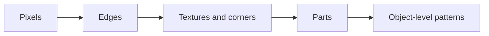

# Lecture 36 — How a Neural Network Learns to See: Convolution

<!-- NOTEBOOK-LAB-NAV -->

## 🧪 Interactive Lab

The matching notebook is the complete hands-on laboratory for this lesson. It contains the runnable code, experiments, visualizations, and challenges.

**[📓 Open the notebook on GitHub](https://github.com/manish7725/deeplearning/blob/main/Lecture%2036%20-%20How%20a%20Neural%20Network%20Learns%20to%20See%3A%20Convolution/notebook.ipynb)**  · **[▶ Open the notebook in Google Colab](https://colab.research.google.com/github/manish7725/deeplearning/blob/main/Lecture%2036%20-%20How%20a%20Neural%20Network%20Learns%20to%20See%3A%20Convolution/notebook.ipynb)**


## 🧭 Where this lesson fits

**Previous lesson:** Blog 12 — How Do We Know If Our Model Really Learned?.

**Today:** Blog 13 — How a Neural Network Learns to See: Convolution.

**Next lesson:** Blog 14 — When Order Matters: Learning From Sequences.

**Student rule:** if you cannot explain why this lesson follows the previous one, stop and reread the final takeaway of the previous blog. The equations below should feel like a continuation, not a new language.


## 1. Start with a tiny image

Imagine a grayscale image represented by

$$
X=
\begin{bmatrix}
1&1&1\\
0&0&0\\
0&0&0
\end{bmatrix}
$$

The top row is bright and the bottom rows are dark.

That looks like a horizontal edge.

---

## 2. A filter looks at a small patch

Consider a filter

$$
K=
\begin{bmatrix}
1&1&1\\
0&0&0\\
-1&-1&-1
\end{bmatrix}
$$

At a location, convolution-like computation multiplies corresponding values and adds them.

For a patch $P$:

$$
S=\sum_{i,j}P_{ij}K_{ij}
$$

The filter produces a strong response when the local pattern resembles what the filter detects.

---

## 3. Sliding the filter

The filter moves across the image:

```text
image
┌───────────────┐
│ █ █ █         │
│ ░ ░ ░         │
│               │
│       filter  │
│       ┌───┐   │
│       │× ×│   │
│       │× ×│   │
│       └───┘   │
└───────────────┘
          ↓
       next patch
```

At every location we calculate a number.

The collection of these numbers forms a **feature map**.

---

## 4. Why local connectivity helps

A fully connected layer could connect every output to every pixel.

For a large image, that creates a huge number of parameters.

A convolution uses a small kernel repeatedly across positions.

This gives two important ideas:

- **local connectivity**
- **weight sharing**

The same filter can detect the same type of pattern in different parts of an image.

---

## 5. The mathematics

For a simple 2D cross-correlation operation, one common deep-learning convention is

$$
Y(i,j)=\sum_{m}\sum_{n}K(m,n)X(i+m,j+n)
$$

Many deep-learning libraries call this operation “convolution” even though the kernel is not flipped as in the strict mathematical definition of convolution.

Understanding the convention prevents confusion when comparing textbooks and code.

---

## 6. Stride and padding

Two important settings control the output.

### Stride

How far the filter moves each time.

### Padding

Extra values added around the border so that edge information can be handled and output size can be controlled.

For a 1D example, a common output-size formula is

$$
\text{output}=
\left\lfloor
\frac{N+2P-K}{S}
\right\rfloor+1
$$

where:

- $N$ = input size
- $P$ = padding
- $K$ = kernel size
- $S$ = stride

---

## 7. From edges to objects

A single filter may learn an edge.

Several filters can learn different patterns.

Stack multiple convolutional layers and the representations can become progressively more abstract:



This hierarchy is learned from data; it is not a rule that every CNN must follow identically.

---

## 8. PyTorch example

```python
import torch
import torch.nn as nn

conv = nn.Conv2d(
    in_channels=1,
    out_channels=4,
    kernel_size=3,
    padding=1
)

x = torch.randn(8, 1, 28, 28)
y = conv(x)

print(x.shape)
print(y.shape)
```

Input:

```text
8 × 1 × 28 × 28
```

Output:

```text
8 × 4 × 28 × 28
```

Because padding and stride were chosen to preserve spatial size, the height and width remain 28 while the number of channels changes from 1 to 4.

---

## 9. Pooling and modern CNNs

Older CNN architectures often used pooling layers to reduce spatial resolution.

For example, max pooling keeps the largest value in a local window.

```python
pool = nn.MaxPool2d(kernel_size=2)
```

Modern architectures use many variations of downsampling, strided convolution and other mechanisms. The broader idea is to trade some spatial resolution for a more compact representation.

---

## Think Like a Scientist 🧠

Take a tiny binary image and invent a filter that detects a vertical edge.

Test your filter on:

1. a blank image;
2. a vertical edge;
3. a horizontal edge.

Which produces the strongest response?

You have just designed a feature detector.

---

## What you should remember

> **Convolution lets a network inspect local image patterns using small, shared filters.**

The core operation is a weighted sum over a local patch.

CNNs become powerful because layers can build representations from local patterns into larger structures.

But images are not the only kind of data.

In language, music and time-series data, **order matters**.

> **Next: sequences and memory.**

---

# 📚 Go Deeper — See Vision From Three Angles

**3Blue1Brown** is useful for the underlying linear-algebra viewpoint: convolution is fundamentally a structured numerical operation.

**Welch Labs** provides a strong hands-on/visual philosophy for understanding how learned representations develop through neural layers. Its AI material emphasizes graphics, exercises and supporting code.

Use **Frame Zero** for first-principles ML explanations and **Visual Kernel** for additional visual intuition about modern neural computation.

Use **MrJensenMath10** when the underlying arithmetic, matrices or coordinate geometry needs reinforcement.

### A useful mental model

Do not think of a convolution kernel as a magical “edge detector.”

Initially, a CNN kernel is simply a collection of learnable numbers.

Training changes those numbers because useful filters help reduce the model's loss.

That takes us back to the central learning loop:

$$
\boxed{\text{data}\rightarrow\text{representation}\rightarrow\text{prediction}\rightarrow\text{loss}\rightarrow\text{gradient}\rightarrow\text{better filters}}
$$

A CNN is therefore not just an image-processing trick. It is another example of learned mathematical representation.
