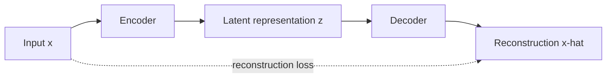
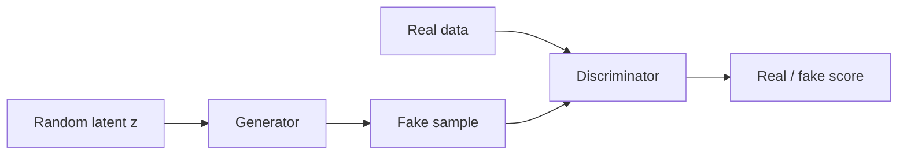

# Lecture 48 — How Can a Machine Create Something New

<!-- NOTEBOOK-LAB-NAV -->

## 🧪 Interactive Lab

The matching notebook is the complete hands-on laboratory for this lesson. It contains the runnable code, experiments, visualizations, and challenges.

**[📓 Open the notebook on GitHub](https://github.com/manish7725/deeplearning/blob/main/Lecture%2048%20-%20How%20Can%20a%20Machine%20Create%20Something%20New/notebook.ipynb)**  · **[▶ Open the notebook in Google Colab](https://colab.research.google.com/github/manish7725/deeplearning/blob/main/Lecture%2048%20-%20How%20Can%20a%20Machine%20Create%20Something%20New/notebook.ipynb)**


## 🧭 Where this lesson fits

**Previous lesson:** Blog 18 — How Does a Language Model Learn to Predict Text?.

**Today:** Blog 19 — How Can a Machine Create Something New?.

**Next lesson:** Blog 20 — Build a Tiny Neural Network From Scratch.

**Student rule:** if you cannot explain why this lesson follows the previous one, stop and reread the final takeaway of the previous blog. The equations below should feel like a continuation, not a new language.


## 1. What does “generate” mean?

A generative model learns a probability distribution over data.

Conceptually:

$$
x\sim p_{data}(x)
$$

The model tries to learn a useful approximation of that distribution.

Then it can sample:

$$
\tilde x\sim p_\theta(x)
$$

The generated example is new, but it is produced according to patterns learned from data.

---

## 2. Autoencoders: compress and reconstruct

An autoencoder has two major parts:

$$
z=Encoder(x)
$$

$$
\hat x=Decoder(z)
$$

The goal is to reconstruct the input:

$$
L=\|x-\hat x\|^2
$$

The latent vector $z$ becomes a compressed representation.



---

## 3. Variational autoencoders

A VAE does something more interesting.

Instead of mapping an input to one fixed latent point, the encoder predicts parameters of a probability distribution, commonly a Gaussian:

$$
q_\phi(z|x)=\mathcal N(\mu(x),\sigma(x)^2)
$$

The model samples a latent variable and decodes it.

A simplified VAE objective is

$$
L=\text{reconstruction loss}+\text{KL divergence}
$$

The KL term encourages the learned latent distribution to stay organized relative to a chosen prior.

This makes it possible to sample latent points and decode them into generated examples.

---

## 4. GANs: two networks compete

Generative Adversarial Networks use:

- a **generator** that creates samples;
- a **discriminator** that tries to distinguish real from generated samples.

The original minimax objective can be written conceptually as

$$
\min_G\max_D
V(D,G)=
\mathbb E_{x\sim p_{data}}[\log D(x)]
+
\mathbb E_{z\sim p(z)}[\log(1-D(G(z)))]
$$

The generator improves by trying to fool the discriminator.



GANs were influential, especially for image generation, although their optimization can be difficult.

---

## 5. Diffusion models: learn to reverse noise

A simplified diffusion story starts with clean data $x_0$ and gradually adds noise.

After many steps, the sample becomes approximately noise.

The model learns to reverse that process.

```text
clean image → noisy → very noisy → noise
noise        → denoise → denoise → clean image
```

A simplified forward process can be represented as

$$
q(x_t|x_{t-1})
$$

and the model learns a reverse process

$$
p_\theta(x_{t-1}|x_t)
$$

Repeated denoising can produce a new sample.

---

## 6. Why generation is still learning

Notice the same ingredients we studied earlier:

- parameters;
- forward computation;
- loss;
- derivatives;
- backpropagation;
- optimization.

Generative models are not outside deep learning.

They use the same mathematical foundation with different architectures and objectives.

---

## 7. A conceptual PyTorch autoencoder

```python
import torch
import torch.nn as nn

class Autoencoder(nn.Module):
    def __init__(self):
        super().__init__()
        self.encoder = nn.Linear(784, 32)
        self.decoder = nn.Linear(32, 784)

    def forward(self, x):
        z = torch.relu(self.encoder(x))
        return self.decoder(z)

model = Autoencoder()
```

Training would compare the reconstruction with the original input and optimize the parameters.

---

## 8. Generation versus copying

A useful question is:

> Is a generated sample simply a memorized training example?

The answer depends on the model, data and training behavior.

Generative models learn statistical structure, but they can also memorize or reproduce training examples in some circumstances.

So responsible evaluation includes checking quality, diversity, robustness and possible memorization.

---

## Think Like a Scientist 🧠

Imagine a model trained on thousands of handwritten digits.

If it generates a digit that nobody in the training set wrote exactly, what makes it recognizable as a “7”?

The interesting answer is that the model has learned statistical structure that defines the data distribution well enough to produce another plausible sample.

---

## What you should remember

> **Generative models learn patterns in data so they can produce new samples according to those learned patterns.**

Autoencoders learn useful representations and reconstruction.

VAEs introduce structured probabilistic latent spaces.

GANs use a generator and discriminator.

Diffusion models learn a process for reversing controlled corruption/noise.

Now it is time to put everything together.

> **Next: build a tiny neural network from scratch.**

---

# 📚 Go Deeper — Generative AI Through Multiple Lenses

**Welch Labs** is especially relevant here because its current AI material includes generative modeling and combines detailed graphics, exercises and supporting Python code.

**ZacharyLLM** is useful for connecting generative modeling to modern language and multimodal systems.

**Frame Zero** helps preserve the first-principles intuition: start with the data distribution and the learning objective rather than the buzzword.

**Visual Kernel** provides another visual/technical lens for modern generative architectures.

**3Blue1Brown** remains useful for the mathematical intuition behind neural networks, vectors, probability and transformations.

Use **MrJensenMath10** for probability, logarithms, functions and algebra.

### The unifying idea

Different generative models look very different, but each defines some way of learning a useful relationship between data, parameters and an objective:

$$
\boxed{\text{data}\rightarrow\text{model}\rightarrow\text{objective}\rightarrow\text{gradient}\rightarrow\text{update}}
$$

Architecture changes.

The mathematical learning machinery remains.
