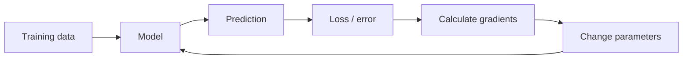

# Blog 01 — What Does It Mean for a Machine to Learn?

> **Deep Learning from First Principles — written for a Class 7 mind, but with the mathematics kept honest.**

Imagine you show a friend ten pictures of apples and ten pictures of oranges.

At first, your friend may confuse them.

But after seeing enough examples, something interesting happens.

You show a new fruit and your friend says:

> **“I think that is an orange.”** 🍊

You never gave your friend a rule for every possible orange.

Your friend discovered a **pattern**.

That tiny idea is the doorway to Machine Learning.

---

## 👑 The King's Question

Imagine a king asks his royal engineer:

> “Can you build me a machine that can recognize cats and dogs?”

The engineer has two choices.

### Choice 1 — Write every rule

```text
IF ears are pointed
AND fur is this color
AND nose has this shape
THEN maybe CAT
```

But what happens when the cat is black?

What happens when the dog has pointed ears?

What happens when the photograph is dark?

The list of rules can become enormous.

### Choice 2 — Show the machine examples

```text
Picture 1 → CAT
Picture 2 → DOG
Picture 3 → CAT
Picture 4 → DOG
...
Picture 10,000 → CAT/DOG
```

Then give it a new picture and ask:

```text
New picture → ?
```

The machine tries to discover the hidden pattern.

That is the central idea of **machine learning**.

---

# 1. Learning from examples

Suppose we are teaching a machine to identify fruit.

For every fruit, we measure three things:

| Feature | Example value |
|---|---:|
| Weight | 150 g |
| Color score | 8 |
| Roundness | 9 |

We can represent one fruit using numbers:

$$
\mathbf{x}=\begin{bmatrix}150\\8\\9\end{bmatrix}
$$

This is a **feature vector**.

A feature is simply a measurable property of something.

So:

```text
fruit
  ↓
measure it
  ↓
[weight, color, roundness]
  ↓
computer sees numbers
```

The computer does not see “apple” the way we do.

It sees numbers from which it can discover patterns.

---

## 🧠 What is a dataset?

One fruit is useful.

Thousands of fruits are much more useful.

Suppose we collect many examples:

```text
x₁ = [150, 8, 9]
x₂ = [170, 7, 8]
x₃ = [80,  9, 6]
...
xₙ = [...]
```

Together these examples form our **dataset**.

If every example has an answer, we can write:

```text
input                    answer
--------------------------------
[150, 8, 9]       →      orange
[170, 7, 8]       →      orange
[80,  9, 6]       →      apple
```

The machine's task is to discover a mathematical relationship between the input and the answer.

---

# 2. The mathematical view

We can think of a machine-learning model as a function:

$$
\hat y=f_\theta(\mathbf x)
$$

Here $\theta$ represents the model's learnable parameters.

For a simple model,

$$
\hat y=wx+b
$$

If $x=3$, $w=2$, and $b=1$:

$$
\hat y=2(3)+1=7
$$

A machine-learning model is also a function.

The difference is important:

> **We don't always know the best parameters beforehand. The machine learns them from data.**

---

# 3. A tiny learning machine

Suppose we want a machine to learn this pattern:

| $x$ | $y$ |
|---:|---:|
| 1 | 3 |
| 2 | 5 |
| 3 | 7 |
| 4 | 9 |

The hidden rule is

$$
y=2x+1
$$

But imagine the machine does **not** know that.

We give it a model:

$$
\hat y=wx+b
$$

The machine must discover good values for $w$ and $b$.

If it eventually finds

$$
w=2,\qquad b=1
$$

then

$$
\hat y=2x+1
$$

and the pattern is captured.

---

## 📈 See the model as a line

The equation

$$
y=2x+1
$$

creates a straight line.

A useful way to visualize it is to plot the training points and the learned line:

```text
 y
10|                ●
 9|              ●
 8|            /
 7|          ●
 6|        /
 5|      ●
 4|    /
 3|  ●
 2|/
 1|●
  +---------------------- x
    0  1  2  3  4  5
```

The points are the examples. The line is the model.

For a simple model, **learning means finding the line that best explains the examples**.

---

# 4. Prediction is not learning

Suppose our machine currently has:

$$
w=1,\qquad b=0
$$

Then

$$
\hat y=x
$$

For $x=3$:

$$
\hat y=3
$$

But the correct answer is

$$
y=7
$$

The machine made a mistake.

This gives us the most important question in learning:

> **How wrong was the machine?**

---

# 5. Loss — the machine's mistake meter

We need a number that tells us how bad a prediction was.

One simple choice is **squared error**:

$$
L=(y-\hat y)^2
$$

Suppose

$$
y=7,\qquad\hat y=3
$$

Then

$$
L=(7-3)^2=16
$$

If the prediction improves to $\hat y=6$:

$$
L=(7-6)^2=1
$$

The loss became smaller.

For many examples we can use mean squared error:

$$
MSE=\frac1n\sum_{i=1}^{n}(y_i-\hat y_i)^2
$$

Learning becomes an optimization problem: find parameters that make the loss small.

---

# 6. A tiny learning loop

Now we can reveal the complete idea.



The machine repeatedly does this:

### Step 1 — Predict

$$
\hat y=f_\theta(x)
$$

### Step 2 — Compare with the correct answer

$$
e=y-\hat y
$$

### Step 3 — Measure the mistake

$$
L(y,\hat y)
$$

### Step 4 — Calculate how parameters affect the loss

$$
\nabla_\theta L
$$

### Step 5 — Change the parameters

$$
\theta\leftarrow\theta-\eta\nabla_\theta L
$$

### Step 6 — Try again

And again.

And again.

Modern neural networks can repeat this process over enormous datasets.

---

# 7. But how does the machine know which direction to move?

This is where **calculus** enters deep learning.

Suppose the machine has one parameter $w$ and a loss

$$
L(w)=(w-3)^2
$$

Its derivative is

$$
\frac{dL}{dw}=2(w-3)
$$

At $w=0$:

$$
\frac{dL}{dw}=-6
$$

The negative sign tells us that increasing $w$ locally decreases the loss.

This is the foundation of gradient descent.

---

# 8. Code the tiny model

You can implement the same idea directly in Python without a deep-learning framework:

> 🧪 **[Run this code in Google Colab](https://colab.research.google.com/github/manish7725/deeplearning/blob/feature/01-deeplearning-syllabus/notebooks/01-what-is-learning.ipynb)**

> 🧪 **[Run this code in Google Colab](https://colab.research.google.com/github/manish7725/deeplearning/blob/main/notebooks/01-what-is-learning.ipynb)**

> 🧪 **[Run this code in Google Colab](https://colab.research.google.com/github/manish7725/deeplearning/blob/main/notebooks/01-what-is-learning.ipynb)**

```python
import numpy as np

x = np.array([1., 2., 3., 4.])
y = np.array([3., 5., 7., 9.])

w = 0.0
b = 0.0
learning_rate = 0.01

for step in range(2000):
    # Forward pass
    prediction = w * x + b

    # Loss
    error = prediction - y
    loss = np.mean(error ** 2)

    # Gradients
    dw = np.mean(2 * error * x)
    db = np.mean(2 * error)

    # Update
    w -= learning_rate * dw
    b -= learning_rate * db

print("weight:", w)
print("bias:", b)
```

The learned values should approach

$$
w\approx2,\qquad b\approx1
$$

This tiny program already contains the essential training loop used by much larger models.

---

# 9. Why mathematics matters

A machine does not understand the word “better.”

It understands numbers.

Mathematics gives us a language for describing learning:

| Idea | Mathematical tool |
|---|---|
| Information | Numbers / vectors |
| Model | Function |
| Many calculations | Matrices |
| Mistake | Loss function |
| Direction of improvement | Derivative / gradient |
| Repeated improvement | Optimization |
| Many transformations | Neural network |

This is why deep learning is not magic.

Underneath image recognition, speech recognition, recommendation systems, and language models are:

```text
Data
  ↓
Representation
  ↓
Mathematical function
  ↓
Prediction
  ↓
Loss
  ↓
Gradient
  ↓
Parameter update
  ↓
Better predictions
```

---

# 10. Why deep learning becomes powerful

Our tiny model was

$$
\hat y=wx+b
$$

Now imagine many transformations:

$$
\mathbf h_1=\sigma(W_1\mathbf x+\mathbf b_1)
$$

$$
\mathbf h_2=\sigma(W_2\mathbf h_1+\mathbf b_2)
$$

$$
\hat y=W_3\mathbf h_2+\mathbf b_3
$$

Each layer transforms the representation.

For an image, you can imagine a hierarchy such as

```text
pixels
  ↓
edges
  ↓
shapes
  ↓
parts
  ↓
objects
```

The exact internal features learned by a network depend on the architecture and data; this hierarchy is a useful mental model rather than a guaranteed rule.

The 3Blue1Brown neural-network series provides an especially useful visual intuition for neurons, layers, weights, biases and the linear-algebra structure behind them. citeturn0youtube30turn0youtube31

---

# 🧪 Think Like a Scientist

Suppose you want to teach a computer to distinguish a **cat 🐈 from a dog 🐕**.

What information could you give it?

Maybe:

- height
- body length
- ear shape
- tail length
- fur pattern
- nose shape

But there is a deeper question:

> **Which measurements actually help?**

A useless measurement gives the model noise.

A useful measurement gives the model information.

So even before neural networks, we need to learn how to represent the world using numbers.

That takes us naturally to our next lesson.

# Blog 02 — How Do Numbers Become Vectors?

Because before a machine can learn from information, **we need to teach the machine how to represent information mathematically.**

---

## 🧠 What you should remember

1. Machine learning learns patterns from examples.
2. Data can be represented using numbers.
3. A model is a mathematical function.
4. Parameters such as weights and biases can be adjusted.
5. A prediction can be compared with the correct answer.
6. A loss function turns “wrong” into a number.
7. Learning means changing parameters to reduce loss.
8. Derivatives tell us how changes in parameters affect the loss.
9. Deep learning builds complicated functions from many simple transformations.

> **Data gives the machine examples. Mathematics gives it a way to learn from those examples.**

---

# 🧪 Hands-on Lab — Make Learning Observable

Use [`../labs/01-learning-lab.md`](../labs/01-learning-lab.md).

Start with the smallest possible learning experiment:

> 🧪 **[Run this code in Google Colab](https://colab.research.google.com/github/manish7725/deeplearning/blob/feature/01-deeplearning-syllabus/notebooks/01-what-is-learning.ipynb)**

> 🧪 **[Run this code in Google Colab](https://colab.research.google.com/github/manish7725/deeplearning/blob/main/notebooks/01-what-is-learning.ipynb)**

> 🧪 **[Run this code in Google Colab](https://colab.research.google.com/github/manish7725/deeplearning/blob/main/notebooks/01-what-is-learning.ipynb)**

```python
import numpy as np

x = np.array([1., 2., 3., 4.])
y = np.array([3., 5., 7., 9.])

w = 0.0
b = 0.0
lr = 0.01

for step in range(2000):
    prediction = w * x + b
    error = prediction - y
    loss = np.mean(error ** 2)

    dw = np.mean(2 * error * x)
    db = np.mean(2 * error)

    w -= lr * dw
    b -= lr * db

print(w, b)
```

### Challenges

1. Start with different values of `w` and `b`.
2. Try three learning rates.
3. Record the loss every 100 steps.
4. Plot the loss.
5. Explain why the loss decreases.
6. Change the data to $y=3x-2$ and train again.

### Final question

Before moving to Blog 02, explain this loop without using the words “AI” or “magic”:

$$
\boxed{\text{predict}\rightarrow\text{measure}\rightarrow\text{differentiate}\rightarrow\text{update}}
$$

If you can explain that, you have understood the seed from which the rest of deep learning grows.

---

# 📚 Go Deeper — Your First Resource Ladder

Use **3Blue1Brown** when you want a visual mathematical explanation of neural networks, vectors, transformations and calculus. Its neural-network material is particularly useful for seeing how the equations map onto the network. citeturn0youtube30turn0youtube31

Use **Welch Labs** when you want to build the ideas with code. Its Neural Networks Demystified sequence explicitly progresses through architecture, forward propagation, gradient descent, backpropagation, numerical gradient checking, training and overfitting. citeturn0search0turn0search8turn0search5

Use **Frame Zero** for another first-principles ML perspective.

Use **MrJensenMath10** for the school-level mathematics that makes algebra, functions, graphs and calculus comfortable.

Use **ZacharyLLM** once the series reaches embeddings, attention, Transformers and LLMs.

Use **Visual Kernel** as an additional visual/technical perspective on modern ML systems.

### How to use these resources

Do not watch every resource before continuing.

Use a resource only when you can name what is missing:

> **I can calculate it but cannot visualize it.** → 3Blue1Brown

> **I understand the idea but my mathematics is weak.** → mathematics practice

> **I understand the math but cannot implement it.** → Welch Labs / PyTorch practice

> **I understand the mechanism but not its modern application.** → Frame Zero / ZacharyLLM / Visual Kernel

The goal of this series is not to replace excellent teachers.

It is to connect their explanations into one coherent path:

$$
\boxed{\text{intuition}\rightarrow\text{mathematics}\rightarrow\text{code}\rightarrow\text{experiment}\rightarrow\text{mastery}}
$$
