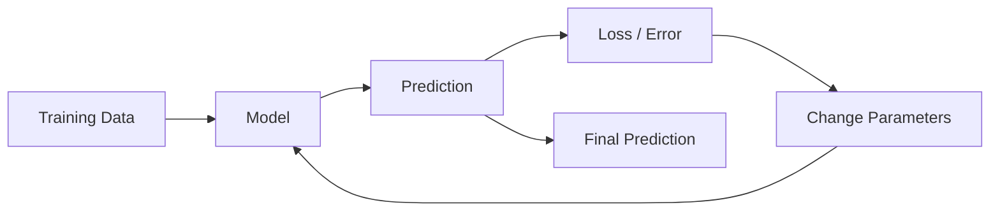

# Blog 01 — What Does It Mean for a Machine to Learn?

> **Deep Learning from First Principles — written for a Class 7 mind, but with the mathematics kept honest.**

Imagine you show a friend ten pictures of apples and ten pictures of oranges.

At first, your friend may confuse them.

But after seeing enough examples, something interesting happens.

You show a new fruit and your friend says:

> **“I think that is an orange.”** 🍊

You never gave your friend a rule for every possible orange.

Your friend discovered a **pattern**.

That tiny idea is the doorway to Machine Learning.

---

## 👑 The King's Question

Imagine a king asks his royal engineer:

> “Can you build me a machine that can recognize cats and dogs?”

The engineer has two choices.

### Choice 1 — Write every rule

```text
IF ears are pointed
AND fur is this color
AND nose has this shape
THEN maybe CAT
```

But what happens when the cat is black?

What happens when the dog has pointed ears?

What happens when the photograph is dark?

The list of rules can become enormous.

### Choice 2 — Show the machine examples

```text
Picture 1 → CAT
Picture 2 → DOG
Picture 3 → CAT
Picture 4 → DOG
...
Picture 10,000 → CAT/DOG
```

Then give it a new picture and ask:

```text
New picture → ?
```

The machine tries to discover the hidden pattern.

That is the central idea of **machine learning**.

---

# 1. Learning from examples

Suppose we are teaching a machine to identify fruit.

For every fruit, we measure three things:

| Feature | Example value |
|---|---:|
| Weight | 150 g |
| Color score | 8 |
| Roundness | 9 |

We can represent one fruit using numbers:

```text
x = [150, 8, 9]
```

This is called a **feature vector**.

A feature is simply a measurable property of something.

So:

```text
fruit
  ↓
measure it
  ↓
[weight, color, roundness]
  ↓
computer sees numbers
```

The computer does not see “apple” the way we do.

It sees numbers from which it can discover patterns.

---

## 🧠 What is a dataset?

One fruit is useful.

Thousands of fruits are much more useful.

Suppose we collect many examples:

```text
x₁ = [150, 8, 9]
x₂ = [170, 7, 8]
x₃ = [80,  9, 6]
...
xₙ = [...]
```

Together these examples form our **dataset**.

If every example has an answer, we can write:

```text
input                    answer
--------------------------------
[150, 8, 9]       →      orange
[170, 7, 8]       →      orange
[80,  9, 6]       →      apple
```

The machine's task is to discover a mathematical relationship between the input and the answer.

---

# 2. The mathematical view

Here is where the programmer and mathematician inside us enters the room. 🧑‍💻➕📐

We can think of a machine-learning model as a function:

```text
f(x) → y
```

This is exactly like a function you may have seen in mathematics.

For example:

```text
f(x) = 2x + 1
```

If `x = 3`:

```text
f(3) = 2(3) + 1
     = 7
```

A machine-learning model is also a function.

The difference is important:

> **We don't always know the best function beforehand. The machine learns its parameters from data.**

---

# 3. A tiny learning machine

Let's make the problem ridiculously small.

Suppose we want a machine to learn this pattern:

```text
x = 1 → y = 3
x = 2 → y = 5
x = 3 → y = 7
```

Can you see the rule?

```text
multiply by 2
then add 1
```

So:

```text
y = 2x + 1
```

But imagine the machine does **not** know that.

We give it a model:

```text
ŷ = wx + b
```

The symbols are simple:

- `x` → input
- `w` → weight
- `b` → bias
- `ŷ` → prediction

The machine must discover good values for `w` and `b`.

If it eventually finds:

```text
w = 2
b = 1
```

then:

```text
ŷ = 2x + 1
```

and the pattern is captured.

---

## 📈 See the model as a line

The equation

```text
y = 2x + 1
```

creates a straight line.

genui{"graph":{"expressions":[{"latex":"y=2x+1","restrictions":["-2\\le x\\le 5"]}]}}

The amazing thing is that **learning a model can mean learning the shape of a mathematical function**.

For a simple model, that shape may be a line.

For a neural network, the shape can become enormously more complicated.

---

# 4. Prediction is not learning

Suppose our machine currently has:

```text
w = 1
b = 0
```

Then:

```text
ŷ = x
```

For `x = 3`:

```text
prediction = 3
```

But the correct answer is:

```text
y = 7
```

The machine made a mistake.

This gives us the most important question in learning:

> **How wrong was the machine?**

---

# 5. Loss — the machine's mistake meter

We need a number that tells us how bad a prediction was.

One simple choice is **squared error**:

```text
L = (y - ŷ)²
```

Suppose:

```text
y  = 7
ŷ  = 3
```

Then:

```text
L = (7 - 3)²
  = 4²
  = 16
```

So the model receives a loss of `16`.

Now imagine the prediction improves:

```text
ŷ = 6
```

Then:

```text
L = (7 - 6)²
  = 1
```

The loss became smaller.

So the machine has a direction:

```text
large loss  ───────────────→  small loss
     😞                         🙂
```

Learning is the process of finding parameters that make this number smaller.

---

# 6. The real learning loop

Now we can reveal the complete idea.



The machine repeatedly does this:

### Step 1 — Predict

```text
ŷ = f(x)
```

### Step 2 — Compare with the correct answer

```text
y - ŷ
```

### Step 3 — Measure the mistake

```text
L(y, ŷ)
```

### Step 4 — Change the parameters

```text
w, b → better values
```

### Step 5 — Try again

And again.

And again.

Millions or billions of times for modern neural networks.

---

# 7. But how does the machine know which direction to move?

This is where **calculus** enters deep learning.

Suppose the machine has a parameter `w`.

We can imagine the loss as a landscape:

```text
Loss
  ↑
  |        ●
  |      /   \
  |    /       \
  |  /           \
  |_/______●______\____→ w
          best
```

Our goal is to move toward a low point of the loss.

A derivative tells us something incredibly useful:

> **If I change this parameter slightly, which way does the loss move?**

That question becomes the foundation of **gradient descent**, which we will study carefully later.

---

# 8. Why mathematics matters

A machine does not understand the word “better.”

It understands numbers.

Mathematics gives us a language for describing learning:

| Idea | Mathematical tool |
|---|---|
| Information | Numbers / vectors |
| Model | Function |
| Many calculations | Matrices |
| Mistake | Loss function |
| Direction of improvement | Derivative / gradient |
| Repeated improvement | Optimization |
| Many layers of models | Neural network |

This is why deep learning is not magic.

Underneath image recognition, speech recognition, recommendation systems, and language models are:

```text
Data
  ↓
Mathematics
  ↓
Functions
  ↓
Parameters
  ↓
Prediction
  ↓
Loss
  ↓
Gradients
  ↓
Parameter updates
  ↓
Better predictions
```

---

# 9. Why deep learning becomes powerful

Our tiny model was:

```text
ŷ = wx + b
```

That is just one simple mathematical transformation.

Now imagine putting many such transformations together:

```text
Input
  ↓
[neurons]
  ↓
[neurons]
  ↓
[neurons]
  ↓
Output
```

Each layer transforms the information.

Early layers may learn simple patterns.

Later layers can combine those patterns into more useful concepts.

For an image, you can imagine the progression:

```text
pixels
  ↓
edges
  ↓
shapes
  ↓
parts
  ↓
objects
```

This idea of **learning representations through layers** is one of the central ideas behind deep learning. The 3Blue1Brown neural-network series illustrates this progression visually, including neurons, layers, weights, biases, and the linear-algebra notation behind them. citeturn0youtube30turn0youtube31

---

# 10. The most important mental model

Do not think of machine learning as:

> “A computer magically becomes intelligent.”

Think of it as:

> **A mathematical machine with adjustable numbers learns useful values for those numbers by looking at examples and measuring its mistakes.**

That sentence is worth remembering.

---

# 🧪 Think Like a Scientist

Suppose you want to teach a computer to distinguish a **cat 🐈 from a dog 🐕**.

What information could you give it?

Maybe:

- height
- body length
- ear shape
- tail length
- fur pattern
- nose shape

But there is a deeper question:

> **Which measurements actually help?**

A useless measurement gives the model noise.

A useful measurement gives the model information.

So even before neural networks, we need to learn how to represent the world using numbers.

That takes us naturally to our next lesson:

# Blog 02 — How Do Numbers Become Vectors?

Because before a machine can learn from information, **we need to teach the machine how to represent information mathematically.**

---

## 🧠 What you should remember

1. Machine learning learns patterns from examples.
2. Data can be represented using numbers.
3. A model is a mathematical function.
4. Parameters such as weights and biases can be adjusted.
5. A prediction can be compared with the correct answer.
6. A loss function turns “wrong” into a number.
7. Learning means changing parameters to reduce loss.
8. Derivatives tell us how changes in parameters affect the loss.
9. Deep learning builds complicated functions from many simple transformations.

> **Data gives the machine examples. Mathematics gives it a way to learn from those examples.**