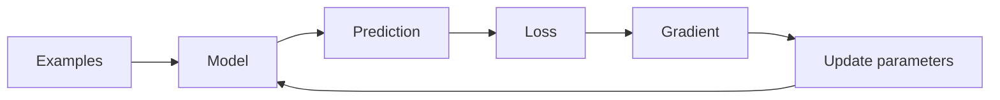

# Chapter 01 — What Does It Mean for a Machine to Learn?

> **Big question:** How can a machine improve its answers without us writing every rule?

<!-- NOTEBOOK-LAB-NAV -->

## 🧪 Laboratory

The matching notebook is the hands-on laboratory for this chapter.

- 📓 [Open the notebook on GitHub](https://github.com/manish7725/deeplearning/blob/reorg/class8-to-phd-curriculum/notebooks/01-what-is-learning.ipynb)
- ▶️ [Open the notebook in Google Colab](https://colab.research.google.com/github/manish7725/deeplearning/blob/reorg/class8-to-phd-curriculum/notebooks/01-what-is-learning.ipynb)

---

## 🧭 Where we are in the journey

**Before this chapter:** nothing. This is our starting point.

**Today:** we build the smallest possible picture of machine learning.

**Next:** we need a language for describing information with numbers. That leads to **vectors**.

The journey begins with one deceptively simple question:

> If we can write a program that makes a prediction, have we taught it to learn?

**No.** Prediction and learning are different things. By the end of this chapter, you will see exactly why.

---

# 1. The King's Question 👑

Imagine a king asks an engineer:

> “Build me a machine that can recognize cats and dogs.”

There are two ways to attack the problem.

### Way A — Write rules

We might try:

```text
IF ears are pointed
AND body has fur
AND nose has a certain shape
THEN CAT
```

But real life immediately fights us.

What if the dog has pointed ears?
What if the cat is sitting in darkness?
What if the photograph is blurry?
What if the animal is partly hidden?

We could keep adding rules forever.

### Way B — Show examples

Instead, we could show the machine examples:

```text
picture → CAT
picture → DOG
picture → CAT
picture → DOG
...
```

Then give it a picture it has never seen:

```text
new picture → ?
```

The machine uses the examples to discover a pattern that can help it make a new prediction.

That is the basic idea behind **machine learning**.

But “learn a pattern” needs to become mathematics.

---

# 2. What exactly is an example?

A computer works with numbers.

So suppose we describe a fruit using three measurements:

| Feature | Example |
|---|---:|
| Weight | 150 g |
| Color score | 8 |
| Roundness | 9 |

We can turn the fruit into a list of numbers:

$$
\mathbf{x}=\begin{bmatrix}150\\8\\9\end{bmatrix}
$$

This is called a **vector**.

For now, don't worry about the fancy word. Think of it as a box containing measurements.

```text
real object
    ↓
measure it
    ↓
[150, 8, 9]
    ↓
computer can calculate with it
```

This creates our first important bridge:

> **Machine learning begins by turning useful observations into numbers.**

We will study vectors properly in Chapter 02.

---

# 3. Many examples make a dataset

One example is rarely enough.

Suppose we collect many fruits:

```text
x₁ = [150, 8, 9]
x₂ = [170, 7, 8]
x₃ = [ 80, 9, 6]
x₄ = [160, 8, 9]
...
```

These examples together form a **dataset**.

If we also know the correct answer for every example, we have labelled examples:

| Input | Correct answer |
|---|---|
| `[150, 8, 9]` | orange |
| `[170, 7, 8]` | orange |
| `[80, 9, 6]` | apple |

The learning problem is now more precise:

> Find a mathematical rule that maps inputs to useful predictions.

We can write that idea as

$$
\hat y=f_\theta(\mathbf{x})
$$

Read this as:

```text
input x
  ↓
model f with parameters θ
  ↓
prediction ŷ
```

The little hat on $\hat y$ means **prediction**, not the true answer.

The symbol $\theta$ represents the values the model can learn.

---

# 4. Our first learning machine

Let's make the machine tiny enough to understand completely.

Suppose the true data follows this pattern:

| $x$ | $y$ |
|---:|---:|
| 1 | 3 |
| 2 | 5 |
| 3 | 7 |
| 4 | 9 |

You may notice:

$$
y=2x+1
$$

But pretend the machine does **not** know that.

We give it a model with two unknown numbers:

$$
\hat y=wx+b
$$

Here:

- $w$ controls the **slope**;
- $b$ controls the **starting height**.

The machine's job is to discover $w$ and $b$.

If it discovers

$$
w=2,\qquad b=1
$$

then its model becomes

$$
\hat y=2x+1.
$$

It has captured the pattern.

---

# 5. Prediction is not learning

Suppose we start with:

$$
w=1,\qquad b=0.
$$

Our machine predicts

$$
\hat y=x.
$$

For $x=3$:

$$
\hat y=3.
$$

But the correct answer is

$$
y=7.
$$

So the machine can **predict**, but it has not yet **learned** the desired relationship.

This distinction is fundamental:

> **Prediction is what the model does. Learning is the process of changing the model so its predictions improve.**

Now we need a way to measure “improve.”

---

# 6. Loss: a mistake meter 📏

We need a number that tells us how bad a prediction is.

For our first lesson, use squared error:

$$
L=(y-\hat y)^2
$$

Suppose:

$$
y=7,\qquad \hat y=3.
$$

Then

$$
L=(7-3)^2=16.
$$

Now imagine the model predicts $6$:

$$
L=(7-6)^2=1.
$$

Smaller loss means a better prediction for this example.

For $n$ examples, we can average the errors:

$$
\mathrm{MSE}=\frac{1}{n}\sum_{i=1}^{n}(y_i-\hat y_i)^2.
$$

This is called **mean squared error**.

Notice what just happened.

We turned the vague idea “the machine should become better” into a number we can calculate.

That is a major theme of deep learning:

> **If we can measure improvement, we can try to optimize it.**

---

# 7. Learning becomes a search problem 🔎

Our model has two unknown parameters:

$$
\theta=(w,b).
$$

Every choice of $w$ and $b$ produces a different line.

Every line produces predictions.

Every set of predictions produces a loss.

So we can imagine a giant search:

```text
choose w,b
   ↓
predict
   ↓
measure loss
   ↓
choose better w,b
   ↓
measure again
   ↓
repeat
```

For a model with only two parameters, we could even imagine trying many possibilities by hand.

For a neural network with millions or billions of parameters, guessing is hopeless.

We need something smarter.

That something is the **gradient**.

---

# 8. The learning loop

Here is the entire idea in one picture:



The loop is:

### Step 1 — Give the model data

$$
\mathbf{x}
$$

### Step 2 — Make a prediction

$$
\hat y=f_\theta(\mathbf{x})
$$

### Step 3 — Measure the mistake

$$
L(y,\hat y)
$$

### Step 4 — Ask how each parameter affects the loss

$$
\nabla_\theta L
$$

### Step 5 — Move the parameters

$$
\theta\leftarrow\theta-\eta\nabla_\theta L
$$

Here $\eta$ is the **learning rate**.

Then we repeat.

```text
predict → measure → calculate direction → move → repeat
```

This simple loop will reappear throughout the entire course.

---

# 9. Why the gradient points us somewhere useful

Let's temporarily forget $w$ and $b$ and study one parameter.

Suppose the loss is

$$
L(w)=(w-3)^2.
$$

The best value is clearly $w=3$, because

$$
L(3)=0.
$$

The derivative is

$$
\frac{dL}{dw}=2(w-3).
$$

At $w=0$:

$$
\frac{dL}{dw}=2(0-3)=-6.
$$

The negative sign tells us that, locally, increasing $w$ moves us toward lower loss.

At $w=5$:

$$
\frac{dL}{dw}=2(5-3)=4.
$$

Now the positive sign tells us that decreasing $w$ is the useful direction.

So the derivative acts like a compass:

```text
negative gradient → move right
positive gradient → move left
near zero         → near a flat/best point
```

Chapter 08 will build this idea carefully from the meaning of slope. Chapter 09 will turn it into gradient descent.

---

# 10. The smallest possible training program

Now we can implement the idea without PyTorch.

```python
import numpy as np

x = np.array([1., 2., 3., 4.])
y = np.array([3., 5., 7., 9.])

w = 0.0
b = 0.0
learning_rate = 0.01

for step in range(2000):
    # 1. Predict
    prediction = w * x + b

    # 2. Measure error
    error = prediction - y
    loss = np.mean(error ** 2)

    # 3. Calculate how w and b affect the loss
    dw = np.mean(2 * error * x)
    db = np.mean(2 * error)

    # 4. Improve the model
    w -= learning_rate * dw
    b -= learning_rate * db

print("weight:", w)
print("bias:", b)
```

The learned values should approach

$$
w\approx2,\qquad b\approx1.
$$

And therefore the model should predict approximately

$$
\hat y\approx11
$$

when $x=5$.

### A very important observation

There is no magic word such as `learn()` in this program.

Learning is just a sequence of mathematical operations:

```text
numbers
→ prediction
→ error
→ loss
→ gradient
→ parameter update
→ better prediction
```

Later, PyTorch will automate many of these calculations. But we will first understand what the calculations mean.

---

# 11. What deep learning adds

Our first model is tiny:

$$
\hat y=wx+b.
$$

A neural network composes many transformations:

$$
\mathbf h_1=\sigma(W_1\mathbf{x}+\mathbf b_1)
$$

$$
\mathbf h_2=\sigma(W_2\mathbf h_1+\mathbf b_2)
$$

$$
\hat y=W_3\mathbf h_2+\mathbf b_3.
$$

$$
$$

The model now has many parameters and can represent much more complicated relationships.

Conceptually:

```text
simple input
    ↓
transformation
    ↓
new representation
    ↓
transformation
    ↓
new representation
    ↓
prediction
```

For images, people often use the helpful mental picture:

```text
pixels → edges → shapes → parts → objects
```

But this is a **mental model**, not a guarantee that every network learns exactly this clean hierarchy.

The essential mechanism remains the same:

> **A model has parameters. Data produces a loss. Gradients tell us how to change the parameters.**

---

# 12. What can go wrong?

Learning is not automatically successful.

### Failure 1 — Bad representation

If the input does not contain useful information, the model may have little chance of solving the task.

### Failure 2 — Wrong model

A straight line cannot perfectly represent every possible relationship.

### Failure 3 — Wrong loss

If we measure the wrong thing, the model may optimize the wrong goal.

### Failure 4 — Bad learning rate

A learning rate that is too small can make learning painfully slow.

A learning rate that is too large can cause unstable updates.

### Failure 5 — Memorization

A model can perform extremely well on examples it has seen while performing poorly on new examples.

Later we will call this **overfitting** and study train/test splits.

So “loss became smaller” is useful—but it is not the entire definition of success.

---

# 13. The three questions to ask about every model

Whenever you meet a new machine-learning algorithm, ask:

### Question 1 — What goes in?

What information does the model receive?

$$
\mathbf{x}
$$

### Question 2 — What calculation happens?

What function transforms the input?

$$
\hat y=f_\theta(\mathbf{x})
$$

### Question 3 — How does it improve?

What loss is measured, and how are the parameters changed?

$$
L(y,\hat y)
$$

and

$$
\theta\leftarrow\theta-\eta\nabla_\theta L.
$$

These three questions will become our permanent mental toolkit.

---

# 14. 🧪 Interactive mathematical playground

The notebook lets you change the model parameters and watch the loss change.

The most important visual we will build later is a **loss landscape**:

```text
loss
 ↑
 |          •
 |       •     •
 |    •           •
 |  •      ★        •
 | •                 •
 +------------------------→ parameter
          best region
```

Imagine the star is the bottom of a valley.

Gradient descent is like a hiker trying to walk downhill without seeing the entire mountain.

Change the learning rate and watch what happens:

- tiny steps → slow progress;
- sensible steps → convergence;
- huge steps → overshooting or instability.

The notebook is where you should **predict first, run second, explain third**.

---

# 15. Hand calculation challenge ✍️

Do this before opening the notebook.

Suppose:

$$
w=2,
\qquad b=0,
\qquad x=4,
\qquad y=10.
$$

### Step 1 — Prediction

$$
\hat y=wx+b=2(4)+0=8.
$$

### Step 2 — Error

Using prediction minus target:

$$
e=\hat y-y=8-10=-2.
$$

### Step 3 — Squared loss

$$
L=e^2=(-2)^2=4.
$$

Now change the prediction to $9$.

What is the new loss?

Answer:

$$
(9-10)^2=1.
$$

The model became better because the loss became smaller.

This tiny calculation contains the seed of the training loop used by modern neural networks.

---

# 16. 🧠 Misconceptions to remove early

### “Machine learning means the computer understands.”

Not necessarily. A model performs mathematical operations learned from data.

### “A model learns because we call a training API.”

The API is a tool. Underneath it are predictions, losses, derivatives and parameter updates.

### “Lower training loss always means a better model.”

No. We ultimately care about useful performance, including behaviour on data the model did not train on.

### “More parameters automatically means better learning.”

No. Data, architecture, optimization, regularization and evaluation all matter.

### “Deep learning is completely different from simple regression.”

The models can be vastly more powerful, but the core loop is surprisingly similar.

---

# 17. What you should be able to explain

Before moving on, explain these sentences without looking at the chapter:

1. A dataset contains examples.
2. A model maps inputs to predictions.
3. Parameters control the model.
4. A loss function measures error according to a chosen objective.
5. A gradient tells us how changing parameters changes the loss locally.
6. Training repeatedly updates parameters to improve the objective.
7. Prediction is an operation; learning is parameter improvement through data and an objective.

If you can explain those seven ideas, you have the foundation for the rest of the course.

---

# 18. 🧩 Mini-project: teach a machine a rule

Create your own tiny dataset following a rule such as

$$
y=3x+2.
$$

Then:

1. create five training examples;
2. start $w$ and $b$ at zero;
3. calculate predictions;
4. calculate MSE;
5. derive or verify the gradients;
6. train for several hundred steps;
7. plot the loss;
8. plot the learned line against the data;
9. predict the answer for an unseen $x$;
10. deliberately make the learning rate too large and explain what happens.

**Research extension:** add noise to the targets. Does the model recover the original rule exactly? What does “best fit” mean when the data is imperfect?

---

# 19. The bigger map

We have now uncovered the central machine-learning loop:

```text
WORLD
  ↓
measure useful information
  ↓
NUMBERS
  ↓
MODEL
  ↓
prediction
  ↓
LOSS
  ↓
GRADIENT
  ↓
PARAMETER UPDATE
  ↓
BETTER MODEL
```

But one piece is still mysterious.

We casually wrote

$$
\mathbf{x}
$$

for our input.

How do we represent something complicated—such as a fruit, image, sentence or sound—as a collection of numbers that mathematics can manipulate?

That is our next chapter.

---

# ➡️ Next: Numbers Become Vectors

**Chapter 02** will answer:

> **How can a list of numbers become a meaningful mathematical object?**

We will learn vectors by hand, visualize them as arrows, calculate with them, and discover why vectors become the basic language of modern machine learning.
