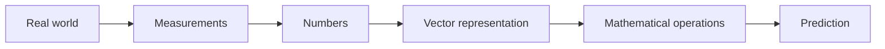

# Blog 02 — How Do Numbers Become Vectors?

> **Deep Learning from First Principles**  
> Written so a Class 7 student can follow the story, while the mathematics stays honest.

Imagine a king walking into the royal laboratory with a strange question:

> **“Can a machine understand which student is likely to become a great scientist?”**

The scientist does not start with a neural network. He starts with a much simpler question:

> **“How will we describe a student using numbers?”**

That question leads us to one of the most important objects in machine learning: the **vector**.

---

## 1. A computer needs a numerical description

Suppose we describe three students using two measurements:

- mathematics score
- science score

```text
Alice → [9, 8]
Bob   → [8, 9]
Cara  → [3, 4]
```

We can write Alice as

$$
\mathbf{x}=\begin{bmatrix}9\\8\end{bmatrix}
$$

A vector is an **ordered collection of numbers**. Order matters:

$$
[9,8]\neq[8,9]
$$

because each position can have a different meaning.

---

## 2. From a story to a coordinate

The vector $[9,8]$ can also be treated as the point $(9,8)$ on a graph.

- first coordinate → horizontal position
- second coordinate → vertical position

We have converted a real-world object into a location in mathematical space.

That is the beginning of **numerical representation**.

---

## 3. Distance gives us a notion of similarity

For Alice $A=(9,8)$ and Bob $B=(8,9)$:

$$
d(A,B)=\sqrt{(9-8)^2+(8-9)^2}=\sqrt2
$$

For Alice and Cara $C=(3,4)$:

$$
d(A,C)=\sqrt{(9-3)^2+(8-4)^2}=\sqrt{52}\approx7.21
$$

So Alice is much closer to Bob than to Cara in this representation.

> **Once objects become vectors, relationships between objects can become mathematics.**

---

## 4. A vector can be an arrow

For

$$
\mathbf{v}=\begin{bmatrix}3\\2\end{bmatrix}
$$

start at $(0,0)$ and move 3 units right and 2 units up.

Its length is

$$
\|\mathbf v\|=\sqrt{3^2+2^2}=\sqrt{13}
$$

This length is called the **norm**.

The same object can therefore be understood in three ways:

| View | Meaning |
|---|---|
| List | A collection of numbers |
| Point | A location in feature space |
| Arrow | Direction + magnitude |

---

## 5. Vector addition

Let

$$
\mathbf a=\begin{bmatrix}2\\1\end{bmatrix},\qquad
\mathbf b=\begin{bmatrix}1\\3\end{bmatrix}
$$

Then

$$
\mathbf a+\mathbf b
=\begin{bmatrix}2+1\\1+3\end{bmatrix}
=\begin{bmatrix}3\\4\end{bmatrix}
$$

Think of this as two consecutive movements. First move $(2,1)$, then $(1,3)$. The total movement is $(3,4)$.

---

## 6. Scalar multiplication

If

$$
\mathbf x=\begin{bmatrix}2\\3\end{bmatrix}
$$

then

$$
2\mathbf x=\begin{bmatrix}4\\6\end{bmatrix}
$$

The direction stays the same while the magnitude doubles.

With $-1$:

$$
-\mathbf x=\begin{bmatrix}-2\\-3\end{bmatrix}
$$

The arrow reverses direction.

These simple operations become building blocks for neural networks.

---

## 7. The dot product — the calculator inside a neuron

Take

$$
\mathbf x=\begin{bmatrix}2\\3\end{bmatrix},\qquad
\mathbf w=\begin{bmatrix}4\\5\end{bmatrix}
$$

Their dot product is

$$
\mathbf x\cdot\mathbf w=2(4)+3(5)=23
$$

In general,

$$
\mathbf x\cdot\mathbf w=\sum_{i=1}^{n}x_iw_i
$$

This is a **weighted sum**. The weights tell us how strongly each feature contributes.

A neuron will soon use almost exactly this calculation.

---

## 8. Python: turn the mathematics into an experiment

```python
import numpy as np

x = np.array([2.0, 3.0])
w = np.array([4.0, 5.0])

print("x + w =", x + w)
print("2x    =", 2 * x)
print("x · w =", x @ w)
print("||x|| =", np.linalg.norm(x))
```

Expected output:

```text
x + w = [6. 8.]
2x    = [4. 6.]
x · w = 23.0
||x|| = 3.6055...
```

Try changing the numbers before running the code. Predict first; verify second.

---

## 9. Dimension: how many coordinates?

$$
[4,7]\quad\text{has 2 dimensions}
$$

$$
[4,7,2]\quad\text{has 3 dimensions}
$$

$$
[x_1,x_2,\ldots,x_{100}]\quad\text{has 100 dimensions}
$$

We cannot easily draw 100 dimensions, but the algebra still works.

A photograph can contain millions of numerical values. A language model can represent a token using hundreds or thousands of coordinates.

> **Visualization has limits. Algebra does not.**

---

## 10. Dimension and shape are not the same idea

```python
x = np.array([2, 3, 4])
print(x.shape)
```

Output:

```text
(3,)
```

Now create three examples:

```python
X = np.array([
    [2, 3, 4],
    [5, 6, 7],
    [8, 9, 10]
])

print(X.shape)
```

Output:

```text
(3, 3)
```

This means **3 examples × 3 features**.

We have just reached the doorway of matrices.

---

## 11. The deep-learning pipeline



A photograph, sound wave, sentence or sensor reading eventually has to become numerical data before a neural network can process it.

But there is a deeper question:

> **Did we choose numbers that preserve useful information?**

That is the representation problem.

---

## 12. A common representation mistake

Suppose we encode colors like this:

```text
red = 1
blue = 2
orange = 3
```

The model could interpret orange as numerically closer to blue than red. But color categories do not naturally have this ordering.

So machine learning is not merely about converting things into numbers.

It is about finding a **useful numerical representation**.

---

## Think Like a Scientist 🧠

Pick three objects around you: perhaps a book, bottle and phone.

Choose three measurable properties for each object. Write each object as a vector.

Then ask:

1. Which two objects are closest?
2. Which feature contributes most to the distance?
3. What happens if you change the units?

You have created a tiny machine-learning dataset.

---

## What you should remember

> **A vector is a structured numerical representation of something.**

Remember:

- vector = ordered numbers
- point = location in feature space
- arrow = direction and magnitude
- distance = one way to compare representations
- dot product = weighted combination
- dimension = number of coordinates
- shape = arrangement of dimensions
- representation quality strongly affects learning

One vector describes one example. Real models learn from many examples.

So next we need a mathematical structure that can hold many vectors at once.

> **Next: matrices — the spreadsheet of mathematics.**
