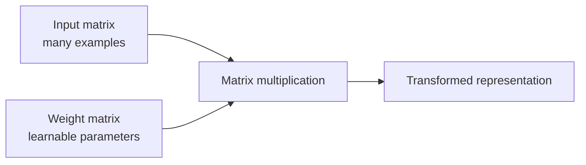

# Blog 03 — Matrices: The Spreadsheet of Mathematics

<!-- NOTEBOOK-LAB-NAV -->

## 🧪 Interactive Lab

The matching notebook is the complete hands-on laboratory for this lesson. It contains the runnable code, experiments, visualizations, and challenges.

**[📓 Open the notebook on GitHub](https://github.com/manish7725/deeplearning/blob/main/notebooks/03-matrices-the-spreadsheet-of-math.ipynb)**  · **[▶ Open the notebook in Google Colab](https://colab.research.google.com/github/manish7725/deeplearning/blob/main/notebooks/03-matrices-the-spreadsheet-of-math.ipynb)**

## 1. A dataset is naturally a matrix

Suppose we measure mathematics and science for three students:

$$
X=
\begin{bmatrix}
8&7\\
9&8\\
3&4
\end{bmatrix}
$$

Read it as a table:

| Student | Math | Science |
|---|---:|---:|
| 1 | 8 | 7 |
| 2 | 9 | 8 |
| 3 | 3 | 4 |

The matrix has **3 rows and 2 columns**, so its shape is

$$
X\in\mathbb R^{3\times2}
$$

Rows are examples. Columns are features.

This convention is common, although other conventions are also possible. The important thing is to be consistent.

---

## 2. Why shape matters

If

$$
X\in\mathbb R^{3\times2}
$$

then each row contains 2 features and there are 3 examples.

In Python:

```python
import numpy as np

X = np.array([
    [8, 7],
    [9, 8],
    [3, 4]
])

print(X.shape)
```

Output:

```text
(3, 2)
```

A huge amount of machine-learning debugging is really **shape debugging**.

---

## 3. A matrix is a collection of vectors

We can view the same matrix row by row:

$$
X=
\begin{bmatrix}
\mathbf x_1^T\\
\mathbf x_2^T\\
\mathbf x_3^T
\end{bmatrix}
$$

where

$$
\mathbf x_1=[8,7],\quad
\mathbf x_2=[9,8],\quad
\mathbf x_3=[3,4]
$$

So the matrix is not a completely new idea. It is a convenient way of organizing vectors.

---

## 4. Matrix multiplication is not random multiplication

Consider

$$
X=\begin{bmatrix}2&3\\4&5\end{bmatrix}
$$

and

$$
W=\begin{bmatrix}10\\20\end{bmatrix}
$$

Their product is

$$
XW=
\begin{bmatrix}
2(10)+3(20)\\
4(10)+5(20)
\end{bmatrix}
=
\begin{bmatrix}80\\140\end{bmatrix}
$$

Notice the pattern: **each row of $X$ takes a dot product with $W$.**

That is why matrix multiplication is so important in neural networks.

One matrix operation can perform many dot products together.

---

## 5. The shape rule

If

$$
A\in\mathbb R^{m\times n}
$$

and

$$
B\in\mathbb R^{n\times p}
$$

then

$$
AB\in\mathbb R^{m\times p}
$$

The inner dimensions must match:

$$
(m\times\boxed n)(\boxed n\times p)
$$

Why? Because each output entry needs a dot product between a row of $A$ and a column of $B$, and those two lists must have the same length.

---

## 6. See one output number being born

Take

$$
A=\begin{bmatrix}2&3\\4&5\end{bmatrix},
\quad
B=\begin{bmatrix}10&1\\20&2\end{bmatrix}
$$

The top-left output is

$$
2(10)+3(20)=80
$$

The top-right is

$$
2(1)+3(2)=8
$$

The complete result is

$$
AB=\begin{bmatrix}80&8\\140&14\end{bmatrix}
$$

A matrix multiplication is therefore a **grid of dot products**.

---

## 7. The neural-network connection

Suppose an input has two features:

$$
\mathbf x=\begin{bmatrix}2\\3\end{bmatrix}
$$

and one neuron has

$$
\mathbf w=\begin{bmatrix}4\\5\end{bmatrix}
$$

Then

$$
\mathbf w^T\mathbf x=4(2)+5(3)=23
$$

Now imagine 100 neurons. Put all their weight vectors into one matrix:

$$
W=
\begin{bmatrix}
\text{--- }\mathbf w_1^T\text{ ---}\\
\text{--- }\mathbf w_2^T\text{ ---}\\
\vdots\\
\text{--- }\mathbf w_{100}^T\text{ ---}
\end{bmatrix}
$$

Then

$$
W\mathbf x
$$

computes 100 weighted sums in one operation.

This is the bridge from elementary linear algebra to neural networks.

---

## 8. Python and PyTorch

NumPy:

```python
import numpy as np

X = np.array([
    [2, 3],
    [4, 5]
])

W = np.array([
    [10],
    [20]
])

print(X @ W)
```

PyTorch:

```python
import torch

X = torch.tensor([[2., 3.],
                  [4., 5.]])

W = torch.tensor([[10.],
                  [20.]])

print(X @ W)
```

Both calculate the same mathematics.

PyTorch becomes especially useful because tensors can be moved to GPUs and differentiated automatically.

---

## 9. Matrix multiplication as a transformation factory

A matrix does two jobs at once:

1. it stores parameters,
2. it transforms vectors.



The weight matrix is not just data. During training, the model learns values inside it.

That means learning a neural network partly means learning **matrices of numbers**.

---

## 10. A beautiful computational idea: batch processing

Suppose one student takes 2 multiplications and additions.

For 1,000 students, doing them one by one means repeating the same pattern 1,000 times.

Matrix multiplication lets the computer express the entire batch as one algebraic operation.

Modern hardware is extremely good at this kind of parallel numerical computation.

This is one reason GPUs are so valuable for deep learning.

---

## 11. A shape puzzle

Suppose

$$
X\in\mathbb R^{64\times128}
$$

and

$$
W\in\mathbb R^{128\times256}
$$

Can we multiply them?

Yes.

$$
(64\times128)(128\times256)=(64\times256)
$$

So 64 examples, each with 128 features, become 64 examples, each with 256 new features.

That is exactly the kind of transformation a neural-network layer performs.

---

## Think Like a Scientist 🧠

Try this without a calculator:

$$
\begin{bmatrix}1&2\\3&4\end{bmatrix}
\begin{bmatrix}5\\6\end{bmatrix}
$$

1. Predict the shape.
2. Calculate the first output.
3. Calculate the second output.
4. Verify with NumPy.

Then change the second matrix to shape $3\times1$ and ask yourself why multiplication fails.

---

## What you should remember

> **A matrix is an organized collection of numbers, and matrix multiplication is a structured collection of dot products.**

Remember:

- shape tells us how numbers are arranged;
- rows and columns can represent examples and features;
- matrix multiplication requires matching inner dimensions;
- each output element is a dot product;
- neural-network layers are largely matrix multiplications plus other operations;
- GPUs are extremely effective at large numerical operations.

But a matrix multiplication still feels like a table calculation.

Next we will discover something more surprising:

> **A matrix can actually transform space.**

---

# Manually verify one element.
print(2*10 + 3*20)
```

### Challenges

1. Predict the shape before running every multiplication.
2. Implement matrix multiplication with Python loops.
3. Compare your implementation with `@`.
4. Multiply a batch of 64 vectors by a weight matrix.
5. Deliberately create a shape mismatch and explain the error.
6. Repeat the experiment in PyTorch and NumPy.

### Mastery challenge

Given

$$
X\in\mathbb R^{128\times64},\qquad
W\in\mathbb R^{64\times256},
$$

explain, without running code, why the output is $128\times256$.

Then answer the deeper question:

> **Why does one matrix multiplication represent hundreds of neurons operating on many examples simultaneously?**

If you can derive that answer from dot products, you have understood the computational heart of dense neural networks.

---

# 📚 Go Deeper — A Resource Ladder

### Visualize it

**3Blue1Brown — Essence of Linear Algebra** is the first resource to use when matrix multiplication feels like a mechanical rule rather than an idea. The visual perspective is especially useful for understanding vectors, basis changes and transformations.

### Build it

**Welch Labs** is useful when you want to connect the mathematics to actual neural-network code. Its neural-network sequence explicitly progresses through architecture, forward propagation, gradient descent, backpropagation, numerical gradient checking, training and overfitting.

### Strengthen the mathematics

Use **MrJensenMath10** for algebra practice when symbolic manipulation is slowing you down. The goal is not advanced theory yet; it is fluency.

### Connect to modern ML

Use **Frame Zero**, **ZacharyLLM**, and **Visual Kernel** after you understand the basic operation. Look for examples where matrices appear inside embeddings, neural-network layers, attention and model projections.

### Resource rule

Do not move on simply because you can calculate:

$$
AB=C
$$

Move on when you can explain:

> **Why does each number in $C$ exist?**

That question becomes crucial later when we derive attention and transformer blocks.

---

## 🔬 The Deep-Learning Connection

A modern neural network repeatedly performs a pattern that now looks surprisingly simple:

$$
\boxed{\text{matrix multiplication}\rightarrow\text{bias}\rightarrow\text{nonlinearity}}
$$

The matrix contains learnable numbers.

Training changes those numbers.

So when we eventually say:

> **“The network learned a representation.”**

one of the concrete things that happened is that millions or billions of numerical parameters were adjusted so that matrix operations produce increasingly useful representations.

The next lesson makes this geometric: **what if a matrix doesn't just calculate numbers, but actually bends, stretches, rotates or reflects space?**
