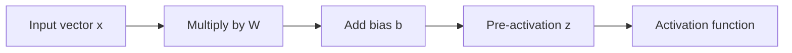

# Blog 04 — A Matrix Can Transform Space

> A matrix is not merely a rectangle of numbers. It can behave like a machine that transforms a vector into another vector.

Imagine drawing a square grid on a rubber sheet.

Now pull the sheet.

Some points move. The grid stretches. Shapes change.

A matrix gives us an algebraic way to describe transformations like these.

---

## 1. Start with one vector

Take

$$
\mathbf x=\begin{bmatrix}1\\2\end{bmatrix}
$$

and the matrix

$$
A=\begin{bmatrix}2&0\\0&2\end{bmatrix}
$$

Then

$$
A\mathbf x=
\begin{bmatrix}2&0\\0&2\end{bmatrix}
\begin{bmatrix}1\\2\end{bmatrix}
=
\begin{bmatrix}2\\4\end{bmatrix}
$$

The vector became twice as long.

This is a **scaling transformation**.

---

## 2. Why does the matrix do that?

Write the multiplication one coordinate at a time:

$$
x'_1=2x_1+0x_2
$$

$$
x'_2=0x_1+2x_2
$$

So the matrix says:

- new horizontal coordinate = 2 × old horizontal coordinate
- new vertical coordinate = 2 × old vertical coordinate

A matrix is therefore a compact set of instructions for transforming coordinates.

---

## 3. The columns reveal a deeper secret

Consider

$$
A=\begin{bmatrix}2&1\\0&2\end{bmatrix}
$$

For

$$
\mathbf x=\begin{bmatrix}x_1\\x_2\end{bmatrix}
$$

we get

$$
A\mathbf x
=x_1\begin{bmatrix}2\\0\end{bmatrix}
+x_2\begin{bmatrix}1\\2\end{bmatrix}
$$

So the output is built from the **columns of the matrix**.

This idea becomes extremely important later when we study linear combinations, basis vectors and neural-network representations.

---

## 4. Swapping coordinates

Take

$$
A=\begin{bmatrix}0&1\\1&0\end{bmatrix}
$$

and

$$
\mathbf x=\begin{bmatrix}2\\5\end{bmatrix}
$$

Then

$$
A\mathbf x=\begin{bmatrix}5\\2\end{bmatrix}
$$

The coordinates swapped.

Geometrically, this reflects the point across the line $y=x$.

A small matrix has performed a geometric operation.

---

## 5. Rotation

A two-dimensional rotation by angle $\theta$ can be represented by

$$
R(\theta)=
\begin{bmatrix}
\cos\theta&-\sin\theta\\
\sin\theta&\cos\theta
\end{bmatrix}
$$

For a $90^\circ$ rotation,

$$
R=\begin{bmatrix}0&-1\\1&0\end{bmatrix}
$$

and

$$
\begin{bmatrix}0&-1\\1&0\end{bmatrix}
\begin{bmatrix}1\\0\end{bmatrix}
=
\begin{bmatrix}0\\1\end{bmatrix}
$$

The vector pointing right now points up.

---

## 6. What does “linear” mean?

A transformation $T$ is linear if it obeys two rules:

$$
T(\mathbf x+\mathbf y)=T(\mathbf x)+T(\mathbf y)
$$

and

$$
T(c\mathbf x)=cT(\mathbf x)
$$

The first says that addition is preserved.

The second says that scaling is preserved.

Together, these rules mean that the transformation respects the structure of vector space.

---

## 7. A matrix transformation has a special property

For a matrix $A$,

$$
T(\mathbf x)=A\mathbf x
$$

automatically satisfies linearity:

$$
A(\mathbf x+\mathbf y)=A\mathbf x+A\mathbf y
$$

and

$$
A(c\mathbf x)=c(A\mathbf x)
$$

That is why matrices are the natural language of linear transformations.

---

## 8. But neural networks use $Wx+b$

Here is an important detail.

A neural-network layer often calculates

$$
\mathbf z=W\mathbf x+\mathbf b
$$

The matrix part $W\mathbf x$ is linear.

The addition of the bias $\mathbf b$ shifts the result.

Strictly speaking, $W\mathbf x+\mathbf b$ is generally called an **affine transformation**, not a linear transformation.

Why does this matter?

Because precision in language helps us build correct mental models.

---

## 9. The neural-network layer

A simple layer can be viewed as



The layer transforms the representation.

The next layer transforms the transformed representation again.

Deep learning therefore becomes a sequence of representation transformations.

---

## 10. Why do we need activation functions?

Suppose we stack two linear transformations:

$$
\mathbf y=A_2(A_1\mathbf x)
$$

Matrix multiplication lets us combine them:

$$
\mathbf y=(A_2A_1)\mathbf x
$$

So two linear layers without anything nonlinear between them are still just one larger linear transformation.

That means stacking many linear layers alone does **not** give us unlimited expressive power.

Something nonlinear must break the simple linear structure.

That will be our next discovery.

---

## 11. Python experiment

```python
import numpy as np

A = np.array([
    [2., 0.],
    [0., 2.]
])

x = np.array([1., 2.])

print(A @ x)
```

Output:

```text
[2. 4.]
```

Try replacing $A$ with the swap matrix:

```python
A = np.array([
    [0., 1.],
    [1., 0.]
])
```

Now the output becomes `[2, 1]`.

You are directly experimenting with geometry through code.

---

## Think Like a Scientist 🧠

Take

$$
A=\begin{bmatrix}1&0\\0&3\end{bmatrix}
$$

and

$$
\mathbf x=\begin{bmatrix}2\\1\end{bmatrix}
$$

Predict $A\mathbf x$.

Then ask:

- Which direction changed more?
- What happened to the length?
- What would happen to a whole square of points?

You are now thinking geometrically about algebra.

---

## What you should remember

> **A matrix can be understood as a transformation machine.**

It can scale, rotate, reflect, shear or mix coordinates.

The central equation is

$$
\mathbf z=W\mathbf x+\mathbf b
$$

and this equation will appear again and again in deep learning.

But there is still a missing ingredient.

If every layer only performs linear or affine transformations, the entire network can collapse into one affine transformation.

So the next question is unavoidable:

> **What happens when we introduce a nonlinear function?**

That is where the neuron begins to become interesting.
