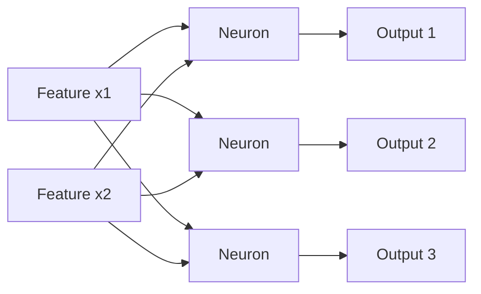

# Blog 05 — Meet the Smallest Neural Network

> A neural network begins with a tiny mathematical machine: multiply, add, and learn the numbers that control the calculation.

Imagine the king asks:

> “Can we build the smallest possible machine that learns from examples?”

The scientist says:

> “Yes. We only need a few numbers called **parameters**.”

---

## 1. The smallest possible model

Suppose we want to predict a student's final score from a single input.

Start with

$$
\hat y=wx
$$

Here:

- $x$ = input
- $w$ = weight
- $\hat y$ = prediction

If $x=3$ and $w=2$:

$$
\hat y=2(3)=6
$$

This is already a model.

It is not intelligent yet. It simply follows a rule.

---

## 2. Add a bias

A more useful model is

$$
\hat y=wx+b
$$

Suppose

$$
w=2,\quad x=3,\quad b=1
$$

Then

$$
\hat y=2(3)+1=7
$$

The weight controls how strongly the input changes the output.

The bias shifts the entire relationship up or down.

---

## 3. See the model as a line

The equation

$$
\hat y=2x+1
$$

is a straight line.

```text
prediction
   |
  9|             *
  7|          *
  5|       *
  3|    *
  1| *
   +---------------- input
     0  1  2  3  4
```

The slope is $2$ and the intercept is $1$.

So the humble neuron begins life as a line.

---

## 4. Multiple inputs

Real objects have many features.

Suppose

$$
\mathbf x=\begin{bmatrix}2\\3\end{bmatrix}
$$

and

$$
\mathbf w=\begin{bmatrix}4\\5\end{bmatrix}
$$

Then

$$
z=\mathbf w^T\mathbf x+b
$$

For $b=1$:

$$
z=4(2)+5(3)+1=24
$$

The neuron combines several pieces of information into one number.

---

## 5. What does a weight mean?

Suppose the features are:

- hours studied
- attendance
- previous score

and the weights are

$$
\mathbf w=\begin{bmatrix}2\\0.5\\3\end{bmatrix}
$$

A larger positive weight means that, within this model, increasing that feature pushes the pre-activation upward more strongly.

A negative weight would push it downward.

A weight of zero means that feature contributes nothing to this particular calculation.

Be careful: a learned weight is not automatically a causal explanation. It is a parameter in a model.

---

## 6. From one neuron to many

One neuron produces one number.

Suppose we want three outputs:

$$
\mathbf z=W\mathbf x+\mathbf b
$$

where

$$
W=
\begin{bmatrix}
1&2\\
3&4\\
5&6
\end{bmatrix}
$$

and

$$
\mathbf x=\begin{bmatrix}2\\3\end{bmatrix}
$$

Then

$$
W\mathbf x=
\begin{bmatrix}
8\\18\\28
\end{bmatrix}
$$

Three neurons have effectively worked together.

---

## 7. The architecture is simple



Each neuron has its own weights and bias.

The network is therefore a collection of small mathematical functions.

---

## 8. Why is it called a neuron?

The name comes from biological inspiration, but we should not confuse the two.

A biological neuron is a complex living cell.

An artificial neuron is a mathematical function.

A simplified artificial neuron is:

$$
z=\mathbf w^T\mathbf x+b
$$

followed, in modern neural networks, by a nonlinear activation:

$$
a=f(z)
$$

The artificial neuron is a useful abstraction, not a complete simulation of biology.

---

## 9. Python: build a neuron yourself

> 🧪 **[Run this code in Google Colab](https://colab.research.google.com/github/manish7725/deeplearning/blob/feature/01-deeplearning-syllabus/notebooks/05-the-smallest-neural-network.ipynb)**

> 🧪 **[Run this code in Google Colab](https://colab.research.google.com/github/manish7725/deeplearning/blob/main/notebooks/05-the-smallest-neural-network.ipynb)**

> 🧪 **[Run this code in Google Colab](https://colab.research.google.com/github/manish7725/deeplearning/blob/main/notebooks/05-the-smallest-neural-network.ipynb)**

```python
import numpy as np

x = np.array([2.0, 3.0])
w = np.array([4.0, 5.0])
b = 1.0

z = w @ x + b

print(z)
```

Output:

```text
24.0
```

There is no magic here.

It is multiplication + addition.

The magic of deep learning comes later, when we learn how to **change $w$ and $b$ automatically**.

---

## 10. A PyTorch version

> 🧪 **[Run this code in Google Colab](https://colab.research.google.com/github/manish7725/deeplearning/blob/feature/01-deeplearning-syllabus/notebooks/05-the-smallest-neural-network.ipynb)**

> 🧪 **[Run this code in Google Colab](https://colab.research.google.com/github/manish7725/deeplearning/blob/main/notebooks/05-the-smallest-neural-network.ipynb)**

> 🧪 **[Run this code in Google Colab](https://colab.research.google.com/github/manish7725/deeplearning/blob/main/notebooks/05-the-smallest-neural-network.ipynb)**

```python
import torch

x = torch.tensor([2., 3.])
w = torch.tensor([4., 5.])
b = torch.tensor(1.)

z = w @ x + b
print(z)
```

PyTorch represents the same mathematics while providing tools for automatic differentiation and optimization.

---

## 11. Parameters versus inputs

This distinction is essential.

| Quantity | Meaning |
|---|---|
| $x$ | data supplied to the model |
| $w$ | learned parameter |
| $b$ | learned parameter |
| $z$ | intermediate calculation |
| $\hat y$ | model prediction |

During inference, $x$ changes from example to example.

During training, the model changes $w$ and $b$ so that its predictions become better.

That is the beginning of learning.

---

## 12. The network is not intelligent yet

Imagine the model starts with

$$
w=0,\quad b=0
$$

For every input it predicts

$$
\hat y=0
$$

Clearly this is not useful.

The important question is:

> **How do we know that the prediction is bad, and how should we change $w$ and $b$?**

That leads to the next blog.

---

## Think Like a Scientist 🧠

Take

$$
\hat y=3x-2
$$

and calculate the prediction for

$$
x=0,1,2,3
$$

Then change the weight from 3 to 1.

What changed: the slope, the intercept, or both?

Now change the bias from $-2$ to $4$.

You have just experimented with the parameters of a model.

---

## What you should remember

> **A neuron is a small mathematical function, not a mysterious piece of intelligence.**

The core calculation is

$$
z=\mathbf w^T\mathbf x+b
$$

A neural network is many such calculations organized into layers.

But a model that only calculates a prediction has not necessarily learned anything.

Next we need to define **how wrong the prediction is**.

> **Next: prediction is not the same as learning.**

---

# 🧪 Hands-on Lab — Build a Neuron From Scratch

Use [`../labs/05-neuron-lab.md`](../labs/05-neuron-lab.md) as the companion exercise.

Start without PyTorch:

> 🧪 **[Run this code in Google Colab](https://colab.research.google.com/github/manish7725/deeplearning/blob/feature/01-deeplearning-syllabus/notebooks/05-the-smallest-neural-network.ipynb)**

> 🧪 **[Run this code in Google Colab](https://colab.research.google.com/github/manish7725/deeplearning/blob/main/notebooks/05-the-smallest-neural-network.ipynb)**

> 🧪 **[Run this code in Google Colab](https://colab.research.google.com/github/manish7725/deeplearning/blob/main/notebooks/05-the-smallest-neural-network.ipynb)**

```python
import numpy as np

x = np.array([2., 3., 4.])
w = np.array([1., -2., 0.5])
b = 1.

z = np.dot(w, x) + b
print(z)
```

Then write the same calculation using an explicit loop:

> 🧪 **[Run this code in Google Colab](https://colab.research.google.com/github/manish7725/deeplearning/blob/feature/01-deeplearning-syllabus/notebooks/05-the-smallest-neural-network.ipynb)**

> 🧪 **[Run this code in Google Colab](https://colab.research.google.com/github/manish7725/deeplearning/blob/main/notebooks/05-the-smallest-neural-network.ipynb)**

> 🧪 **[Run this code in Google Colab](https://colab.research.google.com/github/manish7725/deeplearning/blob/main/notebooks/05-the-smallest-neural-network.ipynb)**

```python
z = b
for xi, wi in zip(x, w):
    z += xi * wi
```

### Challenges

1. Add a fourth feature.
2. Make one weight negative.
3. Set one weight to zero and explain what disappears.
4. Create three neurons with three different weight vectors.
5. Replace the manual calculation with a matrix multiplication.

### Mastery test

Given $n$ inputs and $m$ neurons, predict the shape of the weight matrix before writing any code.

That single habit will prevent a huge number of PyTorch errors later.

---

# 📚 Go Deeper — From One Neuron to Deep Networks

**3Blue1Brown** is the best visual companion when you want to understand why a neuron is naturally described using vectors, weights, biases and matrix multiplication. citeturn0youtube30turn0youtube31

**Welch Labs** is especially useful here because its Neural Networks Demystified series builds a complete network in Python and then moves through forward propagation, gradient descent and backpropagation. citeturn0search0turn0search8

Use **Frame Zero** for another first-principles ML perspective and **MrJensenMath10** when algebraic manipulation is the part you need to strengthen.

Use **ZacharyLLM** and **Visual Kernel** later when you want to see how the same basic weighted-sum idea scales into modern architectures.

The learning rule for this series remains:

$$
\boxed{\text{derive it first}\rightarrow\text{implement it second}\rightarrow\text{use PyTorch to verify it}}
$$

A neural network becomes much less mysterious once you can build its smallest component yourself.
