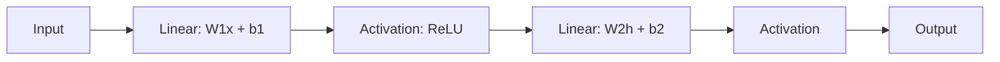

# Blog 06 — Why Does a Neuron Need an Activation Function?

We have a neuron:

$$
z=\mathbf w^T\mathbf x+b
$$

It can multiply and add. But there is a problem.

> **If we stack only linear calculations, the whole network is still just one linear calculation.**

We need something nonlinear.

---

## 1. The line problem

Suppose

$$
f(x)=2x+1
$$

Now apply another linear function:

$$
g(x)=3x-4
$$

Then

$$
g(f(x))=3(2x+1)-4=6x-1
$$

Still a line.

Add ten linear layers and we still get another linear transformation.

That means depth alone is not enough.

---

## 2. Enter the activation function

A neuron first calculates

$$
z=\mathbf w^T\mathbf x+b
$$

and then applies a nonlinear function:

$$
a=f(z)
$$

This function is called an **activation function**.

The full neuron is therefore

$$
a=f(\mathbf w^T\mathbf x+b)
$$

---

## 3. ReLU: the simple superstar

A very common activation is ReLU:

$$
\operatorname{ReLU}(x)=\max(0,x)
$$

So:

| $x$ | ReLU$(x)$ |
|---:|---:|
| -3 | 0 |
| -1 | 0 |
| 0 | 0 |
| 2 | 2 |
| 5 | 5 |

It simply removes negative values.

```text
ReLU(x)
  |
  |       /
  |      /
  |     /
  |____/________ x
       0
```

---

## 4. Why this changes everything

Consider two layers:

$$
h=W_1x+b_1
$$

$$
y=W_2h+b_2
$$

Without activation:

$$
y=W_2(W_1x+b_1)+b_2
$$

which can be rearranged into another affine transformation.

But with ReLU:

$$
h=\operatorname{ReLU}(W_1x+b_1)
$$

$$
y=W_2h+b_2
$$

Now the transformation is piecewise and can bend around regions of input space.

That is the beginning of nonlinear decision boundaries.

---

## 5. Other activations

### Sigmoid

$$
\sigma(x)=\frac{1}{1+e^{-x}}
$$

Its output lies between 0 and 1.

It is useful when we want a number that can be interpreted as a probability-like score, although whether it is a calibrated probability depends on the model and training.

### Tanh

$$
\tanh(x)=\frac{e^x-e^{-x}}{e^x+e^{-x}}
$$

Its output lies between $-1$ and $1$.

### ReLU

$$
\operatorname{ReLU}(x)=\max(0,x)
$$

Simple, fast and widely used in hidden layers.

---

## 6. Python

> 🧪 **[Run this code in Google Colab](https://colab.research.google.com/github/manish7725/deeplearning/blob/feature/01-deeplearning-syllabus/notebooks/06-why-neurons-need-activation.ipynb)**

> 🧪 **[Run this code in Google Colab](https://colab.research.google.com/github/manish7725/deeplearning/blob/main/notebooks/06-why-neurons-need-activation.ipynb)**

> 🧪 **[Run this code in Google Colab](https://colab.research.google.com/github/manish7725/deeplearning/blob/main/notebooks/06-why-neurons-need-activation.ipynb)**

> 🧪 **[Run this code in Google Colab](https://colab.research.google.com/github/manish7725/deeplearning/blob/main/notebooks/06-why-neurons-need-activation.ipynb)**

```python
import numpy as np

def relu(x):
    return np.maximum(0, x)

z = np.array([-3., -1., 0., 2., 5.])
print(relu(z))
```

Output:

```text
[0. 0. 0. 2. 5.]
```

---

## 7. PyTorch

> 🧪 **[Run this code in Google Colab](https://colab.research.google.com/github/manish7725/deeplearning/blob/feature/01-deeplearning-syllabus/notebooks/06-why-neurons-need-activation.ipynb)**

> 🧪 **[Run this code in Google Colab](https://colab.research.google.com/github/manish7725/deeplearning/blob/main/notebooks/06-why-neurons-need-activation.ipynb)**

> 🧪 **[Run this code in Google Colab](https://colab.research.google.com/github/manish7725/deeplearning/blob/main/notebooks/06-why-neurons-need-activation.ipynb)**

> 🧪 **[Run this code in Google Colab](https://colab.research.google.com/github/manish7725/deeplearning/blob/main/notebooks/06-why-neurons-need-activation.ipynb)**

```python
import torch

x = torch.tensor([-2., -1., 0., 1., 2.])
print(torch.relu(x))
```

The operation is tiny. Its consequence for deep networks is enormous.

---

## 8. A network as alternating operations



This pattern repeats across many neural networks.

---

## Think Like a Scientist 🧠

Compare:

$$
f(x)=2x+1
$$

with

$$
g(x)=\operatorname{ReLU}(2x+1)
$$

What happens for $x=-2,-1,0,1,2$?

You will notice that the second function behaves differently on different parts of the input space.

That “different behavior in different regions” is one reason nonlinear networks can model complicated patterns.

---

## What you should remember

> **Activation functions give neural networks nonlinearity.**

The key equation is

$$
a=f(\mathbf w^T\mathbf x+b)
$$

Without nonlinear activation, stacking linear layers does not create fundamentally richer functions.

Now our network can produce complicated functions.

But there is still a giant missing piece:

> **How does the network know whether its prediction is good or bad?**

Next we introduce the loss function and the actual learning problem.

---

# 🧪 Hands-on Lab — Make Nonlinearity Visible

Use [`../labs/06-activation-lab.md`](../labs/06-activation-lab.md).

Start by comparing a linear function and ReLU:

> 🧪 **[Run this code in Google Colab](https://colab.research.google.com/github/manish7725/deeplearning/blob/feature/01-deeplearning-syllabus/notebooks/06-why-neurons-need-activation.ipynb)**

> 🧪 **[Run this code in Google Colab](https://colab.research.google.com/github/manish7725/deeplearning/blob/main/notebooks/06-why-neurons-need-activation.ipynb)**

> 🧪 **[Run this code in Google Colab](https://colab.research.google.com/github/manish7725/deeplearning/blob/main/notebooks/06-why-neurons-need-activation.ipynb)**

> 🧪 **[Run this code in Google Colab](https://colab.research.google.com/github/manish7725/deeplearning/blob/main/notebooks/06-why-neurons-need-activation.ipynb)**

```python
import numpy as np

x = np.linspace(-5, 5, 21)
linear = 2 * x + 1
relu = np.maximum(0, linear)

for a, b in zip(linear, relu):
    print(f"linear={a:6.2f}  relu={b:6.2f}")
```

### Challenges

1. Implement sigmoid from its equation.
2. Implement tanh without using a framework activation.
3. Compare their outputs for `[-5, -2, 0, 2, 5]`.
4. Build two linear layers and prove numerically that they collapse into one affine transformation.
5. Insert ReLU and show that the equivalence disappears.

### Mastery experiment

Create a two-layer network and vary the bias of the first layer.

Observe how the location of the ReLU “kink” changes.

Then explain:

> **How can many small piecewise-linear regions combine to approximate a complicated function?**

That question is a bridge from basic neurons to the expressive power of deep networks.

---

# 📚 Go Deeper — Three Different Lenses

**3Blue1Brown** gives the strongest visual intuition for why layers, weights and nonlinearities create expressive neural networks. citeturn0youtube30turn0youtube31

**Welch Labs** is useful for seeing the activation function inside an actual trainable network and then following the path toward gradient descent and backpropagation. citeturn0search0turn0search8

**MrJensenMath10** is the supporting mathematics resource: functions, graphs, slopes and exponentials are exactly the school-level ideas behind these activation functions.

Use **Frame Zero** for another first-principles ML explanation and **ZacharyLLM/Visual Kernel** when you later want to see where nonlinear transformations appear in modern architectures.

### A useful rule

If you can draw the activation but cannot explain its equation, revisit the mathematics.

If you know the equation but cannot explain why it changes network expressiveness, revisit the visual explanation.

If you understand both but cannot implement it, do the lab again.

$$
\boxed{\text{picture}\leftrightarrow\text{equation}\leftrightarrow\text{code}}
$$

That three-way connection is the standard we will use throughout this series.
