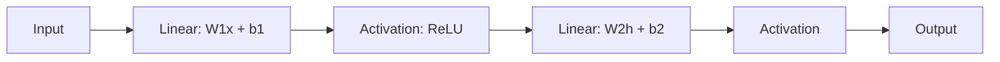

# Blog 06 — Why Does a Neuron Need an Activation Function?

We have a neuron:

$$
z=\mathbf w^T\mathbf x+b
$$

It can multiply and add. But there is a problem.

> **If we stack only linear calculations, the whole network is still just one linear calculation.**

We need something nonlinear.

---

## 1. The line problem

Suppose

$$
f(x)=2x+1
$$

Now apply another linear function:

$$
g(x)=3x-4
$$

Then

$$
g(f(x))=3(2x+1)-4=6x-1
$$

Still a line.

Add ten linear layers and we still get another linear transformation.

That means depth alone is not enough.

---

## 2. Enter the activation function

A neuron first calculates

$$
z=\mathbf w^T\mathbf x+b
$$

and then applies a nonlinear function:

$$
a=f(z)
$$

This function is called an **activation function**.

The full neuron is therefore

$$
a=f(\mathbf w^T\mathbf x+b)
$$

---

## 3. ReLU: the simple superstar

A very common activation is ReLU:

$$
\operatorname{ReLU}(x)=\max(0,x)
$$

So:

| $x$ | ReLU$(x)$ |
|---:|---:|
| -3 | 0 |
| -1 | 0 |
| 0 | 0 |
| 2 | 2 |
| 5 | 5 |

It simply removes negative values.

```text
ReLU(x)
  |
  |       /
  |      /
  |     /
  |____/________ x
       0
```

---

## 4. Why this changes everything

Consider two layers:

$$
h=W_1x+b_1
$$

$$
y=W_2h+b_2
$$

Without activation:

$$
y=W_2(W_1x+b_1)+b_2
$$

which can be rearranged into another affine transformation.

But with ReLU:

$$
h=\operatorname{ReLU}(W_1x+b_1)
$$

$$
y=W_2h+b_2
$$

Now the transformation is piecewise and can bend around regions of input space.

That is the beginning of nonlinear decision boundaries.

---

## 5. Other activations

### Sigmoid

$$
\sigma(x)=\frac{1}{1+e^{-x}}
$$

Its output lies between 0 and 1.

It is useful when we want a number that can be interpreted as a probability-like score, although whether it is a calibrated probability depends on the model and training.

### Tanh

$$
\tanh(x)=\frac{e^x-e^{-x}}{e^x+e^{-x}}
$$

Its output lies between $-1$ and $1$.

### ReLU

$$
\operatorname{ReLU}(x)=\max(0,x)
$$

Simple, fast and widely used in hidden layers.

---

## 6. Python

```python
import numpy as np

def relu(x):
    return np.maximum(0, x)

z = np.array([-3., -1., 0., 2., 5.])
print(relu(z))
```

Output:

```text
[0. 0. 0. 2. 5.]
```

---

## 7. PyTorch

```python
import torch

x = torch.tensor([-2., -1., 0., 1., 2.])
print(torch.relu(x))
```

The operation is tiny. Its consequence for deep networks is enormous.

---

## 8. A network as alternating operations



This pattern repeats across many neural networks.

---

## Think Like a Scientist 🧠

Compare:

$$
f(x)=2x+1
$$

with

$$
g(x)=\operatorname{ReLU}(2x+1)
$$

What happens for $x=-2,-1,0,1,2$?

You will notice that the second function behaves differently on different parts of the input space.

That “different behavior in different regions” is one reason nonlinear networks can model complicated patterns.

---

## What you should remember

> **Activation functions give neural networks nonlinearity.**

The key equation is

$$
a=f(\mathbf w^T\mathbf x+b)
$$

Without nonlinear activation, stacking linear layers does not create fundamentally richer functions.

Now our network can produce complicated functions.

But there is still a giant missing piece:

> **How does the network know whether its prediction is good or bad?**

Next we introduce the loss function and the actual learning problem.
