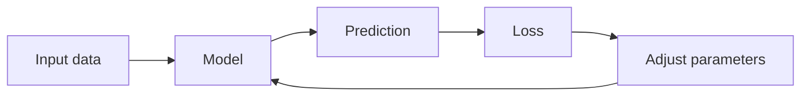

# Blog 07 — Prediction Is Not the Same as Learning

A neural network can make a prediction without learning.

That sounds strange, so let us make the distinction precise.

---

## 1. A model can calculate before it can learn

Suppose

$$
\hat y=wx+b
$$

with

$$
w=2,\quad b=1
$$

For $x=3$:

$$
\hat y=7
$$

The model has produced an answer.

But where did $w=2$ and $b=1$ come from?

If nobody adjusted them using examples, the model has not learned those values.

---

## 2. Give the model an example

Suppose the true answer is

$$
y=10
$$

but the model predicts

$$
\hat y=7
$$

The prediction is wrong by

$$
\hat y-y=7-10=-3
$$

We need a numerical measure of “how wrong”.

---

## 3. Loss turns a mistake into a number

A simple loss is squared error:

$$
L=(\hat y-y)^2
$$

For our example:

$$
L=(7-10)^2=9
$$

A perfect prediction gives

$$
L=(10-10)^2=0
$$

So lower is better.

---

## 4. Why square the error?

If we used simply $\hat y-y$, positive and negative mistakes could cancel.

Squaring gives both a positive contribution and makes large errors matter more:

$$
(-3)^2=9,\qquad 3^2=9
$$

For a dataset of $n$ examples, mean squared error is

$$
MSE=\frac1n\sum_{i=1}^{n}(\hat y_i-y_i)^2
$$

This turns many mistakes into one score.

---

## 5. The learning objective

Now the problem becomes beautifully simple:

> **Find parameters that make the loss small.**

If the model parameters are collected into $\theta$, we can write

$$
\theta^*=\arg\min_{\theta}L(\theta)
$$

Read it as:

> “Find the parameter values that minimize the loss.”

This is the mathematical heart of training.

---

## 6. One-dimensional picture

Imagine loss as a landscape.

```text
Loss
 ^
 |       *
 |     *   *
 |   *       *
 | *           *
 +------------------> parameter
             minimum
```

The training algorithm tries to move the parameters toward low-loss regions.

Later, calculus will tell us which direction to move.

---

## 7. A complete tiny dataset

Suppose the true relationship is approximately

$$
y=2x+1
$$

and we observe:

| $x$ | $y$ |
|---:|---:|
| 1 | 3 |
| 2 | 5 |
| 3 | 7 |
| 4 | 9 |

Start with the bad model

$$
\hat y=x
$$

Predictions are $1,2,3,4$.

The errors are

$$
-2,-3,-4,-5
$$

and the squared errors are

$$
4,9,16,25
$$

Therefore

$$
MSE=\frac{4+9+16+25}{4}=13.5
$$

The model needs improvement.

---

## 8. Try a better model

Use

$$
\hat y=2x+1
$$

Predictions are exactly

$$
3,5,7,9
$$

so

$$
MSE=0
$$

We found the correct parameters for this toy dataset.

Real deep-learning problems are much harder because the parameter space may contain millions or billions of parameters.

---

## 9. Code it

> 🧪 **[Run this code in Google Colab](https://colab.research.google.com/github/manish7725/deeplearning/blob/feature/01-deeplearning-syllabus/notebooks/07-prediction-is-not-learning-yet.ipynb)**

```python
import numpy as np

x = np.array([1., 2., 3., 4.])
y = np.array([3., 5., 7., 9.])

w = 1.0
b = 0.0

prediction = w * x + b
loss = np.mean((prediction - y) ** 2)

print("prediction:", prediction)
print("loss:", loss)
```

Now change `w` and `b` and watch the loss change.

You have created a tiny optimization problem.

---

## 10. The learning loop



Training is repeated improvement.

The model predicts, measures its error, changes parameters, and predicts again.

---

## 11. Important distinction

**Prediction:**

$$
\hat y=f_\theta(x)
$$

**Evaluation:**

$$
L(\hat y,y)
$$

**Learning:** changing $\theta$ so that future loss tends to become smaller on relevant data.

These are three different ideas.

---

## Think Like a Scientist 🧠

Try these models for the dataset above:

$$
\hat y=x
$$

$$
\hat y=2x
$$

$$
\hat y=2x+1
$$

Calculate the MSE for each.

Do not guess which is best. Measure it.

That habit—**hypothesis → measurement → improvement**—is central to machine learning.

---

## What you should remember

> **A prediction is an output. Learning is the process of changing parameters to improve an objective.**

The central ideas are:

- prediction produces $\hat y$;
- loss measures error;
- training minimizes loss;
- parameters are the quantities we change;
- the learning problem can be written as an optimization problem.

Now comes the mathematical question:

> **How do we know which direction will reduce the loss?**

For that, we need derivatives.

---

# 🧪 Hands-on Lab — Turn Loss Into an Experiment

Use [`../labs/07-loss-lab.md`](../labs/07-loss-lab.md).

Start with a parameter sweep:

> 🧪 **[Run this code in Google Colab](https://colab.research.google.com/github/manish7725/deeplearning/blob/feature/01-deeplearning-syllabus/notebooks/07-prediction-is-not-learning-yet.ipynb)**

```python
import numpy as np

x = np.array([1., 2., 3., 4.])
y = np.array([3., 5., 7., 9.])

for w in [0., 0.5, 1., 1.5, 2., 2.5, 3.]:
    prediction = w * x
    loss = np.mean((prediction - y) ** 2)
    print(f"w={w:3.1f} loss={loss:5.2f}")
```

### Challenges

1. Add the bias parameter.
2. Search over both `w` and `b`.
3. Find the lowest-loss pair using only loops.
4. Plot the loss as a function of `w`.
5. Explain why the best parameter is at the bottom of the loss curve.

### Important experiment

Replace squared error with absolute error:

$$
L=|\hat y-y|
$$

Compare the two losses for a small error and a very large error.

This is your first introduction to the idea that **the choice of loss function changes what the model is encouraged to optimize**.

---

# 📚 Go Deeper — Optimization Starts Here

**Welch Labs** is particularly relevant at this point. Its Neural Networks Demystified sequence moves from architecture to forward propagation and then to gradient descent, backpropagation and training. citeturn0search0turn0search8

**3Blue1Brown** is the visual companion when you want to see a model and its loss as geometry rather than only equations. citeturn0youtube30turn0youtube31

Use **MrJensenMath10** to strengthen algebra and graph-reading skills. Use **Frame Zero** for additional first-principles ML intuition.

Later, **ZacharyLLM** and **Visual Kernel** become useful for seeing how the same optimization idea scales from a toy model to modern AI systems.

### Scientist's rule

Never say:

> “The model learned because the output looks good.”

Ask:

1. What objective was optimized?
2. What data was used to optimize it?
3. What parameters changed?
4. Did performance improve on data the model did not directly optimize on?

Those questions will become essential when we reach training, validation, testing and overfitting.
