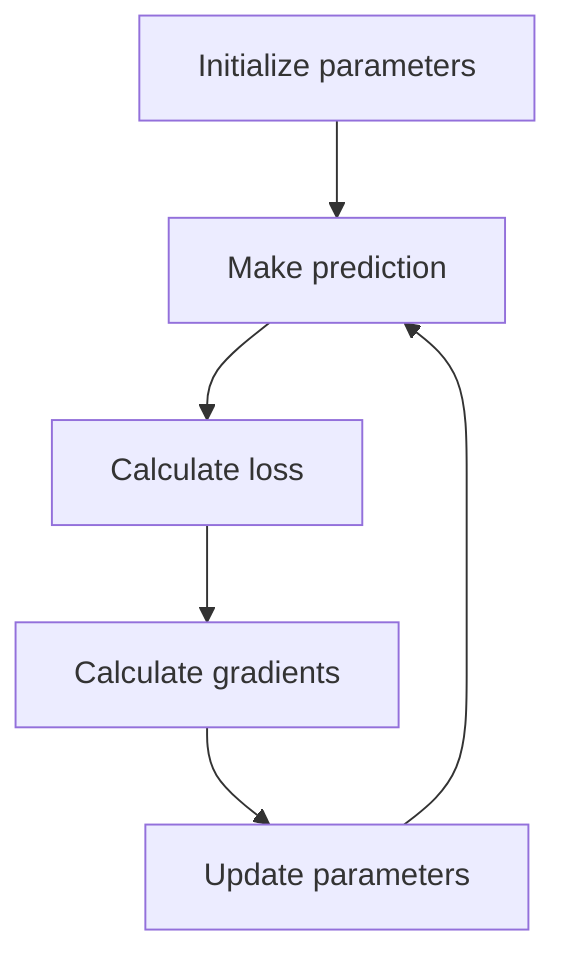

# Blog 09 — Gradient Descent: Teaching a Model to Improve

We now have the ingredients:

- a model,
- a loss function,
- derivatives.

Now we need an algorithm that repeatedly changes parameters to reduce loss.

That algorithm is **gradient descent**.

---

## 1. Imagine a mountain

Suppose the loss is a landscape.

You are standing somewhere on the landscape and want to reach a valley.

You cannot see the entire landscape, but you can measure the local slope.

The gradient tells you the direction of steepest increase.

Therefore, to go downhill, move in the opposite direction.

---

## 2. The update equation

For one parameter $w$:

$$
w_{new}=w_{old}-\eta\frac{dL}{dw}
$$

For many parameters:

$$
\boldsymbol\theta_{new}
=
\boldsymbol\theta_{old}-\eta\nabla_\theta L
$$

where $\eta$ is the **learning rate**.

This one equation powers a huge amount of modern machine learning.

---

## 3. A complete numerical example

Suppose

$$
L(w)=(w-3)^2
$$

Then

$$
\frac{dL}{dw}=2(w-3)
$$

Start with

$$
w=0
$$

The gradient is

$$
2(0-3)=-6
$$

Choose

$$
\eta=0.1
$$

Then

$$
w_{new}=0-0.1(-6)=0.6
$$

The parameter moved toward 3.

---

## 4. Repeat

At $w=0.6$:

$$
\frac{dL}{dw}=2(0.6-3)=-4.8
$$

Update:

$$
w=0.6-0.1(-4.8)=1.08
$$

Again we moved toward the minimum.

Continue this process and $w$ approaches 3.

The model is **iteratively improving**.

---

## 5. Why the learning rate matters

Imagine taking steps down a hill.

### Too small

The model moves safely but slowly.

### Too large

It may jump across the valley and become unstable.

### Reasonable

It moves toward a low-loss region efficiently.

The learning rate is therefore one of the most important training hyperparameters.

---

## 6. The optimization loop



This loop can run thousands or millions of times.

---

## 7. Gradient descent on a simple function

For

$$
L(w)=(w-3)^2
$$

the minimum occurs at $w=3$.

The derivative is zero there:

$$
\frac{dL}{dw}=2(w-3)=0
$$

so

$$
w=3
$$

The gradient tells us not only that we are away from the minimum, but also which direction to move.

---

## 8. Batch, stochastic and mini-batch learning

Suppose the dataset contains one million examples.

### Batch gradient descent

Calculate the loss and gradient using all examples.

### Stochastic gradient descent

Use one example at a time.

### Mini-batch gradient descent

Use a small batch, such as 32 or 128 examples.

Mini-batches are common in deep learning because they balance noisy updates with efficient hardware utilization.

---

## 9. Code it yourself

> 🧪 **[Run this code in Google Colab](https://colab.research.google.com/github/manish7725/deeplearning/blob/feature/01-deeplearning-syllabus/notebooks/09-gradient-descent.ipynb)**

```python
w = 0.0
learning_rate = 0.1

for step in range(10):
    loss = (w - 3) ** 2
    gradient = 2 * (w - 3)

    w = w - learning_rate * gradient

    print(step, w, loss)
```

Notice that we did not use a machine-learning library.

We implemented gradient descent ourselves.

That is worth doing once because it removes the mystery.

---

## 10. PyTorch optimizer

In practice, PyTorch can handle the update:

> 🧪 **[Run this code in Google Colab](https://colab.research.google.com/github/manish7725/deeplearning/blob/feature/01-deeplearning-syllabus/notebooks/09-gradient-descent.ipynb)**

```python
import torch

w = torch.tensor(0.0, requires_grad=True)
optimizer = torch.optim.SGD([w], lr=0.1)

for step in range(10):
    loss = (w - 3) ** 2

    optimizer.zero_grad()
    loss.backward()
    optimizer.step()

print(w.item())
```

The library is doing the same conceptual loop:

$$
\text{forward}\rightarrow\text{loss}\rightarrow\text{gradient}\rightarrow\text{update}
$$

---

## 11. Gradient descent is not “magic AI”

The algorithm is remarkably simple:

1. calculate an answer;
2. measure error;
3. calculate how parameters affect error;
4. move parameters in a better direction;
5. repeat.

The sophistication of deep learning comes from applying this idea to huge models, huge datasets and carefully designed architectures.

---

## Think Like a Scientist 🧠

Try

$$
L(w)=(w-5)^2
$$

with

$$
w_0=0,\qquad\eta=0.2
$$

Calculate the first three updates by hand.

Then implement them in Python.

If your answer and program disagree, inspect the mathematics before blaming the computer.

---

## What you should remember

> **Gradient descent is a repeated parameter-update process that uses derivatives to reduce loss.**

The central equation is

$$
\boldsymbol\theta\leftarrow\boldsymbol\theta-\eta\nabla_\theta L
$$

But one question remains.

A modern network may contain millions of parameters. How can we efficiently calculate the gradient for every one?

The answer is the chain rule applied systematically.

> **Next: backpropagation — sending the error backward.**

---

# 🧪 Hands-on Lab — Watch Optimization Happen

Use [`../labs/09-gradient-descent-lab.md`](../labs/09-gradient-descent-lab.md).

Implement the algorithm without PyTorch first:

> 🧪 **[Run this code in Google Colab](https://colab.research.google.com/github/manish7725/deeplearning/blob/feature/01-deeplearning-syllabus/notebooks/09-gradient-descent.ipynb)**

```python
w = 0.0
lr = 0.1

for step in range(20):
    loss = (w - 3)**2
    grad = 2 * (w - 3)
    w -= lr * grad
    print(step, w, loss)
```

### Learning-rate experiment

Run the same problem with:

```text
0.001
0.01
0.1
0.5
1.0
1.1
```

Record what happens.

You should discover that optimization is not only about the direction of movement. **Step size matters.**

### Mastery challenge

Modify the program to optimize

$$
L(x,y)=x^2+4y^2
$$

from a starting point such as $(5,5)$.

Why do the two coordinates behave differently?

That experiment prepares you for gradients in many dimensions.

---

# 📚 Go Deeper — Optimization Through Different Teachers

**3Blue1Brown** is excellent for seeing gradient descent as movement across a landscape and for building geometric intuition around derivatives and optimization. citeturn0youtube30turn0youtube31

**Welch Labs** provides a particularly useful implementation-oriented progression from gradient descent into backpropagation and numerical gradient checking. citeturn0search0turn0search8

Use **Frame Zero** for first-principles ML intuition and **MrJensenMath10** for the calculus/algebra needed to reason about slopes.

When you later study modern optimizers, use **ZacharyLLM** and **Visual Kernel** to connect the basic update equation to large-scale model training.

### One experiment before moving on

Try to deliberately make gradient descent fail.

Choose a learning rate that is too large.

Observe the loss.

Then explain why the update

$$
\theta\leftarrow\theta-\eta\nabla L
$$

can move *past* a good solution.

Understanding failure modes is part of understanding optimization.
