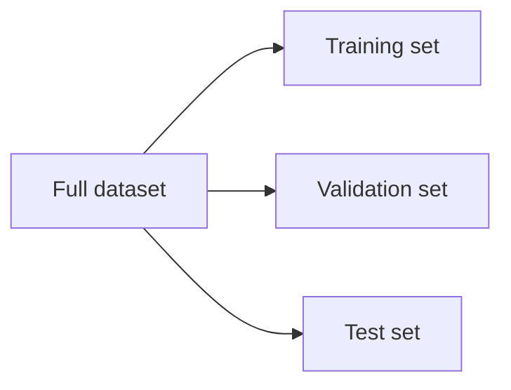

# Blog 12 — How Do We Know If Our Model Really Learned?

<!-- NOTEBOOK-LAB-NAV -->

## 🧪 Interactive Lab

The matching notebook is the complete hands-on laboratory for this lesson. It contains the runnable code, experiments, visualizations, and challenges.

**[📓 Open the notebook on GitHub](https://github.com/manish7725/deeplearning/blob/main/notebooks/12-training-and-testing.ipynb)**  · **[▶ Open the notebook in Google Colab](https://colab.research.google.com/github/manish7725/deeplearning/blob/main/notebooks/12-training-and-testing.ipynb)**

## 1. Training accuracy can fool us

Suppose a model sees 1,000 training examples.

It eventually predicts all 1,000 correctly.

Training performance is excellent.

But what happens on examples it has never seen?

That is where **generalization** matters.

---

## 2. Split the data

A common conceptual split is:



### Training set
Used to learn parameters.

### Validation set
Used to make development choices such as hyperparameters, architecture or training duration.

### Test set
Used for a final, less-biased estimate after model-development choices have been made.

The exact protocol depends on the problem, but the principle is crucial: **do not let evaluation data quietly become training data.**

---

## 3. Overfitting

Suppose a model is extremely flexible.

It may learn real patterns:

```text
useful signal
```

but also memorize accidental details:

```text
noise + peculiarities of training examples
```

Then training error becomes very small while validation error starts increasing.

That is **overfitting**.

---

## 4. Underfitting

The opposite can happen.

A model that is too simple may fail even on the training set.

So we have three useful ideas:

| Situation | Training error | Validation error |
|---|---:|---:|
| Underfitting | high | high |
| Good generalization | low | low |
| Overfitting | very low | high |

These are conceptual patterns, not rigid laws.

---

## 5. A simple learning curve

Imagine training for more epochs.

```text
error
 ^
 |\\ training
 | \\
 |  \\
 |   \\
 |    \\
 |     \\
 |      
 |   validation
 |  /\\
 | /  \\
 +------------------> epochs
```

Training error often decreases as optimization continues.

Validation error may decrease at first, then increase if the model starts fitting the training data too specifically.

---

## 6. Accuracy is not always enough

Suppose 99 out of 100 examples are healthy and only 1 is sick.

A model that always predicts “healthy” gets 99% accuracy.

Yet it detects none of the sick cases.

For classification we may also need:

- precision
- recall
- F1 score
- confusion matrix
- ROC-AUC or PR-AUC, depending on the problem

Metric choice should match the actual cost of mistakes.

---

## 7. Confusion matrix

For binary classification:

| | Predicted positive | Predicted negative |
|---|---:|---:|
| Actual positive | TP | FN |
| Actual negative | FP | TN |

From these counts:

$$
\text{Precision}=\frac{TP}{TP+FP}
$$

$$
\text{Recall}=\frac{TP}{TP+FN}
$$

The formulas are simple. The difficult part is deciding which errors matter most for the application.

---

## 8. Data leakage: the silent disaster

Suppose a feature accidentally contains information created **after** the outcome we are trying to predict.

The model may appear brilliant during testing.

But the information would not actually be available at prediction time.

This is called **data leakage**.

A model can have an impressive score and still be scientifically invalid.

---

## 9. A tiny PyTorch evaluation pattern

```python
model.eval()

with torch.no_grad():
    predictions = model(x_test)
    loss = loss_fn(predictions, y_test)

print(loss.item())
```

`eval()` tells modules such as dropout and batch normalization to use evaluation behavior.

`no_grad()` avoids storing gradients when we only want inference.

---

## 10. The scientific mindset

A good ML engineer should constantly ask:

> “Could my evaluation be giving me a false sense of success?”

Ask:

- Was the test data truly unseen?
- Did preprocessing leak information?
- Is the metric appropriate?
- Does the data represent real deployment conditions?
- Is the model robust to distribution changes?

Evaluation is not a celebration at the end.

It is part of the scientific method.

---

## Think Like a Scientist 🧠

Imagine a model gets:

```text
Training accuracy   = 99.9%
Validation accuracy = 72%
Test accuracy       = 70%
```

What might be happening?

Now imagine:

```text
Training accuracy   = 72%
Validation accuracy = 71%
Test accuracy       = 70%
```

What might be happening there?

Do not immediately change the model. First form a hypothesis.

---

## What you should remember

> **A model is useful only if it generalizes to the situations where we will actually use it.**

Training asks:

$$
\text{Can I fit these examples?}
$$

Evaluation asks:

$$
\text{Can I perform well on appropriate unseen examples?}
$$

Now we can move from abstract numbers to one of the richest sources of data humans have: images.

> **Next: convolution — how a neural network learns to see local patterns.**

---

# 📚 Go Deeper — The Science of Evaluation

**Welch Labs** explicitly covers overfitting, testing and regularization in its neural-network series, making it a useful companion for this lesson. citeturn0search5

**3Blue1Brown** helps with the geometric intuition behind model fitting and representation, while **Frame Zero** is useful for first-principles ML reasoning. citeturn0youtube30turn0youtube31

Use **MrJensenMath10** for the arithmetic and probability foundations behind metrics.

Later, **ZacharyLLM** and **Visual Kernel** can help connect evaluation concepts to modern foundation models, where benchmark design and distribution shift become especially important.

### The scientist's rule

A test score is not automatically truth.

Before trusting a number, ask:

$$
\boxed{\text{What data? What metric? What protocol? What deployment condition?}}
$$

That mindset is as important as the model architecture itself.
