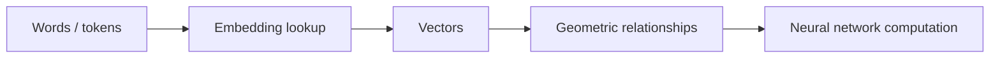

# Blog 15 — How Can a Computer Represent the Meaning of a Word?

A computer does not naturally understand the word **king**.

It sees symbols or token IDs.

So we need a numerical representation that lets related concepts occupy related regions of a mathematical space.

This is the idea behind **embeddings**.

---

## 1. From word to ID

A tokenizer might map words or subword pieces to integers:

```text
king   → 1729
queen  → 2048
apple  → 391
```

But integer IDs are labels, not meaningful coordinates.

The distance between 1729 and 2048 does not mean “king is somewhat close to queen.”

We need learned vectors.

---

## 2. The embedding vector

Suppose

$$
\text{king}\rightarrow
\begin{bmatrix}
0.8\\0.2\\0.9\\\vdots
\end{bmatrix}
$$

and

$$
\text{queen}\rightarrow
\begin{bmatrix}
0.7\\0.3\\0.8\\\vdots
\end{bmatrix}
$$

These vectors can be learned so that useful relationships emerge from training.

The dimensions do not usually have simple human labels such as “royalness” or “gender.”

They are distributed representations.

---

## 3. Similarity

A common similarity measure is cosine similarity:

$$
\cos(\theta)=
\frac{\mathbf a\cdot\mathbf b}
{\|\mathbf a\|\|\mathbf b\|}
$$

If two vectors point in similar directions, cosine similarity is close to 1.

If they are orthogonal, it is 0.

If they point in opposite directions, it approaches -1.

---

## 4. Why context matters

Consider:

> “The bat flew through the cave.”

and

> “He swung the bat.”

The same word has different meanings.

A single fixed vector for “bat” cannot fully represent every contextual meaning.

This motivates **contextual representations**, where the representation of a token can depend on the surrounding tokens.

Transformers are especially powerful at producing such context-dependent representations.

---

## 5. Embedding lookup

In a neural network, an embedding layer can be thought of as a table:

$$
E\in\mathbb R^{V\times d}
$$

where:

- $V$ = vocabulary size
- $d$ = embedding dimension

Token ID $i$ selects row $i$ of the table.

So an embedding lookup is essentially:

$$
\mathbf e_i=E[i]
$$

---

## 6. PyTorch example

> 🧪 **[Run this code in Google Colab](https://colab.research.google.com/github/manish7725/deeplearning/blob/feature/01-deeplearning-syllabus/notebooks/15-word-embeddings.ipynb)**

> 🧪 **[Run this code in Google Colab](https://colab.research.google.com/github/manish7725/deeplearning/blob/main/notebooks/15-word-embeddings.ipynb)**

```python
import torch
import torch.nn as nn

embedding = nn.Embedding(
    num_embeddings=10000,
    embedding_dim=128
)

tokens = torch.tensor([10, 25, 900])

vectors = embedding(tokens)
print(vectors.shape)
```

Output:

```text
torch.Size([3, 128])
```

Three token IDs became three 128-dimensional vectors.

---

## 7. A geometric mental model

Imagine every word as a point in a high-dimensional space.



The model learns the geometry indirectly through its training objective.

---

## 8. The famous “vector arithmetic” idea

You may hear examples such as

$$
\text{king}-\text{man}+\text{woman}\approx\text{queen}
$$

This is an interesting property observed in some learned embedding spaces, but it should not be treated as a universal law of language models.

Different models, training objectives and embedding spaces can behave differently.

The deeper lesson is more reliable:

> **Learning can organize information into a numerical geometry where useful relationships become accessible to computation.**

---

## 9. Why embeddings are everywhere

Embeddings are used for:

- words and tokens;
- images;
- users;
- products;
- documents;
- code;
- audio;
- recommendations.

Whenever we need to compare or transform complex objects numerically, a learned representation can be useful.

---

## Think Like a Scientist 🧠

Imagine you have vectors for:

```text
cat
kitten
dog
car
```

Without knowing the actual coordinates, predict which pairs you would expect to be closer in a useful language representation.

Then ask the more important question:

> **What training signal would cause those relationships to emerge?**

That question leads naturally to attention and self-supervised learning.

---

## What you should remember

> **An embedding is a learned numerical representation of an object such that useful relationships can emerge in vector space.**

Token IDs are labels.

Embeddings are vectors.

Contextual representations can change with surrounding information.

Now we are ready for the mechanism that lets one token ask:

> “Which other tokens should I pay attention to?”

> **Next: attention.**

---

# 🧪 Hands-on Lab — Build a Tiny Embedding Space

Use [`../labs/15-embeddings-lab.md`](../labs/15-embeddings-lab.md).

Create a tiny embedding table:

> 🧪 **[Run this code in Google Colab](https://colab.research.google.com/github/manish7725/deeplearning/blob/feature/01-deeplearning-syllabus/notebooks/15-word-embeddings.ipynb)**

> 🧪 **[Run this code in Google Colab](https://colab.research.google.com/github/manish7725/deeplearning/blob/main/notebooks/15-word-embeddings.ipynb)**

```python
import torch
import torch.nn as nn

embedding = nn.Embedding(6, 3)

ids = torch.tensor([0, 1, 2, 3, 4, 5])
vectors = embedding(ids)

print(vectors)
```

### Experiments

1. Compute pairwise cosine similarities.
2. Find the two most similar vectors.
3. Train the embedding on a tiny synthetic task.
4. Inspect how the vectors move during training.
5. Reduce a larger embedding space to two dimensions for visualization.

### Mastery challenge

Explain why

```text
cat = 17
```

contains almost no semantic information, while a learned vector for `cat` can participate in meaningful geometric comparisons.

Then explain why a static embedding cannot fully represent the two meanings of “bank” in different sentences.

---

# 📚 Go Deeper — From Geometry to LLMs

**3Blue1Brown** is useful for the geometric intuition behind vectors, dot products and high-dimensional representations. citeturn0youtube30turn0youtube31

**Frame Zero** is a strong companion for first-principles representation learning.

**ZacharyLLM** becomes particularly relevant from this point onward because embeddings, attention and token representations are central to modern LLMs.

**Visual Kernel** can provide another visual/technical lens on representations and model internals.

Use **Welch Labs** when you want to reinforce the general pattern of learning representations through code and experiments; its AI material emphasizes supporting code and hands-on exploration. citeturn0search1turn0search3

Use **MrJensenMath10** for the vector and algebra foundations.

### The key conceptual jump

A token ID is a **label**.

An embedding is a **learned coordinate**.

Attention will then allow those coordinates to interact dynamically with context.

That is the bridge from simple vectors to language understanding machinery.
