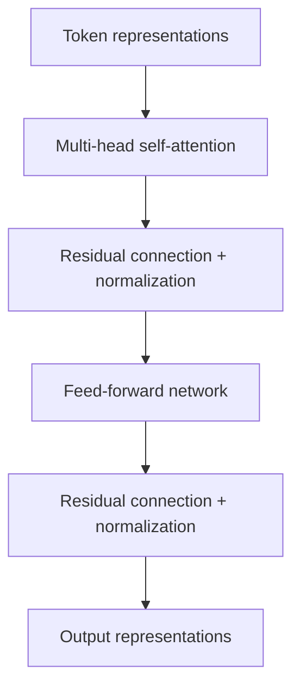

# Blog 17 — Transformers: Building With Attention

Attention is a mechanism.

A Transformer is an architecture built around attention plus several other important components.

It became the foundation of many modern language models.

---

## 1. From tokens to representations

Suppose the input is

```text
The cat sat
```

The text is converted into tokens, then token embeddings.

But embeddings alone do not tell the model where each token occurs.

We therefore need positional information.

---

## 2. Position matters

These sequences contain the same words:

```text
cat chased dog
dog chased cat
```

but their meanings differ.

A Transformer therefore needs information about token position.

One family of methods uses sinusoidal positional encodings such as

$$
PE(pos,2i)=\sin\left(\frac{pos}{10000^{2i/d}}\right)
$$

$$
PE(pos,2i+1)=\cos\left(\frac{pos}{10000^{2i/d}}\right)
$$

Modern models may instead use learned or relative/rotary positional methods. The central requirement is the same: **the model needs access to positional information**.

---

## 3. One Transformer block

A simplified Transformer block can be pictured as:



Different Transformer variants use slightly different ordering and normalization conventions, but these are the major ideas.

---

## 4. Multi-head attention

One attention mechanism may learn one type of relationship.

Instead of using one head, Transformers use multiple heads.

For head $i$:

$$
head_i=Attention(QW_i^Q,KW_i^K,VW_i^V)
$$

Then concatenate the heads:

$$
MultiHead(Q,K,V)=Concat(head_1,\ldots,head_h)W^O
$$

Different heads can learn different interaction patterns.

Do not assume that every head has a clean human-readable role; learned representations can be distributed and redundant.

---

## 5. Feed-forward network

After attention, each token representation passes through a position-wise feed-forward network.

A simplified form is

$$
FFN(x)=W_2\sigma(W_1x+b_1)+b_2
$$

Attention mixes information **between positions**.

The feed-forward network transforms each position's representation **independently**.

This division is a useful mental model.

---

## 6. Residual connections

Suppose a block computes $F(x)$.

A residual connection produces

$$
y=x+F(x)
$$

Instead of forcing a layer to learn an entirely new representation, the network can learn a useful modification of the existing one.

Residual connections also help optimization in deep networks.

---

## 7. Why Transformers train efficiently

RNNs naturally process tokens sequentially.

Self-attention can process many sequence positions in parallel during training.

For a sequence length $n$, the attention score matrix has shape

$$
(n,n)
$$

because every query can compare with every key.

That gives attention a major computational cost as sequence length grows, roughly quadratic in $n$ for standard full attention.

So Transformers trade sequential recurrence for highly parallel computation and a different scaling challenge.

---

## 8. Encoder and decoder families

The original Transformer architecture had an encoder and decoder.

Later models often use different subsets:

- encoder-only models for representation tasks;
- decoder-only models for autoregressive generation;
- encoder-decoder models for sequence-to-sequence tasks.

This is why “Transformer” describes an architecture family rather than one single model design.

---

## 9. A small PyTorch module

> 🧪 **[Run this code in Google Colab](https://colab.research.google.com/github/manish7725/deeplearning/blob/feature/01-deeplearning-syllabus/notebooks/17-transformers.ipynb)**

> 🧪 **[Run this code in Google Colab](https://colab.research.google.com/github/manish7725/deeplearning/blob/main/notebooks/17-transformers.ipynb)**

```python
import torch
import torch.nn as nn

layer = nn.TransformerEncoderLayer(
    d_model=64,
    nhead=4,
    batch_first=True
)

x = torch.randn(8, 20, 64)
y = layer(x)

print(y.shape)
```

The shape remains

```text
8 × 20 × 64
```

The layer transforms the representations while preserving batch size, sequence length and model dimension in this example.

---

## 10. The big picture

```text
Text
 ↓
Tokens
 ↓
Embeddings + position information
 ↓
Transformer blocks
 ├─ Self-attention
 ├─ Residual + normalization
 ├─ Feed-forward network
 └─ Residual + normalization
 ↓
Contextual representations
 ↓
Prediction head
```

This architecture can be stacked many times.

---

## Think Like a Scientist 🧠

Explain the difference between:

$$
\text{Embedding}
$$

and

$$
\text{Contextual representation}
$$

Then ask:

> Why would the representation of “bank” need to change depending on the sentence?

If you can answer that, you understand one of the central motivations behind attention.

---

## What you should remember

> **A Transformer combines attention, nonlinear transformations, residual connections, normalization and positional information into a highly scalable sequence architecture.**

Attention answers “what should interact with what?”

The surrounding architecture makes those interactions trainable and reusable at scale.

Now we can finally ask the question that powers modern language models:

> **How does a model learn to predict text?**

---

# 🧪 Hands-on Lab — Build a Mini Transformer Block

Use [`../labs/17-transformer-lab.md`](../labs/17-transformer-lab.md).

Start with PyTorch's building blocks:

> 🧪 **[Run this code in Google Colab](https://colab.research.google.com/github/manish7725/deeplearning/blob/feature/01-deeplearning-syllabus/notebooks/17-transformers.ipynb)**

> 🧪 **[Run this code in Google Colab](https://colab.research.google.com/github/manish7725/deeplearning/blob/main/notebooks/17-transformers.ipynb)**

```python
import torch
import torch.nn as nn

layer = nn.TransformerEncoderLayer(
    d_model=64,
    nhead=4,
    batch_first=True
)

x = torch.randn(2, 8, 64)
y = layer(x)

print(x.shape)
print(y.shape)
```

### Challenges

1. Change the sequence length.
2. Change the number of heads.
3. Explain why `d_model` must be compatible with the chosen number of heads.
4. Inspect the model parameters.
5. Implement one attention head manually using the equation from Blog 16.
6. Compare your result conceptually with the PyTorch layer.

### Architecture challenge

Draw the complete data path:

```text
token IDs
→ embeddings
→ position information
→ attention
→ residual
→ normalization
→ feed-forward
→ residual
→ normalization
```

Then explain what each component contributes.

---

# 📚 Go Deeper — Understand the Architecture, Not Just the Name

**3Blue1Brown** is one of the best visual companions for understanding the mathematical structure behind neural networks and attention. citeturn0youtube30turn0youtube31

**ZacharyLLM** is particularly relevant here for connecting the Transformer architecture to modern LLMs.

**Frame Zero** is useful for first-principles explanations of modern ML systems.

**Visual Kernel** can provide another visual/technical perspective on model internals.

**Welch Labs** is valuable for its implementation-first philosophy and supporting code; its AI material explicitly combines exercises, graphics and code. citeturn0search1turn0search3

Use **MrJensenMath10** when the underlying algebra, functions or matrix operations need reinforcement.

### The architectural insight

A Transformer is not “just attention.”

It is a repeated block of cooperating ideas:

$$
\boxed{
\text{mix information}
\rightarrow
\text{preserve information}
\rightarrow
\text{transform information}
\rightarrow
\text{repeat}
}
$$

That repeated structure is what turns a single attention mechanism into a deep architecture.
