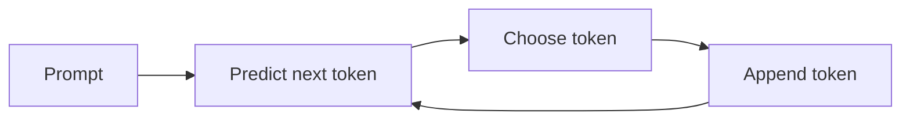

# Blog 18 — How Does a Language Model Learn to Predict Text?

Imagine reading:

> “The sun rises in the ___.”

Your brain expects a word such as “east”.

A language model turns this prediction problem into mathematics.

---

## 1. The training task

Given a sequence of tokens

$$
x_1,x_2,\ldots,x_t
$$

the model tries to predict the next token $x_{t+1}$.

Mathematically:

$$
P(x_{t+1}\mid x_1,\ldots,x_t)
$$

The model produces a probability distribution over the vocabulary.

---

## 2. From hidden representation to vocabulary scores

Suppose the Transformer produces a final representation

$$
h_t\in\mathbb R^d
$$

A linear layer maps it to vocabulary logits:

$$
z=W_oh_t+b_o
$$

If the vocabulary has $V$ tokens, then

$$
z\in\mathbb R^V
$$

One score corresponds to each possible next token.

---

## 3. Softmax turns scores into probabilities

$$
P_i=\frac{e^{z_i}}{\sum_{j=1}^{V}e^{z_j}}
$$

All probabilities are positive and sum to 1:

$$
\sum_iP_i=1
$$

The model can therefore rank possible next tokens.

---

## 4. Cross-entropy loss

Suppose the correct next token has probability $p$.

A simple single-example negative log-likelihood is

$$
L=-\log p
$$

If the model assigns high probability to the correct token, loss is small.

If it assigns tiny probability, loss becomes large.

For a sequence, the average cross-entropy can be written as

$$
L=-\frac1T\sum_{t=1}^{T}\log P(x_t\mid x_{<t})
$$

where $x_{<t}$ means the preceding tokens.

---

## 5. Teacher forcing in next-token training

Suppose the training text is

```text
I love deep learning
```

Training examples can be aligned as:

```text
Input:  I        → Target: love
Input:  I love   → Target: deep
Input:  I love deep → Target: learning
```

A causal Transformer can calculate many of these positions in parallel during training using a causal mask, even though the prediction rule itself is left-to-right.

---

## 6. Why enormous datasets help

A language model encounters many patterns:

- syntax;
- facts and associations;
- style;
- code structure;
- common sequences;
- long-range dependencies.

The model does not receive a table saying “this is grammar” or “this is a fact.”

It receives examples and an objective.

The parameters are adjusted so that the probability distribution improves across training data.

---

## 7. The training loop


This is gradient-based learning at very large scale.

---

## 8. Tiny PyTorch example

```python
import torch
import torch.nn.functional as F

logits = torch.tensor([[2.0, 1.0, -1.0]])
target = torch.tensor([0])

loss = F.cross_entropy(logits, target)
print(loss.item())
```

`cross_entropy` combines the log-softmax operation with negative log-likelihood in a numerically stable implementation.

---

## 9. Training is not the same as generating

During training, the model learns from known target tokens.

During generation, the model must choose a token and feed that generated token into the next step.



This continues until a stopping condition is reached.

---

## 10. Sampling changes behavior

Suppose the model produces probabilities:

```text
cat      0.55
animal   0.25
dog      0.15
car      0.05
```

Taking the highest-probability token is one strategy.

Sampling from the distribution can produce different outputs.

Temperature can reshape the distribution. Lower temperature tends to make choices more concentrated; higher temperature tends to make them more diverse.

Sampling controls do not create knowledge that the model does not contain.

---

## 11. What does the model actually learn?

This question needs care.

The training objective directly optimizes next-token prediction.

Useful capabilities can emerge because predicting text requires the model to capture many regularities in its training distribution.

But a language model is not a database with a clean lookup table of facts, and high likelihood does not guarantee truth.

That distinction matters enormously when using language models.

---

## Think Like a Scientist 🧠

Take the sentence:

> “The child picked up the glass because it was ___.”

Write several plausible next words.

Now ask:

> What information would a model need to assign sensible probabilities?

The answer leads into representation, attention, world regularities and context.

---

## What you should remember

> **A language model can be trained as a next-token prediction system.**

The core mathematical chain is:

$$
\text{tokens}
\rightarrow
\text{representations}
\rightarrow
\text{logits}
\rightarrow
\text{probabilities}
\rightarrow
\text{loss}
\rightarrow
\text{gradients}
\rightarrow
\text{parameter updates}
$$

The same basic learning machinery we studied at the beginning is now operating inside a Transformer at enormous scale.

But prediction is not the only thing neural networks can learn to do.

> **Next: generative models — how machines create new data.**

---

# 🧪 Hands-on Lab — Train a Tiny Character Language Model

Use [`../labs/18-language-model-lab.md`](../labs/18-language-model-lab.md).

Start with a tiny vocabulary and a tiny text corpus. Your first goal is not performance; it is understanding the training signal.

```python
import torch
import torch.nn.functional as F

logits = torch.randn(4, 10)
targets = torch.tensor([1, 4, 2, 7])

loss = F.cross_entropy(logits, targets)
print(loss.item())
```

### Challenges

1. Convert a tiny text corpus into token IDs.
2. Create input/target pairs shifted by one token.
3. Compute cross-entropy.
4. Train a tiny model until the loss decreases.
5. Generate text one token at a time.
6. Compare greedy decoding with sampling.

### Mastery question

Explain why a model can be trained on many next-token predictions simultaneously while generation is performed step by step.

That distinction is central to understanding modern LLM training versus inference.

---

# 📚 Go Deeper — From Language Modeling to LLMs

**ZacharyLLM** is particularly useful from this point forward because the concepts here—tokenization, next-token prediction, Transformers, inference and LLM behavior—are its natural territory.

**3Blue1Brown** provides the visual mathematics behind neural networks, attention and language-model concepts. citeturn0youtube30turn0youtube31

**Frame Zero** provides a complementary first-principles perspective on ML and modern AI.

**Visual Kernel** is useful when you want another visual/technical explanation of model internals.

**Welch Labs** is valuable for reinforcing the implementation mindset: build small systems, inspect the equations and use supporting code. Its AI resources explicitly emphasize hands-on exploration and supporting code. citeturn0search1turn0search3

Use **MrJensenMath10** to strengthen probability, logarithms and algebra.

### The deepest connection

The language model looks radically more sophisticated than our Blog 01 linear model.

But the training loop is still:

$$
\boxed{\text{predict}\rightarrow\text{measure error}\rightarrow\text{differentiate}\rightarrow\text{update}}
$$

The architecture became vastly more expressive. The learning principle remained recognizable.
