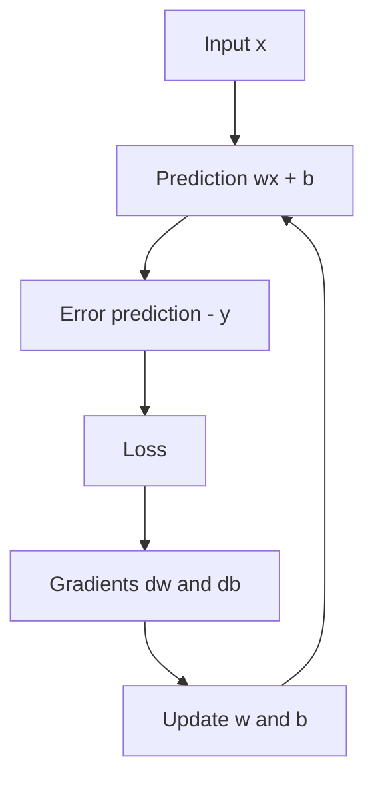

# Blog 20 — Build a Tiny Neural Network From Scratch

<!-- NOTEBOOK-LAB-NAV -->

## 🧪 Interactive Lab

The matching notebook is the complete hands-on laboratory for this lesson. It contains the runnable code, experiments, visualizations, and challenges.

**[📓 Open the notebook on GitHub](https://github.com/manish7725/deeplearning/blob/main/notebooks/20-neural-network-from-scratch.ipynb)**  · **[▶ Open the notebook in Google Colab](https://colab.research.google.com/github/manish7725/deeplearning/blob/main/notebooks/20-neural-network-from-scratch.ipynb)**

## 1. Our toy problem

Suppose the data follows:

```math
y = 2x + 1
```

Use four examples:

```python
import numpy as np

x = np.array([1., 2., 3., 4.])
y = np.array([3., 5., 7., 9.])
```

We want our model

```math
\hat{y} = wx + b
```

to discover $w \approx 2$ and $b \approx 1$.

---

## 2. Start with terrible parameters

```python
w = 0.0
b = 0.0
```

The initial model predicts zero for every input.

For $x = 1$:

```math
\hat{y} = 0
```

while the correct answer is 3.

The model needs to learn.

---

## 3. Define the loss

Use mean squared error (MSE):

```math
L = \frac{1}{n}\sum_{i=1}^{n}(\hat{y}_i-y_i)^2
```

The smaller the loss, the closer our predictions are to the targets.

---

## 4. Derive the gradients

We have

```math
\hat{y}_i = wx_i + b
```

and

```math
L = \frac{1}{n}\sum_i(\hat{y}_i-y_i)^2
```

Using the chain rule, we get the gradient with respect to the weight:

```math
\frac{\partial L}{\partial w}
= \frac{2}{n}\sum_i(\hat{y}_i-y_i)x_i
```

And the gradient with respect to the bias:

```math
\frac{\partial L}{\partial b}
= \frac{2}{n}\sum_i(\hat{y}_i-y_i)
```

These are the exact instructions needed to improve $w$ and $b$.

### Why does the bias gradient not contain $x_i$?

Because

```math
\frac{\partial \hat{y}_i}{\partial b} = 1
```

while

```math
\frac{\partial \hat{y}_i}{\partial w} = x_i
```

That small difference is important: the weight gradient is scaled by the input, while the bias gradient is not.

---

## 5. Write gradient descent

For learning rate $\eta$:

```math
w \leftarrow w - \eta\frac{\partial L}{\partial w}
```

```math
b \leftarrow b - \eta\frac{\partial L}{\partial b}
```

That is the entire learning algorithm for this toy model.

---

## 6. Full NumPy implementation

```python
import numpy as np

x = np.array([1., 2., 3., 4.])
y = np.array([3., 5., 7., 9.])

w = 0.0
b = 0.0
learning_rate = 0.01

for step in range(2000):
    # Forward pass
    prediction = w * x + b

    # Loss
    error = prediction - y
    loss = np.mean(error ** 2)

    # Backward pass
    dw = np.mean(2 * error * x)
    db = np.mean(2 * error)

    # Update
    w -= learning_rate * dw
    b -= learning_rate * db

    if step % 200 == 0:
        print(step, loss, w, b)

print("final weight:", w)
print("final bias:", b)
```

After training, the learned parameters should be close to:

```math
w = 2, \qquad b = 1
```

The exact numerical values depend on the learning rate and number of steps.

---

## 7. What just happened?

Every iteration followed the same scientific loop:



Nothing mysterious happened.

The model started with poor parameters and repeatedly changed them according to the gradient.

### The training loop in one picture

```text
             ┌───────────────┐
             │    Input x    │
             └───────┬───────┘
                     ↓
             ┌───────────────┐
             │  wx + b        │
             │  Prediction    │
             └───────┬───────┘
                     ↓
             ┌───────────────┐
             │     Loss       │
             └───────┬───────┘
                     ↓
             ┌───────────────┐
             │   Gradients    │
             │    dw, db      │
             └───────┬───────┘
                     ↓
             ┌───────────────┐
             │ Update w and b │
             └───────┬───────┘
                     │
                     └──────────→ repeat
```

---

## 8. Now let PyTorch do the bookkeeping

The same model can be written with PyTorch:

```python
import torch

x = torch.tensor([1., 2., 3., 4.])
y = torch.tensor([3., 5., 7., 9.])

w = torch.tensor(0.0, requires_grad=True)
b = torch.tensor(0.0, requires_grad=True)

optimizer = torch.optim.SGD([w, b], lr=0.01)

for step in range(2000):
    prediction = w * x + b
    loss = torch.mean((prediction - y) ** 2)

    optimizer.zero_grad()
    loss.backward()
    optimizer.step()

print(w.item(), b.item())
```

Compare this with the NumPy version.

The mathematics is the same.

PyTorch automates the gradient calculation and parameter update machinery.

---

## 9. From one neuron to a network

Our model had one input and one output.

A real neural network may have:

```math
\mathbf{h} = \sigma(W_1\mathbf{x} + \mathbf{b}_1)
```

followed by

```math
\hat{y} = W_2\mathbf{h} + \mathbf{b}_2
```

Training still follows the same conceptual loop:

```math
\text{forward}
\rightarrow
\text{loss}
\rightarrow
\text{backward}
\rightarrow
\text{update}
```

The network becomes more complicated, but the core idea does not disappear.

---

## 10. What you have actually learned

You now have the mathematical foundation needed to understand many deep-learning systems.

### Representation

```math
\mathbf{x}
```

### Transformation

```math
W\mathbf{x} + \mathbf{b}
```

### Nonlinearity

```math
\sigma(W\mathbf{x} + \mathbf{b})
```

### Prediction

```math
\hat{y} = f_\theta(x)
```

### Objective

```math
L(\hat{y}, y)
```

### Gradient

```math
\nabla_\theta L
```

### Optimization

```math
\theta \leftarrow \theta - \eta\nabla_\theta L
```

That is the mathematical skeleton of deep learning.

---

## 11. Your final challenge 🧠

Change the dataset to:

```math
y = 3x - 2
```

and train again.

Then try a two-feature model:

```math
\hat{y} = w_1x_1 + w_2x_2 + b
```

Derive the gradients yourself.

Then implement it.

Finally, add a hidden layer and ReLU.

At that point you will no longer be merely reading about neural networks.

You will be constructing them.

---

## The complete mental model

```text
Real world
    ↓
Numerical representation
    ↓
Vectors / tensors
    ↓
Linear transformations
    ↓
Nonlinear transformations
    ↓
Prediction
    ↓
Loss
    ↓
Gradient
    ↓
Parameter update
    ↓
Better prediction
    ↺
```

The most important lesson is not a particular architecture.

It is this:

> **Deep learning is a way of learning useful transformations of numerical representations by optimizing a differentiable objective with data.**

Once you understand that sentence mathematically, CNNs, RNNs, Transformers and generative models stop looking like unrelated magic.

They become different ways of constructing and learning functions.

---

# Where to go next

The natural next stage is to turn this foundation into serious practice:

1. Linear algebra — vectors, matrices, eigenvalues, SVD.
2. Probability and statistics — distributions, expectation, variance and estimation.
3. Calculus — derivatives, partial derivatives and chain rule.
4. Optimization — SGD, Momentum, Adam and learning-rate schedules.
5. PyTorch — datasets, modules, autograd and training loops.
6. CNNs — image classification and computer vision.
7. Sequence models — RNN, LSTM and GRU.
8. Attention — Q, K, V and masking.
9. Transformers — encoder, decoder and modern architectures.
10. Language models — tokenization, pretraining, fine-tuning and inference.
11. Generative models — VAEs, GANs and diffusion.
12. Production deep learning — evaluation, monitoring, serving and optimization.

You have reached the end of this first-principles series.

But you have not reached the end of deep learning.

You have reached the point where the next step is to **build**.

---

# 🧪 Final Capstone Lab — Remove Every Layer of Magic

.

Complete the progression without skipping levels:

### Level 1 — One parameter

Implement

$$
\hat y=wx
$$

and derive $dL/dw$.

### Level 2 — Weight + bias

Implement

$$
\hat y=wx+b
$$

and derive both gradients.

### Level 3 — Multiple features

Implement

$$
\hat y=\mathbf w^T\mathbf x+b
$$

using vectors.

### Level 4 — Multiple neurons

Implement

$$
\mathbf z=W\mathbf x+\mathbf b
$$

using matrix multiplication.

### Level 5 — Nonlinearity

Add ReLU:

$$
\mathbf h=ReLU(W_1\mathbf x+\mathbf b_1)
$$

### Level 6 — Backpropagation

Derive the gradients through the hidden layer.

### Level 7 — PyTorch

Rebuild the same network with `nn.Module`, autograd and an optimizer.

### Level 8 — Explain it

Teach the entire network to another person without showing code first.

If you can do all eight levels, you have crossed an important boundary: you understand the mechanism rather than merely knowing the vocabulary.

---

# 📚 Your Mastery Resource Stack

Use **3Blue1Brown** for visual mathematics and neural-network intuition. citeturn0youtube30turn0youtube31

Use **Welch Labs** for hands-on mathematical explanations, graphics and supporting code; its Neural Networks Demystified sequence and newer AI material strongly reinforce the build-and-understand approach. citeturn0search0turn0search1

Use **Frame Zero** for first-principles machine-learning intuition.

Use **MrJensenMath10** for mathematical fluency.

Use **ZacharyLLM** for the modern LLM path.

Use **Visual Kernel** for additional visual/technical understanding of model internals.

### The final learning loop

Do not finish this series by watching more videos.

Finish it by building things.

$$
\boxed{
\text{Learn}
\rightarrow
\text{Derive}
\rightarrow
\text{Implement}
\rightarrow
\text{Experiment}
\rightarrow
\text{Break}
\rightarrow
\text{Debug}
\rightarrow
\text{Explain}
}
$$

That loop is the real curriculum.

The blogs give you the map.

The labs give you the hands.

The mathematics gives you the language.

And the experiments turn knowledge into understanding.
