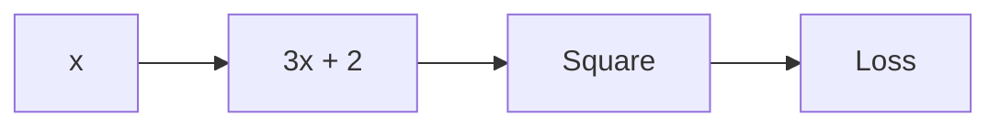

# Blog 21 — How Does a Computer Calculate Gradients Automatically?

> **Deep Learning from First Principles — written for a Class 7 mind, but with the mathematics kept honest.**

Imagine you are climbing a hill in thick fog.

You cannot see the whole mountain.

But you can feel the ground under your feet.

If the ground slopes upward to your right, you know:

> “I should probably step left if I want to go downhill.”

A neural network does something very similar.

It has a **loss**. It needs to know which direction makes the loss smaller.

That direction is the **gradient**.

But a modern neural network may contain millions or billions of calculations.

Who calculates all those derivatives?

The answer is **automatic differentiation**, or **autodiff**.

---

# 1. Start with a tiny equation

Suppose

$$
y = 3x + 2$$

Then

$$
\frac{dy}{dx}=3
$$

Easy.

Now try:

$$
z=(3x+2)^2
$$

There are two operations:

```text
x
↓
3x + 2
↓
square
↓
z
```

We can name the middle value:

$$
a=3x+2$$

and then

$$
z=a^2$$

The chain rule says:

$$
\frac{dz}{dx}=\frac{dz}{da}\frac{da}{dx}
$$

So

$$
\frac{dz}{da}=2a
$$

and

$$
\frac{da}{dx}=3
$$

therefore

$$
\frac{dz}{dx}=2a\cdot3=6a
$$

---

# 2. The computer thinks in a graph

A neural network is really a giant collection of small operations.

For example:



The computer can remember this calculation graph.

Then it can travel backward through the graph and calculate how each operation affected the final result.

That is the basic idea behind **backpropagation + autodiff**.

---

# 3. PyTorch does the bookkeeping

> 🧪 **[Run this code in Google Colab](https://colab.research.google.com/github/manish7725/deeplearning/blob/feature/01-deeplearning-syllabus/notebooks/21-automatic-differentiation.ipynb)**

> 🧪 **[Run this code in Google Colab](https://colab.research.google.com/github/manish7725/deeplearning/blob/main/notebooks/21-automatic-differentiation.ipynb)**

> 🧪 **[Run this code in Google Colab](https://colab.research.google.com/github/manish7725/deeplearning/blob/main/notebooks/21-automatic-differentiation.ipynb)**

> 🧪 **[Run this code in Google Colab](https://colab.research.google.com/github/manish7725/deeplearning/blob/main/notebooks/21-automatic-differentiation.ipynb)**

```python
import torch

x = torch.tensor(2.0, requires_grad=True)
a = 3 * x + 2
z = a ** 2

z.backward()

print(x.grad)
```

At $x=2$:

$$
a=3(2)+2=8$$

and

$$
\frac{dz}{dx}=6a=48
$$

PyTorch calculates that derivative for us.

But remember:

> **PyTorch is not replacing calculus. It is automating calculus.**

---

# 4. Why this matters for neural networks

A neural network might look like:

```text
input
  ↓
linear layer
  ↓
activation
  ↓
linear layer
  ↓
activation
  ↓
loss
```

Each arrow contains mathematical operations.

Autodiff helps calculate:

$$
\frac{\partial L}{\partial W_1},
\frac{\partial L}{\partial b_1},
\frac{\partial L}{\partial W_2},
\frac{\partial L}{\partial b_2}
$$

Then gradient descent changes those parameters.

```text
forward
  ↓
prediction
  ↓
loss
  ↓
backward
  ↓
gradients
  ↓
update
```

That loop is the engine of neural-network training.

---

# 🧪 Think Like a Scientist

Take

$$
z=(2x+1)^2$$

Calculate $dz/dx$ by hand.

Then ask PyTorch to calculate it.

If the answers differ, do not simply trust the computer.

Find out why.

That habit—**predict first, run the experiment second**—is one of the best habits in machine learning.

---

# 🧠 What you should remember

1. A neural network is a chain of mathematical operations.
2. The chain rule connects derivatives through those operations.
3. Backpropagation applies this idea backward through a network.
4. Automatic differentiation performs the bookkeeping automatically.
5. PyTorch's `autograd` is a practical implementation of this idea.

> **Autodiff is not magic. It is calculus performed systematically by a computer.**

---

# 🧪 Hands-on challenge

Build a three-step computation yourself:

$$
a=2x+1$$

$$
b=a^2$$

$$
L=b+5
$$

Calculate $dL/dx$ by hand and with PyTorch.

Then change the numbers.

The goal is not memorizing the answer.

The goal is seeing the same mathematics appear in both your notebook and your program.